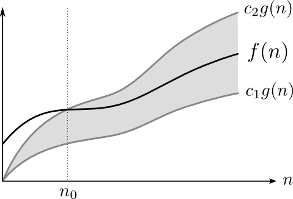
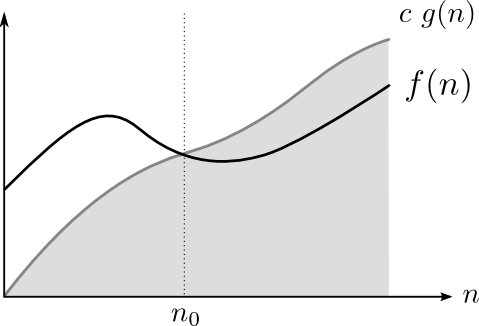

=======================
Eficiència d'Algorismes
=======================

.. rubric:: Objectius

- Descriure el concepte d'ordre de creixement.

- Enumerar els ordres de creixement típics.

- Descriure la utilitat dels ordres de creixement en la comparació
  d'algorismes.

- Analitzar l'eficiència d'un algorisme senzill.

Anàlisi d'algorismes
====================

Anàlisi d'algorismes
  Estudi teòric sobre els programes d'ordinador en termes de la seva
  eficiència (velocitat) i ús de recursos. Es tracta d'un estudi del
  *cost* (temporal o de memòria).

**Exemple: Ordenació**

El problema d'ordenar una seqüència de nombres es pot enunciar
explicitant quina és l'entrada de l'algorisme i quina n'és la sortida:

**Entrada:** Una taula de nombres :math:`a_1, a_2, \ldots, a_n`. 

**Sortida:** Permutació dels nombres :math:`a_1', a_2', \ldots, a_n'` tal
que :math:`a_1' < a_2' < \ldots < a_n'`.

Ordenació per inserció
----------------------

Una forma de resoldre aquest problema seria implementar la ordenació
per inserció::

  const int N = 100;
  typedef int Vector[N];
  
  void ordena_insercio(Vector& A) {
    int j, k, i;
    for (j = 2; j < N; j++) {
      k = A[j];
      i = j - 1;
      while (i >= 0 && A[i] > k) {
        A[i+1] = A[i];
	i--;
      }
      A[i+1] = k;
    }
  }

La ordenació per inserció funciona suposant que hi ha dues zones en la
taula: la zona baixa (amb índexs petits), que està ordenada, i la zona
alta, que està per ordenar. Cada pas de l'algorisme agafa el primer
element de la zona alta i llavors mou elements de la zona ordenada per
tal d'obrir-li una posició al lloc que li pertoca. L'element es coloca
llavors al forat que ha quedat. Aquesta operació amplia la zona
ordenada en 1 element. Aplicant-la repetidament, ordenarem la taula.

Temps d'execució de l'algorisme
===============================

Ens preguntem: quan triga aquest algorisme en executar-se?

De fet, el temps d'execució depèn de molts factors:

- De la taula concreta que rep com entrada. Si aquesta taula ja està
  ordenada, per exemple, el procés és molt ràpid. Si la taula està
  ordenada al revés, el procés és molt més lent.

- Del tamany de la taula: no es triga el mateix en ordenar una taula
  de 100 elements que una de 10000 elements.

- De la velocitat de la màquina amb què fem els càlculs. El nostre
  algorisme acabarà molt més ràpid si l'executem en un ordinador té
  una freqüència de rellotge més alta (i pot executar més instruccions
  per segon).

Anàlisi dels diferents temps d'execució
=======================================

En general, es pren el tamany de l'entrada :math:`n` com a paràmetre
clau (en el nostre cas el tamany de la taula), i es dóna un valor únic
al temps d'execució d'un algorisme, que és llavors una funció
:math:`T(n)` del tamany de l'entrada. També se suposa que l'algorisme
és correcte per a qualsevol entrada (dóna sempre un resultat
correcte).

Donat que el temps d'execució real de l'algorisme depèn de molts
factors, hi haurà en realitat molts temps diferents (tindrem una
distribució de valors). Si suposem que executem l'algorisme en el
mateix ordinador, podem resumir tots aquests diferents valors en un de
sol de 3 maneres:

- *Pitjor cas*: li donem a :math:`T(n)` el valor del temps més gran que
  triga l'algorisme per a entrades de tamany :math:`n`.

- *Cas mitjà*: li donem a :math:`T(n)` el valor de la mitjana dels
  temps d'execució per a totes les entrades de tamany :math:`n`.

- *Cas millor*: li donem a :math:`T(n)` el valor del temps més petit
  que triga per a entrades de tamany :math:`n`.

L'anàlisi del millor cas és, de fet, inútil. Si el valor de la funció
:math:`T(n)` descriu el temps més curt d'execució de l'algorisme, és
com no saber-ne res. La raó és que l'algorisme pot ser que ordeni
certa taula concreta molt ràpidament (perquè té la solució
precalculada, per exemple) i en canvi la majoria de les altres les fa
molt malament. Llavors, el temps d'execució :math:`T(n)` ens semblaria
molt bo quan en realitat no ho és.

El temps mitjà és un referent millor. Si :math:`T(n)` és la mitjana
dels temps d'execució, aquest valor reflexa de forma més acurada el
comportament de l'algorisme en el conjunt sencer dels cassos. Però tot
i ser útil, no ens dóna garanties. Un algorisme amb temps mitjà
:math:`T(n) = 5n` pot ser molt més lent en cassos concrets. Necessitem
doncs, una manera d'assegurar que el temps d'execució és menor que un
cert valor, i poder *certificar-ne* la seva eficiència.

És per això que en general es fa servir el pitjor cas. Si :math:`T(n)`
representa el valor màxim del temps que triga l'algorisme, aquest
valor és una cota superior al temps que trigarà, i per tant tenim la
garantia que el temps serà aquest o menor. Amb el pitjor cas tenim la
seguretat de poder fer afirmacions sòlides sobre el temps d'execució
de l'algorisme.

Anàlisi assimptòtica
====================

Però encara tenim el problema de que un algorisme lent executat en un
ordinador ràpid pot trigar menys que un algorisme ràpid executat en un
ordinador lent. Com podem comparar algorismes diferents sense
necessitat de tenir un ordinador amb una velocitat de referència?

La solució és no analitzar els valors concrets, sinó les *tendències*
d'aquests valors (el seu valor assimptòtic). Com que disposem dels
valors del temps d'execució :math:`T(n)` per a entrades de diferents
tamanys, el que farem és mirar com creix el temps d'execució quan
augmentem el valor de :math:`n`. El que importarà, doncs, no són els
valors precisos sobre els temps sino quin *ordre* de creixement tenen.

Límits
------

En matemàtiques, la noció de límit ens permet obtenir el valor d'una
funció quan el seu paràmetre creix. Tenim els següents límits bàsics:

.. math::

   \lim_{n\rightarrow\infty} n = \infty

.. math::

   \lim_{n\rightarrow\infty} \log n = \infty

.. math::

   \lim_{n\rightarrow\infty} \frac{1}{n} = 0

.. math::
   
   \lim_{n\rightarrow\infty} \frac{\log n}{n} = 0

El primer límit és, de fet, una tautologia, perquè per definició, la
variable :math:`n` tendeix a :math:`\infty` en un límit. I el segon es
pot demostrar, però la demostració no és tan senzilla. De fet el
logaritme és la funció que creix cap a :math:`\infty` de la forma més
lenta possible (però hi arriba).

En els límits a on hi ha una divisió, es pot pensar que hi ha una
cursa entre el denominador i el numerador i depenent del guanyador
tindrem un valor diferent: :math:`\infty` si guanya el numerador,
:math:`0` si guanya el denominador i una constant si queden empatats.

Quan una funció :math:`g(n)` "guanya" a una altra funció :math:`f(n)`
en un límit d'aquests, podem escriure:

.. math::

   f(n) \prec g(n)

i quan són equivalents es posa:

.. math::

   f(n) \sim g(n)

Fent servir la noció de límit, es pot classificar a les funcions en
grups, posant les equivalents en el mateix grup, i mirant quins grups
guanyen a quins. Tots els polinomis de grau 2 guanyen als de grau 1,
per exemple, independentment de les constants que tinguin.

.. exercici::

   Calcula el següent limit

   .. math::

      \lim_{n\rightarrow\infty} \frac{n}{\log n}

.. exercici::
   
   Busca un argument per demostrar que

   .. math::
      
      \lim_{n\rightarrow\infty} \frac{e^n}{n} = \infty

.. exercici::

   Calcula el següent límit

   .. math::

      \lim_{n\rightarrow\infty} 
      \frac{2 (n + 1) (\log n + 7)}{ 7n^2 + 1 }

Ordres de creixement
--------------------

Quan analitzem el comportament d'una funció de :math:`n` quan
:math:`n` creix, ens hem de fixar en el seu *ordre de creixement* (o,
simplement, el seu ordre). L'ordre d'una funció és el grup de funcions
equivalents (en termes de creixement) al que pertany. Se sol agafar un
representant d'aquest grup per denotar-lo (la funció més simple
possible). 

En el cas més senzill, el dels polinomis, l'ordre es determina amb
l'exponent més alt que veiem. Per exemple, si la funció és

.. math::

   T(n) = 3 n^3 + 90 n^2 - 5n + 6046

el valor que realment domina quan :math:`n` creix és
:math:`n^3`. L'obtenim així:

- Expressant al funció com un polinomi.

- Descartant els termes d'ordre inferior del polinomi.

- Ignorant les constants multiplicatives.

Notació :math:`\Theta`
""""""""""""""""""""""

Per expressar els ordres de funcions farem servir la notació :math:`\Theta`,
que donada una funció, indica el seu l'ordre de creixement entre
parèntesis:

.. math::

   3 n^3 + 90 n^2 - 5n + 6046 = \Theta(n^3)

La notació :math:`\Theta(n^3)` indica un ordre cúbic i s'agafa la
funció més senzilla d'ordre cúbic com a
representant. :math:`\Theta(n^3)` és el grup de totes les funcions que
tenen un terme cúbic (i cap de més gros) i qualsevol valor en les
constants. Totes elles són equivalents en aquest tipus d'anàlisi.

.. exercici::

   Determina l'ordre de creixement de les següents funcions: 

   .. math::
   
      f_1(n) = 14n(n-1)

   .. math::

      f_2(n) = \frac{3n^2 - 15}{5n}

   .. math::

      f_3(n) = \frac{8n^7 + n^4}{3n^2-17}

   .. math::
   
      f_4(n) = \frac{7n + 3}{3n(9 - n)} + \Theta(n)

Definició matemàtica de :math:`\Theta`
""""""""""""""""""""""""""""""""""""""

La definició de :math:`\Theta` és, per tant:

  Donada una funció :math:`g(n)`, diem que :math:`\Theta(g(n))` és el
  conjunt de les funcions :math:`f(n)` per a les quals existeixen dues
  constants :math:`c_1` i :math:`c_2` tals que

     .. math::
  
        0 \leq c_1 g(n) \leq f(n) \leq c_2 g(n)

  a partir de cert :math:`n_0` quan :math:`n` tendeix a :math:`\infty`.

Aquesta definició ens diu que podem fer un "sandwich" de :math:`f(n)`,
tal com mostra la figura següent

Cotes superiors: notació :math:`O`
""""""""""""""""""""""""""""""""""

Per l'anàlisi d'algorismes, donat que estudiem el cas pitjor, el que
volem és poder expressar que l'ordre de creixement és igual o *menor*
que un cert ordre. Per poder expressar això tenim la notacio
:math:`O`. La definició és molt semblant a la de :math:`\Theta`:

  Donada una funció :math:`g(n)`, diem que :math:`O(g(n))` és el
  conjunt de les funcions :math:`f(n)` per a les quals existeix una constant
  :math:`c` tal que

     .. math::
  
        0 \leq f(n) \leq c g(n)

  a partir de cert :math:`n_0` quan :math:`n` tendeix a
  :math:`\infty`.

En aquest cas, :math:`f(n)` estarà acotada per :math:`g(n)` excepte
per una constant tal com mostra la següent figura:

Exemples
""""""""

En resum, en l'àmbit de l'anàlisi assimptòtica (quan :math:`n`
tendeix a :math:`\infty`), la notació :math:`\Theta` és un símil de
l'operador "igual" i la notació :math:`O` ens permet expressar la noció de
"menor o igual". 

Els següents exemples mostren l'ús de les dues notacions:

.. math::

   6n^3 = O(n^4)

.. math::

   \frac{1}{2}n^2 - 3n = \Theta(n^2)

.. math::

   (n + 1)^2 = n^2 + O(n)

.. math::

   6n^3 \neq \Theta(n^2)

.. math::

   7 n^3 - 3 n^2 + n + 19 = O(n^3)

.. math::

   n^3 = O(7 n^3 - 3 n^2 + n + 19)

.. math::

   6n^3 + 4n^2 = 6n^3 + \Theta(n^2) = 6n^3 + O(n^2)

.. math::

   \Theta(n^3) + 451 n^2 - 104 n = \Theta(n^3)   

.. math::

   n^{O(1)} = O(e^n)

.. TODO: Ejercicio donde se diga si unas expresiones son ciertas o
   falsas

Ordres de creixement típics
"""""""""""""""""""""""""""

La següent taula mostra els ordres de creixement típics de menor a major:

===================== ========================
Notació               Nom de l'ordre
===================== ========================
:math:`O(1)`          Constant
:math:`O(\log n)`     Logarítmic
:math:`O(n)`          Linial
:math:`O(n \log n)`   Loglinial o Quasilinial.
:math:`O(n^2)`        Quadràtic
:math:`O(n^3)`        Cúbic
:math:`O(n^c), c > 1` Polinòmic
:math:`O(c^n), c > 1` Exponencial
:math:`O(n!)`         Factorial
===================== ========================

Comparació d'algorismes
-----------------------

El gran avantatge dels ordres de creixement és que ens permeten comparar
algorismes directament. Un algorisme A amb un temps d'execució :math:`O(n^3)`
*és sempre pitjor* que un algorisme B amb temps :math:`O(n^2)`. Per
la definició matemàtica de :math:`O`, sempre hi haurà un valor de
:math:`n` a partir del qual A triga més que B, fins i tot si A
s'executa en un ordinador més ràpid que el de B (que multiplica el
temps per una constant).

Vegem un exemple concret. Suposem que :math:`T_A(n) = 2 n^2` i que
:math:`T_B(n) = 50 n \log n`, a on les dues funcions mesuren el número
d'instruccions totals necessàries per produir la sortida. L'ordinador
d'A és capaç d'executar :math:`10^9` d'instruccions per segon, i
l'ordinador de B només :math:`10^7` (un factor 100). Malgrat aquest
gran avantatge de A sobre B, si el tamany de l'entrada :math:`n` és
d'un milió, els temps reals d'execució de cada algorisme seràn:

.. math::
   
   t_A = \frac{2\times (10^6)^2\ \text{instruccions}}
              {10^9\ \text{instruccions}/\text{segon}} = 2000\ \text{segons}

.. math::

   t_B = \frac{50\times 10^6 \log 10^6\ \text{instruccions}}
              {10^7\ \text{instruccions}/\text{segon}} \approx 70\ \text{segons}

És clar, doncs, que l'avantatge de A no ha servit per a res. Malgrat
l'ordinador de A és 100 vegades més ràpid, l'algorisme A s'executa
finalment 20 vegades més lentament que B, per a una entrada
suficientment gran. La clau està en els ordres de creixement,
:math:`T_A(n) = \Theta(n^2)` i :math:`T_B(n) = \Theta(n \log n)`, ja
que l'ordre de A és major que el de B.

Anàlisi de la ordenació per inserció
====================================

Per poder aplicar tot això, hem d'obtenir la funció que descriu el
temps que triga un algorisme concret en executar-se com una funció del
tamany de l'entrada :math:`n`. Com a exemple farem servir la ordenació
per inserció que ha sortit al principi.

Es tracta d'anar mirant tots els passos de l'algorisme i mirar què
triguen. Com que no podem saber quan triga cada operació
(assignacions, increments, comparacions, etc.) el que farem és posar
una constant desconeguta :math:`t_k` per a cada cosa que no sapiguem,
i operarem amb aquestes constants. Al final, aquestes constants no
importaran per a l'ordre de creixement, o sigui que en el fons estem
fent l'anàlisi *independentment* de l'ordinador concret en què
executem l'algorisme.

La següent taula mostra la comptabilitat de cada instrucció:

+------------------------------------+--------------+-------------------------------------------------+
| Línia de codi                      | Temps        | Vegades                                         |
+====================================+==============+=================================================+
| ``for (j = 2; j < N; j++) {``      | :math:`t_1`  | :math:`n`                                       |
+------------------------------------+--------------+-------------------------------------------------+
| ``k = A[j];``                      | :math:`t_2`  | :math:`n-1`                                     |
+------------------------------------+--------------+-------------------------------------------------+
| ``i = j - 1;``                     | :math:`t_3`  | :math:`n-1`                                     |
+------------------------------------+--------------+-------------------------------------------------+
| ``while (i >= 0 && A[i] > k) {``   | :math:`t_4`  | :math:`\sum_{j=2}^{n} j = \frac{n(n+1)}{2} - 1` |
+------------------------------------+--------------+-------------------------------------------------+
| ``A[i+1] = A[i];``                 | :math:`t_5`  | :math:`\sum_{j=2}^{n} j-1 = \frac{n(n-1)}{2}`   |
+------------------------------------+--------------+-------------------------------------------------+
| ``i--;``                           | :math:`t_6`  | :math:`\sum_{j=2}^{n} j-1 = \frac{n(n-1)}{2}`   |
+------------------------------------+--------------+-------------------------------------------------+
| ``}``                              |              |                                                 |
+------------------------------------+--------------+-------------------------------------------------+
| ``A[i+1] = k;``                    | :math:`t_7`  | :math:`n-1`                                     |
+------------------------------------+--------------+-------------------------------------------------+
| ``}``                              |              |                                                 |
+------------------------------------+--------------+-------------------------------------------------+

A cada instrucció se li ha posat un temps i el número de vegades que
s'executa. Si ara sumem cada temps pel seu número de vegades, obtenim
el temps total:

.. math::
   
   T(n) = t_1 n + (t_2 + t_3 + t_7) (n-1) + 
          t_4 \left(\frac{n(n-1)}{2} - 1\right) + 
	  (t_5 + t_6) \frac{n(n-1)}{2} 

Si el simplifiquem obtenim

.. math::

   T(n) = \left(\frac{t_4}{2} + \frac{t_5}{2} + \frac{t_6}{2}\right) n^2 +
          \left(t_1 + t_2 + t_3 + t_7 + \frac{t_4}{2} - \frac{t_5}{2} - \frac{t_6}{2}\right) n -
	  (t_2 + t_3 + t_7 + t_4)

i la funció resultant és, clarament :math:`\Theta(n^2)`. Per tant, la
ordenació per inserció té un ordre quadràtic.

.. rubric:: Bibliografia

A Wikipedia:

- Notació :math:`\Theta` i :math:`O`:
  `http://en.wikipedia.org/wiki/Big_O_notation
  <http://en.wikipedia.org/wiki/Big_O_notation>`_.

- Anàlisi assimptòtic: `http://en.wikipedia.org/wiki/Asymptotic_analysis
  <http://en.wikipedia.org/wiki/Asymptotic_analysis>`_.

