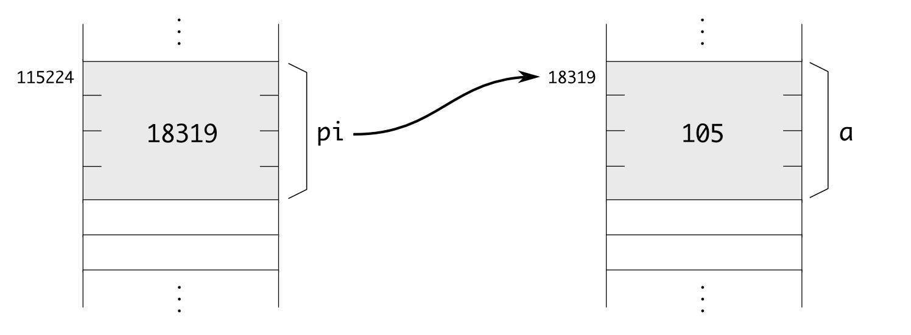
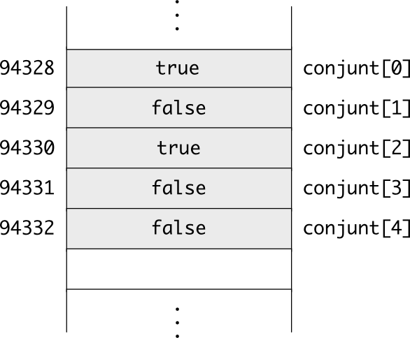

=====================
Punters i Referències
=====================

.. rubric:: Objectius

- Descriure què és una adreça de memòria i un punter.

- Declarar punters a un tipus qualsevol. Accedir al valor apuntat,
  incloent camps d'estructures.

- Iterar posicions de memòria consecutives fent servir punters.

- Passar paràmetres per referència fent servir punters.

Punters
=======

La memòria és una gran taula de *bytes*
---------------------------------------

La memòria d'un ordinador és una taula molt gran (amb milions de
caselles), i a on cada casella conté un *byte* [#nota1]_. Si un
ordinador té 512Mb de memòria, aquesta taula té :math:`512 \times
1024^2` caselles de 1 byte, que són 536870912. 

Per accedir a una posició de memòria, doncs, hem d'especificar quina
casella volem. El número de la casella (el seu índex), és el que
s'anomena l'**adreça de memòria**. En el cas d'un ordinador amb 512Mb,
l'adreça és, doncs, un enter entre 0 i 536870911. El tamany en bits
d'una adreça és molt important. En un ordinador de 32 bits, la màxima
adreça que es pot manipular és precisament un enter amb 32 bits.

.. exercici::

   En un ordinador amb 4Gb de memòria (:math:`4 \times 1024^3`), quina
   és la primera i la última adreça de memòria?

   Quants bits es necessiten per emmagatzemar l'enter que representa
   l'adreça?

Quan en un programa es reserva espai per a una variable, realment
s'estan agafant unes quantes caselles consecutives de la memòria amb
espai suficient per contenir un valor d'aquell tipus. Per exemple, si
en un programa declarem les variables::

  int a = 260;
  bool b = true;
  char c = 'X';

A la memòria hi haurà

.. image:: img/memoria_vars.png 
   :scale: 50

És a dir, ``a`` ocupa les caselles 79416 a 79419, la ``b`` ocupa la
79420 i la ``c`` ocupa la 79421. No podem saber quines seran
exactament les caselles que es faran servir (cada cop que s'executa el
programa poden ser diferents), però sí que estaran més o menys juntes
i el seu tamany [#nota2]_. L'adreça d'una variable és, de fet l'índex
de la *primera casella* (si en té més d'una) que ocupa. En el programa
anterior, l'adreça de ``a`` seria 79416, la de ``b`` 79420 i la de
``c`` 79421.

.. rubric:: L'operador ``sizeof``

La següent taula mostra el tamany que tenen els tipus bàsics:

========== ===================
*Tipus*    *Tamany*
---------- -------------------
``bool``   1 byte
``char``   1 byte
``int``    4 bytes
``float``  4 bytes
``double`` 8 bytes
``string`` 4 o 8 bytes
========== ===================

Però com podem saber el tamany que ocupa un cert tipus? Doncs fent
servir l'operador ``sizeof``, que rep entre parèntesis un tipus, i
retorna una constant que representa el número de bytes que ocupa el
tipus posat. Aquest operador *no* és una funció. Un senzill programa que
permet obtenir la informació de la taula anterior és el següent:

.. literalinclude:: src/05_Punters/sizeof.cpp

Aquest programa fa servir l'operador ``sizeof`` de C++ que permet obtenir el
tamany en memòria (en bytes) d'un tipus qualsevol. El tipus ``string``
ocupa diferent en funció de si l'ordinador és de 32 o 64 bits.

L'operador ``&`` permet obtenir l'adreça d'una variable
-------------------------------------------------------

En un programa podem obtenir l'adreça d'una variable ``a`` posant
``&a``. Per exemple, el programa següent mostra les adreces reals en
que ``a``, ``b`` i ``f`` resideixen:

.. literalinclude:: src/05_Punters/cout_addr.cpp

.. exercici::

   Compila el :download:`programa anterior <src/05_Punters/cout_addr.cpp>` 
   i mira quines adreces surten.

Un punter és una variable que conté una adreça
----------------------------------------------

En C++ no només podem obtenir una adreça d'una variable, també la
podem emmagatzemar. El valor de l'adreça, però, no el podem guardar en
una variable de tipus enter (malgrat és cert que una adreça *és* un
enter). Per emmagatzemar adreces, hem de declarar variables de tipus
especial ja que les adreces a dades de tipus enter són diferents
de les adreces a dades de tipus caràcter (la memòria, cal
recordar-ho, és completament uniforme i sense cap pista, no podem
saber de quin tipus és un grup de *bytes*).

Per exemple, el següent codi declara un punter a enters::

  int *pi;

Els punters es declaren amb un tipus normal però posant asterisc
(``*``) enganxat a davant del nom de la variable. La variable
``pi``, doncs, pot emmagatzemar adreces de variables que siguin enters
(només!). Per tant, en un programa podem fer el següent::

  int a = 105;
  int *pi;
  pi = &a;

L'assignació del final omple la variable ``pi`` amb l'adreça de la
variable ``a``. Aquesta situació es representa així:

Es diu que el punter ``pi`` apunta a la variable ``a``, perquè conté
l'adreça d'aquesta variable, i es posa una fletxa desde ``pi`` a ``a``.

Cada tipus "``X``" té associat un tipus punter "``X *``", per a
variables que contenen adreces a dades tipus "``X``". El següent codi
declara punters de diferents tipus, i els assigna adreces::

  int a, b, c;
  float x, y, z;
  char c, d;

  char *pc, *pd;
  float *pf1, *pf2;
  int *p1, *p2;
  ostream *pos;

  pc = &c;
  pd = &d;
  pf1 = &x;
  pf2 = &x;
  p1 = &a;
  pos = &cout;

.. exercici::

   Declara dos punters de nom ``pc1`` i ``pc2`` a variables de la
   classe ``Complex``.

L'operador ``*`` obté el valor que hi ha en una adreça
------------------------------------------------------

Si disposem d'un punter, això ens dóna accés (indirectament) a una
posició de memòria que conté algun valor. Per accedir a aquest valor a
partir del punter, ja sigui per consultar-lo o modificar-lo, farem
servir l'operador ``*`` (unari!), que es diu "operador d'indirecció" o
"operador de desdirecció". Si tenim un punter ``pi`` que apunta a un
valor enter, per obtenir aquest enter s'escriu ``*pi``
[#nota3]_. L'expressió ``*pi`` és substituible per la variable
original (d'on hem tret l'adreça), i podem fer amb ella el que hem fet
sempre amb les variables.

El següent programa mostra la utilització d'aquest operador::

  int a = 5;
  int *pi = &a; // pi apunta a 'a'  
  *pi = 3;
  cout << "La variable 'a' val: " << a << endl;

El programa mostrarà per pantalla un ``3``, ja que hem modificat, amb
la instrucció ``*pi = 3`` el valor enter a la posició de memòria a on
``a`` residia, i per tant el seu valor ha canviat. És com si haguéssim
posat la instrucció "``a = 3``".

.. exercici::

   Digues quina és la sortida del següent programa::

     int a = 1;
     int *p1 = &a, *p2 = &a;
     *p1 += 1;
     *p2 += 1;
     cout << a << endl;

.. exercici::

   Digues quina és la sortida del següent programa::

     float x = 1.0, y = 2.0;
     float *pf1 = &x, *pf2 = &y, *pf3;
     pf3 = pf1;
     pf1 = pf2;
     pf2 = pf3;
     *pf1 += 0.5;
     *pf2 = *pf2 / 2.0;
     cout << x << ' ' << y << endl;

La prioritat de l'operador ``*`` respecte a altres operadors
------------------------------------------------------------

Si escrivim un programa com::

  int a = 1;
  int *pa = &a;
  *pa++;
  cout << a << endl;

la sortida pot sembla sorprenent. Un espera que per la pantalla surti
un 2, però no és així. Surt un 1. La raó és que la instrucció
"``*pa++``" s'interpreta com "``*(pa++)``", i no com "``(*pa)++``" que
és el que volem nosaltres. En el programa, doncs, el que s'incrementa
és el punter mateix (l'adreça!), i no pas el valor enter al que
apunta. Això succeeix perquè l'operador d'increment ``++`` és més fort
que l'operador d'indirecció ``*``.

S'ha d'anar amb compte, doncs, a l'hora de manipular punters. Això
també afecta l'accés a tuples::

  struct Punt {
    double x, y;
  };

  int main() {
    Punt a;
    Punt *pa = &a;
    *p.x = 0.0; // error, 'p' no té camps
    *p.y = 1.0; // error, 'p' no té camps
  }

Com que l'operador d'accés a tuples és el més fort de tots, s'aplica
primer i per tant el codi dona un error de compilació. Per arreglar-ho
podem fer servir parèntesis::

    (*p).x = 0.0;
    (*p).y = 1.0;

Així el codi funcionaria perfectament.

.. rubric:: L'operador ``->``

El fet d'haver de posar "``(*p).``" per accedir als camps d'una tupla de
seguida és fa feixuc, i per això C++ té una sintaxi equivalent:
"``p->``". La fletxa es pot interpretar com "accedeix al camp de la
tupla a la que apunta ``p``".  En un programa com l'anterior, doncs,
podriem escriure::

   p->x = 0.0;
   p->y = 0.0;
 
Aquesta notació és més clara (i més fàcil d'escriure) i és utilitzada
majoritàriament.

.. TODO ejercicio sobre acceder a métodos de clases a través de un puntero!!

Els punters permeten fer pas per referència de paràmetres a accions
-------------------------------------------------------------------

Suposem que tenim una acció com la següent::

  void suma5(int& a) {
    a += 5;
  }

Aquesta acció es crida desde un programa principal com::

  int main() {
    int x;
    cout << "Un enter? ";
    cin >> x;
    suma5(x);
    cout << "Més 5 dóna: " << x << endl;
  }

El main, doncs, té una variable ``x`` que conté el valor al que volem
sumar 5. Si fem una acció ``suma5p`` que rebi un punter en comptes
d'un valor per referència, es pot aconseguir el mateix resultat, ja
que el punter contindrà l'adreça de la variable que s'ha de modificar
i en el ``main`` passarem l'adreça de ``x`` a ``suma5p``. La nova
implementació és::

  void suma5p(int *a) {
    *a += 5;
  }

I per invocar l'acció ``suma5p`` ara haurem de posar l'adreça de ``x``
en el ``main``::

  int main() {
    int x;
    cout << "Un enter? ";
    cin >> x;
    suma5p(&x);
    cout << "Més 5 dóna: " << x << endl;
  }

.. exercici::
   
   Digues quina és la sortida del següent programa si l'entrada és "7 11"::

     void f(int *a, int *b) {
       int x = *a;
       *a = *b;
       *b = x;
     }

     int main() {
       int i, j;
       cout << "Dos enters? ";
       cin >> i >> j;
       f(&i, &j);
       cout << "Ara són: " << i << ' ' << j << endl;
     }

Organització de taules en memòria
=================================

A un punter se li pot sumar i restar un enter
---------------------------------------------

Els punters, ja que són variables, també es poden modificar. Fins ara
hem vist que els podem assignar l'adreça d'una variable. Però també
se'ls pot sumar i restar un enter. Si un punter conté l'adreça d'un
caràcter (suposem que val ``13925``)::

  char c;
  char *pc = &c;

i li sumem 1::

  pc += 1;

llavors teòricament tindrem l'adreça ``13926``, que seria l'adreça del
caràcter situat just al costat de ``c`` a la memòria.

Però com hem vist abans, no tots els tipus de dades tenen el mateix
tamany. Llavors, si tenim un punter ``px``::

  int x;
  int *px = &x;

i volem fer-lo apuntar a l'adreça de memòria de l'enter del costat,
hauríem de sumar 4 en comptes de 1 (ja que els enters ocupen 4 bytes i
cada adreça és per a 1 byte). El propi C++, però, ja controla aquest
fet, i quan sumem 1 a un punter a enters, realment a l'adreça **se li
suma 4**.

.. exercici::

   Compila el següent programa i observa les adreces que surten per
   pantalla:

   .. literalinclude:: src/05_Punters/ptr_inc.cpp

Les caselles de les taules ocupen posicions de memòria consecutives
-------------------------------------------------------------------

En C++, les taules no són més que posicions de memòria consecutives
que contenen valors d'un mateix tipus. Quan declarem una taula, es
reserva un bloc en memòria amb tants bytes com el tipus de la casella
multiplicat pel tamany de la taula. Per exemple::

  bool conjunt[5] = { true, false, true, false, false };

reserva 5 bytes consecutius en memòria, ja que un ``bool`` hem vist
abans que ocupa 1 byte. La representació d'aquesta taula seria:

Quan fem servir un índex a una casella, doncs, el que succeeix és que
es fa servir la primera adreça de la taula i se li suma un enter que
és l'índex que posem, per tant escriure::

  conjunt[2]

vol dir agafar l'adreça base, sumar 2 (tercera casella), i accedir a
la posició resultant (ja sigui per modificar o per consultar). El fet
que els índexs de les taules facin servir com a primer element el 0
prové d'aquesta manera de emmagatzemar taules en memòria.

.. exercici::

   Quants bytes ocupa una taula de 10 floats?

El nom d'una taula és un punter al seu primer element
-----------------------------------------------------

Quan declarem una taula, per obtenir la seva adreça (la primera adreça
que conté dades de la taula) tenim dues opcions. Una de senzilla, pel
que hem vist, seria treure l'adreça de la primera casella::

  int prim[5] = { 2, 3, 5, 7, 11 };
  int *p1;
  p1 = &prim[0];

Al cap i a la fi, ``prim[0]`` és una variable i per tant podem obtenir
l'adreça amb l'operador ``&``. L'altra manera que tenim és fer servir
el nom de la taula sense corxets::
 
  int *p2 = prim; // igual que p2 = &prim[0]

En C++, se segueix la convenció que el nom d'una taula és *un punter a
la seva primera casella*. De fet, això implica (tenint en compte que
sumar un enter a un punter incrementa la seva posició en funció del
tamany del tipus al que apunta) que una instrucció com::

  prim[2] = 5;

És equivalent a::

  int *p3 = prim;
  p3 += 2;
  *p3 = 5;

O, si ho posem tot junt::

  *(prim + 2) = 5;

.. exercici::
   
   Digues quina serà la sortida del següent programa::

     int main() {
       char T[4] = { 'a', 'b', 'c', 'd' };
       char *p = T + 3;
       cout << *(p - 1) << endl;
     }

.. exercici::

   Digues quina serà la sortida del següent programa::

     int main() {
       int T[3] = { 5, 10, 15 };
       int *p = T;
       p += 2;
       *p = *p / 3;
       p--;
       *p = *p - 1;
       cout << T[0] << ", " << T[1] << ", " << T[2] << endl;
     }

Els *strings* de C són punters a caràcters
------------------------------------------

El llenguatge C++ prové de C, i en C els punters a caràcter tenen un
significat especial. En C, s'assumeix que si tenim un punter a
caràcters, aquest punter apunta a una **taula de caràcters acabada en
0**. La taula té un sentinella perquè així sabem el seu tamany
implícitament. Si no hi hagués sentinella, no es pot transmetre el
tamany de la taula només amb el punter (que és una simple adreça).

Quan escrivim en un programa una paraula entre cometes dobles (``"``),
es crea una taula de caràcters amb un caràcter més del compte (per
posar el sentinella), i es retorna un punter a la primera casella::

  int main() {
    char *paraula = "hola";
  }

Les cadenes de caracters com aquestes són més bàsiques que el tipus
``string`` (que és una classe de C++). Però una cadena de caracters es
pot mostrar per pantalla fàcilment::

  int main() {
    char *paraula = "hola";
    cout << paraula << endl;
  }

La instrucció "``cout << paraula``" és com "``cout << "hola"``", que
hem fet servir sempre abans. Ara sabem, però, que realment ``cout``
rep un punter a caracter i l'interpreta com una taula.

.. exercici::

   Determina la sortida del següent programa:

   .. literalinclude:: src/05_Punters/petita_gran_frase.cpp

La classe ``string`` de C++, doncs, té un constructor que permet crear
un string a partir d'una cadena de caràcters de C, tal com en::

  string R("Rosebud");

i també té un mètode ``c_str`` que permet obtenir un punter a
caràcters a partir d'un ``string``::

  const char *p = R.c_str();

El tipus del punter no és "``char *``", però, ja que això ens permetria
modificar els caracters individuals. El punter és, de fet, a una taula
de caràcters constants (no modificables), per això el ``const``.

.. rubric:: Els arguments d'un programa

Quan executem un programa, aquest pot rebre arguments (com si fós una
"funció del sistema operatiu"). Per exemple, si tenim un programa
anomenat ``img_invert`` que inverteix una imatge, per dir-li al
programa quina imatge ha d'invertir, podem posar en la comanda, al
costat del nom del programa, un nom de fitxer [#nota4]_::

  C:\Mis Documentos\PBD\05_Punters> img_invert groucho.pgm

Aquests arguments (en aquest cas només ``groucho.pgm``) els rep la
funció ``main``, però amb la declaració de la funció que hem fet
servir fins ara no es poden obtenir, ja que declarem ``main`` sense
paràmetres (``int main()``). La declaració de ``main`` si volem
tenir accés als arguments és::

  int main(int argc, char *argv[]);

En aquesta versió, ``main`` rep un enter (``argc``, el número
d'arguments) i una taula ``argv`` de cadenes de caracters (paraules),
que són els arguments en sí. De fet, ``argv`` és una taula de punters,
ja que cada cadena és un punter. Els arguments, de fet, comencen a la
casella 1, ja que el primer argument (el 0) és el nom del programa.

El següent programa ``hola`` fa servir el primer argument
(``argv[1]``) i fa una salutació suposant que se li passa un nom:

.. literalinclude:: src/05_Punters/hola.cpp

.. exercici::

   Compila :download:`programa anterior <src/05_Punters/hola.cpp>` i
   executa'l de manera que mostri per pantalla el següent::

     Hola, Groucho, què tal estàs?

   Com s'hauria d'executar per produir::

     Hola, Groucho Marx, què tal estàs?

.. exercici::

   Canvia el programa anterior perquè saludi a tots els noms que rep
   com a arguments. Si l'executem com::

     hola Groucho Chicco Harpo

   he de dir::

     Hola, Groucho, què tal estàs?
     Hola, Chicco, què tal estàs?
     Hola, Harpo, què tal estàs?

.. exercici::

   Fes un programa que mostri el número d'arguments i els arguments
   per pantalla, de manera que puguis comprovar quins arguments rep el
   programa. Anomena el programa ``see_args``. Comprova la sortida per
   a les següents comandes::

      see_args a1 a2 a3
      see_args "a1 a2 a3"
      see_args /x /w

La forma més ràpida de recórrer una taula és amb un punter
----------------------------------------------------------

Quan tenim punters, per recórrer les caselles d'una taula, és
suficient amb tenir un punter que comença a la primera casella de la
taula, i que es va incrementant d'un en un (anirà saltant de casella
en casella per la memòria). Per exemple, la següent funció calcula la
longitud d'una paraula (fem la suposició que és un *string* de C)::

  int longitud(char *paraula) {
    int L = 0;
    char *p = paraula;
    while (*p != 0) {
      L++;
      p++;
    }
    return L; 
  }

Si el punter que ens passen no és realment una taula amb sentinella 0,
el programa donarà un error d'execució gairebé segur.

Donat que el punter que ens passen com a paràmetre el podem fer servir
per recórrer la taula directament (no necessitem una variable més),
podem fins i tot escriure::

  int longitud(char *par) {
    int L = 0;
    while (*par != char(0)) {
      L++;
      par++;
    }
    return L;
  }

Des del programa principal, podriem cridar aquesta funció així::

  int main() {
    cout << longitud("Supercalifragilísticorl!") << endl;
  }

.. exercici::

   Escriu una funció que rebi 2 punters a enters. El primer és una
   taula acabada en -1 (l'orígen). El segon és l'adreça d'una taula
   amb un tamany igual o major que la primera. La funció ha de copiar
   els valors de la primera taula a la segona. Recorda posar el
   sentinella a la segona taula al final de tot.

.. exercici::

   Tradueix la següent funció, que concatena dues cadenes de
   caracters) per tal que faci servir punters en comptes de taules::

      typedef char Cadena[MAX_CHARS];
      void concatena(Cadena c1, Cadena c2, Cadena res) {
        int i = 0;
	while (c1[i] != char(0)) {
	  res[i] = c1[i];
	  i++;
	}
	int k = i;
	while (c2[i-k] != char(0)) {
	  res[i] = c2[i-k];
	  i++;
	}
	res[i] = char(0);
      }

Problemes
=========

.. problema::

   *[Aquest problema és opcional]*

   Modifica el programa de la pràctica 1 per tal que inverteixi la
   imatge que se li passa com a primer argument. Fes servir un nom fix
   per a la imatge de sortida (per exemple, ``sortida.pgm``).

.. problema::

   *[Aquest problema és opcional]*

   Modifica el programa anterior per tal que inverteixi un grup
   d'imatges que es passen com a arguments. Fes una funció que per a
   un nom d'imatge donat (posem ``"groucho.pgm"``), produeixi un nom
   com ``"groucho_inv.pgm"``, i fes servir aquest nom per a la imatge
   guardada (si poses un nom fix per a la sortida, se sobreescriurà).

.. rubric:: Bibliografia

.. Añadir el libro nuesto!!

Bruce Eckel, `Thinking in C++ <http://www.mindview.net/Books/TICPP/ThinkingInCPP2e.html>`_, Volume
1, 2nd Edition. Prentice Hall, 2000. **Seccions 4.4, 4.5, 4.6 i 4.7**. Aquest llibre és de
lliure distribució i d'aquestes seccions existeix una 
`traducció al castellà <http://arco.esi.uclm.es/~david.villa/pensar_en_C++/products/vol1/ch03s04s04.html>`_.

.. [#nota1] Un valor de 8 bits, com un enter entre 0 i 255. El tipus
            ``char`` té aquest tamany.

.. [#nota2] El tamany pot dependre de l'ordinador en concret que es
            faci servir (en concret si és de 32 o 64 bits).

.. [#nota3] El fet que es reaprofita la mateixa notació tant per a la
            declaració com per a l'ús és una font de confusió al
            principi.

.. [#nota4] En Windows, quan arrossegues un fitxer a sobre d'un
            programa executable, el nom del fitxer arrossegat es posa
            com a argument del programa. Si arrossegues un grup de
            fitxers, es posen tots com a arguments.
