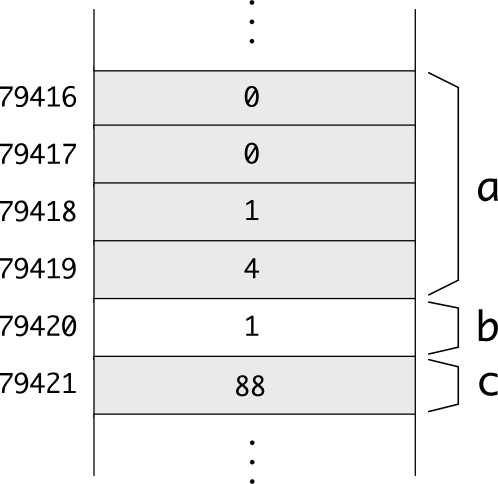

=====================
Punters i Referències
=====================

Punters
=======

Organització de la memòria
--------------------------

La memòria d'un ordinador és una taula molt gran (amb milions de
caselles), i a on cada casella conté un *byte* [#nota1]_. Si un
ordinador té 512Mb de memòria, aquesta taula té :math:`512 \times
1024^2` caselles de 1 byte, que són 536870912. 

Per accedir a una posició de memòria, doncs, hem d'especificar quina
casella volem. El número de la casella (el seu índex), és el que
s'anomena l'**adreça de memòria**. En el cas d'un ordinador amb 512Mb,
l'adreça és, doncs, un enter entre 0 i 536870911. El tamany en bits
d'una adreça és molt important. En un ordinador de 32 bits, la màxima
adreça que es pot manipular és precisament un enter amb 32 bits.

.. exercici::

   En un ordinador amb 4Gb de memòria (:math:`4 \times 1024^3`), quina
   és la primera i la última adreça de memòria?

   Quants bits es necessiten per emmagatzemar l'enter que representa
   l'adreça?

Quan en un programa es reserva espai per a una variable, realment
s'estan agafant unes quantes caselles consecutives de la memòria amb
espai suficient per contenir un valor d'aquell tipus. Per exemple, si
en un programa declarem les variables::

  int a = 260;
  bool b = true;
  char c = 'X';

A la memòria hi haurà

És a dir, ``a`` ocupa les caselles 79416 a 79419, la ``b`` ocupa la
79420 i la ``c`` ocupa la 79421. No podem saber quines seran
exactament les caselles que es faran servir (cada cop que s'executa el
programa poden ser diferents), però sí que estaran més o menys juntes
i el seu tamany [#nota2]_. L'adreça d'una variable és, de fet l'índex
de la *primera casella* (si en té més d'una) que ocupa. En el programa
anterior, l'adreça de ``a`` seria 79416, la de ``b`` 79420 i la de
``c`` 79421.

.. rubric:: L'operador ``sizeof``

La següent taula mostra el tamany que tenen els tipus bàsics:

========== ===================
*Tipus*    *Tamany*
---------- -------------------
``bool``   1 byte
``char``   1 byte
``int``    4 bytes
``float``  4 bytes
``double`` 8 bytes
``string`` 4 o 8 bytes
========== ===================

Però com podem saber el tamany que ocupa un cert tipus? Doncs fent
servir l'operador ``sizeof``, que rep entre parèntesis un tipus, i
retorna una constant que representa el número de bytes que ocupa el
tipus posat. Aquest operador *no* és una funció. Un senzill programa que
permet obtenir la informació de la taula anterior és el següent:

.. literalinclude:: src/05_Punters/sizeof.cpp

Aquest programa fa servir l'operador ``sizeof`` de C++ que permet obtenir el
tamany en memòria (en bytes) d'un tipus qualsevol. El tipus ``string``
ocupa diferent en funció de si l'ordinador és de 32 o 64 bits.

L'operador ``&`` permet obtenir l'adreça d'una variable
-------------------------------------------------------

En un programa podem obtenir l'adreça d'una variable ``a`` posant
``&a``. Per exemple, el programa següent mostra les adreces reals en
què ``a``, ``b`` i ``f`` resideixen:

.. literalinclude:: src/05_Punters/cout_addr.cpp

.. exercici::

   Compila el :download:`programa anterior <src/05_Punters/cout_addr.cpp>` 
   i mira quines adreces surten.

Un punter és una variable que conté una adreça
----------------------------------------------

En C++ no només podem obtenir una adreça d'una variable, també la
podem emmagatzemar. El valor de l'adreça, però, no el podem guardar en
una variable de tipus enter (malgrat és cert que una adreça *és* un
enter). Per emmagatzemar adreces, hem de declarar variables de tipus
especial ja que les adreces a dades de tipus enter són diferents
de les adreces a dades de tipus caràcter (la memòria, cal
recordar-ho, és completament uniforme i sense cap pista, no podem
saber de quin tipus és un grup de *bytes*).

Per exemple, el següent codi declara un punter a enters::

  int *pi;

Els punters es declaren amb un tipus normal però posant asterisc
(``*``) a enganxat a davant del nom de la variable. La variable
``pi``, doncs, pot emmagatzemar adreces de variables que siguin enters
(només!). Per tant, en un programa podem fer el següent::

  int a = 105;
  int *pi;
  pi = &a;

L'assignació del final omple la variable ``pi`` amb l'adreça de la
variable ``a``.

Cada tipus "``X``" té associat un tipus punter "``X *``", per a
variables que contenen adreces a dades tipus "``X``". El següent codi
declara punters de diferents tipus, i els assigna adreces::

  int a, b, c;
  float x, y, z;
  char c, d;

  char *pc, *pd;
  float *pf1, *pf2;
  int *p1, *p2;
  ostream *pos;

  pc = &c;
  pd = &d;
  pf1 = &x;
  pf2 = &x;
  p1 = &a;
  pos = &cout;

.. exercici::

   Declara dos punters de nom ``pc1`` i ``pc2`` a variables de la
   classe ``Complex``.

L'operador ``*`` obté el valor que hi ha en una adreça
------------------------------------------------------

Si disposem d'un punter, això ens dóna accés (indirectament) a una
posició de memòria que conté algun valor. Per accedir a aquest valor a
partir del punter, ja sigui per consultar-lo o modificar-lo, farem
servir l'operador ``*`` (unari!), que es diu "operador d'indirecció" o
"operador de desdirecció". Si tenim un punter ``pi`` que apunta a un
valor enter, per obtenir aquest enter s'escriu ``*p`` [#nota3]_.

El següent programa mostra la utilització d'aquest operador::

  int a = 5;
  int *pi = &a; // pi apunta a 'a'  
  *pi = 3;
  cout << "La variable 'a' val: " << a << endl;

El programa mostrarà per pantalla un ``3``, ja que hem modificat, amb
la instrucció ``*pi = 3`` el valor enter a la posició de memòria a on
``a`` residia, i per tant el seu valor ha canviat.

.. exercici::

   Digues quina és la sortida del següent programa::

     int a = 1;
     int *p1 = &a, *p2 = &a;
     *p1 += 1;
     *p2 += 1;
     cout << a << endl;

.. exercici::

   Digues quina és la sortida del següent programa::

     float x = 1.0, y = 2.0;
     float *pf1 = &x, *pf2 = &y, *pf3;
     pf3 = pf1;
     pf1 = pf2;
     pf2 = pf3;
     *pf1 += 0.5;
     *pf1 = *pf1 / 2.0;
     cout << x << ' ' << y << endl;

La prioritat de l'operador ``*`` respecte a altres operadors
------------------------------------------------------------

Si escrivim un programa com::

  int a = 1;
  int *pa = &a;
  *pa++;
  cout << a << endl;

la sortida pot sembla sorprenent. Un espera que per la pantalla surti
un 2, però no és així. Surt un 1. La raó és que la instrucció
"``*pa++``" s'interpreta com "``*(pa++)``", i no com "``(*pa)++``" que
és el que volem nosaltres. En el programa, doncs, el que s'incrementa
és el punter mateix (l'adreça!), i no pas el valor enter al que
apunta. Això succeeix perquè l'operador d'increment ``++`` és més fort
que l'operador d'indirecció ``*``.

S'ha d'anar amb compte, doncs, a l'hora de manipular punters. Això
també afecta l'accés a tuples::

  struct Punt {
    double x, y;
  };

  int main() {
    Punt a;
    Punt *pa = &a;
    *p.x = 0.0; // error, 'p' no té camps
    *p.y = 1.0; // error, 'p' no té camps
  }

Com que l'operador d'accés a tuples és el més fort de tots, s'aplica
primer i per tant el codi dona un error de compilació. Per arreglar-ho
podem fer servir parèntesis::

    (*p).x = 0.0;
    (*p).y = 1.0;

Així el codi funcionaria perfectament.

.. rubric:: L'operador ``->``

El fet d'haver de posar "``(*p).``" per accedir als camps d'una tupla de
seguida és fa feixuc, i per això C++ té una sintaxi equivalent:
"``p->``". La fletxa es pot interpretar com "accedeix al camp de la
tupla a la que apunta ``p``".  En un programa com l'anterior, doncs,
podriem escriure::

   p->x = 0.0;
   p->y = 0.0;
 
Aquesta notació és més clara (i més fàcil d'escriure) i és utilitzada
majoritàriament.

Pas per referència amb punters
------------------------------

A un punter se li pot sumar i restar un enter
---------------------------------------------

Organització de taules en memòria
=================================

El nom d'una taula és un punter al seu primer element
-----------------------------------------------------

Es pot fer servir un punter com si fos una taula
------------------------------------------------

Les taules de caracters són "strings" de C
------------------------------------------

.. rubric:: Els arguments d'un programa

.. explicar argc i argv

.. [#nota1] Un valor de 8 bits, com un enter entre 0 i 255. El tipus
            ``char`` té aquest tamany.

.. [#nota2] El tamany pot dependre de l'ordinador en concret que es
            faci servir (en concret si és de 32 o 64 bits).

.. [#nota3] El fet que es reaprofita la mateixa notació tant per a la
            declaració com per a l'ús és una font de confusió al
            principi.
