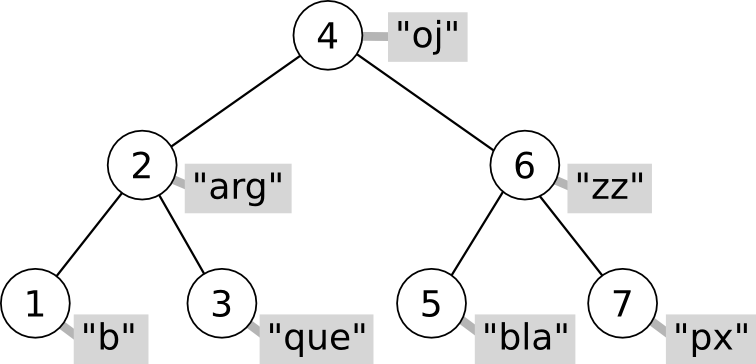

=================================
Piles, Cues i Taules Associatives
=================================

Piles
=====

adaptadors
   Alguns contenidors de la STL s'implementen a partir d'altres. És a
   dir, defineixen mètodes nous però fan servir les operacions
   d'altres contenidors per treballar.

pila 
   *Stack* en anglès. Estructura de dades *Last In First Out*, o LIFO
   (l'últim que va entrar és el primer que surt). Si imaginem les
   piles com estructures verticals (que és la forma que adopten les
   piles d'objectes físics, com ara plats), podem interpretar que
   l'element que ha entrat l'últim està a dalt de tot (el *top*).

Per fer servir piles hem de fer l'``include`` corresponent::

   #include <stack>

Per declarar una pila es fa com amb els altres contenidors de la STL::

   stack<int> S;

que declara una pila d'enters buida. 

Operacions amb piles
--------------------

Les piles són estructures molt bàsiques, només tenen 3 operacions
principals:

- **apilar**, *push* en anglès, que posa un element al damunt de tot
  de la pila. 

- **desapilar**, *pop* en angès, que treu l'element de dalt de tot (i
  deixa al descobert el següent).

- **consultar** el primer, per obtenir el *top*, l'element de dalt de tot, sense
  treure'l de la pila.

Aquestes operacions típiques tenen 3 mètodes especials

Mètodes de la classe ``stack``
------------------------------

Constructors:

.. cfunction:: stack<T>()
   
   Crea una pila buida.

.. cfunction:: stack<T>(const stack<T>& s)
   
   Crea una pila a partir d'una altra.

Els mètodes de la classe ``stack`` són els següents:

.. cfunction:: int stack<T>::size() const
   
   Per obtenir el tamany.

.. cfunction:: bool stack<T>::empty() const
   
   Per saber si la pila està buida. 

.. cfunction:: T& stack<T>::top()
   
   Retorna una referència a l'element de dalt de tot.

.. cfunction:: void stack<T>::push(const T& t)
   
   Apila un element a dalt de tot.

.. cfunction:: void stack<T>::pop()
   
   Elimina l'elemnt de dalt de tot.

.. exercici::

   Què mostra per pantalla el següent codi?
   ::
     
      stack<char> S;
      S.push('l'); S.push('e'); S.push('a');
      S.push('r'); S.push('z'); S.push('A');
      while (!S.empty()) {
        cout << S.top();
	S.pop();
      }

.. exercici::
   
   Fes una acció ``opera`` que rebi una pila d'enters i un caracter
   (que podrà ser només un de ``'+'``, ``'-'``, ``'*'`` i ``'/'``), i
   tregui els 2 valors superiors de la pila, realitzi la operació que
   indica el caracter, i posi el resultat a la pila. En el cas
   de la resta, si el *top* és ``a`` i el de sota ``b``, la resta ha
   de fer ``b - a`` (i semblant amb la divisió).

.. exercici::

   Imagina un programa que fa servir una pila d'enters i rep una
   seqüència d'enters i operacions. Quan rep un enter, l'apila, i quan
   rep una operació, tal com amb l'acció de l'exercici anterior,
   realitza la operació amb els 2 enters de dalt de la pila. Si el
   programa rep "``3 2 +``" deixarà un 5 a la pila. Si rep ``1 1 + 2
   *`` deixarà un 4. Calcula el resultat de les seqüències següents:

   - ``3 3 3 + *``
   - ``3 4 5 1 * + -``
   - ``1 2 + 3 -``
   - ``5 4 * 100 + 2 3 * 10 * -``

   Escriu aquestes expressions de la forma habitual (amb
   parèntesis). Per exemple, la seqüència ``1 1 + 2 *`` seria ((1 +
   1) * 2). La notació amb forma de seqüència s'anomena postfixa o
   polaca (algunes calculadores la fan servir).

.. exercici::
   
   L'acció següent intenta convertir un ``string`` en un enter i si
   pot, retorna ``true`` i fa servir el paràmetre ``val`` per retornar
   el resultat. Si no pot, retorna ``false``. Per fer-la servir és
   necessari fer un ``include`` especial: ``#include <sstream>``.
   ::

      bool es_enter(string s, int& val) {
        istringstream sin(s);
        sin >> val;
        return !sin.fail();
      }

   Amb l'ajuda, doncs, de l'acció ``es_enter`` i l'acció ``opera`` de
   l'exercici anterior, fes un programa que rebi una seqüència de
   paraules (acabada en ``"."``) que poden ser interpretats com enters
   o operadors, en notació polaca. Un exemple de seqüència seria::

      3 2 1 + * .
      
   El programa he de tenir una pila d'enters, i ha de llegir la
   seqüència com si fós de ``string``\s. Donat un element, si aquest
   representa un enter s'ha d'apilar, i si no s'ha de cridar a
   ``opera`` amb el caracter corresponent (podem suposar que la
   seqüència només conté les 4 operacions amb enters). Un cop rebut
   l'últim element (el ``"."``), s'ha de mostrar el *top* de la pila
   per pantalla.
  
Cues
====

cua
   *Queue* en anglès. Estructura de dades *First In First Out*, o FIFO
   (el primer que va entrar és el primer que surt).

Per fer servir cues hem de fer l'``include`` corresponent::

   #include <queue>

Per declarar una cua es fa com amb els altres contenidors de la STL::

   queue<int> S;

que declara una cua d'enters buida.

Operacions amb cues
-------------------

Les cues són estructures també molt bàsiques, i com les piles, només
tenen 3 operacions principals:

- **posar** (també *push*), que inserta un element al final de
  la cua.

- **treure** (també *pop*), que treu l'element del principi de la cua
  (el *front*).

- **consultar** el primer, per obtenir el *front*, el primer element.

Mètodes de la classe ``queue``
------------------------------

Constructors:

.. cfunction:: queue<T>()
   
   Crea una cua buida.

.. cfunction:: queue<T>(const queue<T>& s)
   
   Crea una cua a partir d'una altra.

Altre mètodes:

.. cfunction:: int queue<T>::size() const
   
   Per obtenir el tamany.

.. cfunction:: bool queue<T>::empty() const
   
   Per saber si la cua està buida. 

.. cfunction:: T& queue<T>::front()
   
   Retorna una referència al primer element.

.. cfunction:: T& queue<T>::back()
   
   Retorna una referència a l'últim element.

.. cfunction:: void queue<T>::push(const T& t)
   
   Inserta un element al final de la cua.

.. cfunction:: void queue<T>::pop()
   
   Elimina el primer element.

.. exercici::

   Determina el que mostrarà el següent codi per pantalla::

     queue<int> Q;
     for (int k = 3; k < 9; k++) Q.push(k);
     int& f = Q.front();
     f = 5;
     int& b = Q.back();
     b = 11;
     while (!Q.empty()) {
       cout << Q.front() << ' ';
       Q.pop();
     }
     

Taules associatives
===================

taula associativa
  Una taula associativa és un contenidor de parelles de valors. Cada
  parella està composada d'una **clau** (o *key*, en anglès) i un
  **valor** (o *value*). El contenidor està organitzat especialment
  per buscar eficientment aquestes parelles fent servir la clau.

Parelles
--------

La STL ofereix una plantilla per crear tuples de 2 valors (o parelles)
de forma molt senzilla. El tipus parella s'anomena ``pair<A,B>`` a on
``A`` i ``B`` són tipus qualssevol. Les taules associatives fan servir
``pair`` per emmagatzemar els elements. Declarar parelles és tan
senzill com::

   pair<int,char> p1, p2;
  
Aquest codi declara dues variables (``p1`` i ``p2``) que contenen,
cadascuna, un valor ``int`` i un valor ``char``. Els camps de la
parella tenen els noms ``first`` i ``second`` per definició, i tenen
els tipus ``int`` i ``char`` en aquest cas (``first`` tindrà el primer
tipus i ``second`` el segon). Per tant, si volem que ``p1`` contingui
els valors ``12`` i ``'q'`` farem::

   p1.first = 12;
   p1.second = 'q';

En definitiva, quan declarem una variable de tipus ``pair<int,char>`` ens
estem *estalviant* haver de declarar primer una tupla com la següent::

   struct tParella {
     int first;	   
     char second;
   };

Els tipus de la parella poden ser qualssevol, i com en tots els altres
contenidors de la STL, podem crear parelles de tipus (i per tant,
classes) que haguem definit nosaltres::

   pair<string,Data> p;

Per omplir la parella en el moment de la construcció, es pot fer
servir un constructor amb dos paràmetres::
 
   pair<int,string> q(10, "Satriani");

.. exercici::

   Declara el següent:

   - Una parella amb un real i un Booleà.
   - Una parella amb dos enters, inicializats a -1 i 13 (fent servir
     el constructor).

.. exercici::

   Declara un vector de 3 caselles de parelles d'un enter i un
   caràcter i omple el vector amb les parelles (``'a'``, 1), (``'b'``,
   2) i (``'c'``, 3).

.. exercici::

   Fes una funció que rebi una llista de parelles d'un ``string`` i un
   enter i esborri de la llista aquelles parelles a on l'enter sigui
   negatiu.

Construcció ràpida (``make_pair``)
""""""""""""""""""""""""""""""""""

Sovint sorgeix la necessitat de passar parelles de valors com a
paràmetres. Per exemple, suposem la funció::

   bool func_X(const pair<string,int>& p) {
     // ...
   }

I suposem que la volem cridar amb una parella amb els valors ``"Oh!"``
i 5. Podem declarar primer una parella amb aquests valors i
passar-la com a paràmetre::

  pair<string,int> oh("Oh!", 5);
  func_X(oh);

o podem crear amb ``make_pair`` una parella només per poder cridar la
funció. La funció ``make_pair`` es crida amb 2
valors i retorna un ``pair`` del tipus dels valors que hem passat::

  func_X(make_pair("Oh!", 5));

.. exercici::
   
   Suposa que tens una acció com::
  
     void resultat_partit(const pair<string,int>& local,
                          const pair<string,int>& visitant) {
       // ...
     }

   Cada paràmetre és un dels equips, amb el seu nom i el número de
   gols. Fent servir ``make_pair``, crida l'acció ``resultat_partit``
   amb el següent resultat: (Matalascanyas, 5), (Zurrianico, 1).

Taules associatives
-------------------

Les taules associatives són força diferents dels contenidors
seqüencials com la llista o el vector. La principal diferència és que
els elements es guarden en un arbre i es mantenen en un ordre concret
que permet la cerca ràpida.

Cada node de l'arbre té una clau, dues branques i el valor associat
(en el dibuix és un ``string`` i està en gris). Tenint en compte la
clau de qualsevol node de l'arbre, per la branca de l'esquerra es pot
accedir a aquells elements amb clau *menor* i per la de la dreta als
elements amb una clau *major*. Per exemple, el node del dibuix que es
troba a l'arrel (el que conté un 4), té a l'esquerra els nodes 1, 2 i
3, i a la dreta el 5, 6 i 7.

La cerca en un arbre amb aquesta estructura és força ràpida. La cerca
comença al node "arrel" (el 4 en el dibuix). Es tracta de mirar si la
clau que busquem és més gran, més petita o igual que 4. Suposem que és
més gran. Llavors hem de situar-nos a la branca de la dreta (que té un
6), i tornar a fer la mateixa pregunta. És fàcil veure que, si l'arbre
està equilibrat, cada cop de escollim una branca estem descartant la
*meitat* dels elements del contenidor. Això fa que la cerca en un
arbre així tingui un cost logarítmic.

.. exercici::

   Quantes vegades haig de dividir per 2 el número 2048 per tal que
   sigui igual que 1? 

.. exercici::

   Quantes iteracions (com a màxim) hauré de fer en una taula
   associativa (perfectament equilibrada) de 512 elements per tal de
   trobar un element?

.. exercici::

   Quantes iteracions (com a màxim) hauré de fer en una taula
   associativa de ``n`` elements per trobar-ne un.

La classe ``map``
-----------------

La classe ``map`` implementa una taula associativa fent servir un
arbre que emmagatzema parelles de valors (de tipus ``pair``). Per fer
servir la classe ``map`` és necessari fer l'include següent::

   #include <map>

Per declarar un ``map`` hem d'especificar dos tipus: el tipus de la
clau i el tipus del valor associat a aquesta clau::

   map<string, int> dies_mes;

En aquest cas, declarem una taula associativa que associa ``string``\s
amb enters. 

Les taules associatives imposen certs **requeriments sobre el tipus de
la clau**:

- Constructor per defecte.
- Operador d'assigació (``operator=``).
- Operador de comparació (``operator<``). Aquest últim és molt
  important ja que la taula associativa ordena implícitament els
  elements fent servir la clau.
- Cada clau diferent es pot associar només a *un* valor.

Accéss simple als valors
""""""""""""""""""""""""

L'accés als valors de la taula es pot fer amb l'operador ``[]``, tal
com en el vector. Tenint en compte la declaració de ``dies_mes``
anterior, per associar els noms dels mesos amb el número de dies que
tenen, faríem::

   dies_mes["gener"] = 31;
   dies_mes["febrer"] = 28;
   dies_mes["març"] = 31;
   dies_mes["abril"] = 30;
   dies_mes["maig"] = 31;
   ...

La notació amb el corxet és anàloga a la del vector, si bé és
important remarcar dues diferències importants:

- En les taules associatives, el valor que va entre corxets *no és
  necessàriament un enter*, com en els vectors.

- Una taula associativa que contingui 10 elements i que faci servir
  enters com a clau *no té perquè contenir totes les claus
  desde 0 fins a 9*. Les claus d'aquesta taula poden molt bé ser,
  simplement: 2, 5, 15, 20, 21, 22, 30, 40, 100, i 101.

A part d'aquestes diferències amb el vector, un aspecte sobre
l'operador corxet és de gran importància:

.. note::

   Quan accedim amb el corxet a un element amb una clau que no
   existeix en la taula associativa, es crearà l'element amb el valor
   per defecte

Això implica que si fem::

   map<string, int> M;
   int x = M["hola"];
   cout << x << endl;

per pantalla sortirà un ``0``, i el ``map`` contindrà una parella que
associa ``"hola"`` amb el valor 0, malgrat no l'hem insertat
explícitament. Aquesta forma d'accés a les parelles de la taula
associativa és còmoda però n'estudiarem d'altres que ofereixen un
major control sobre la inserció.

.. exercici::

   Declara una taula associativa amb clau ``string`` i valors reals i
   posa-hi els valors: (``"pi"``, 3.14159), (``"e"``, 2.71828),
   (``"arrel2"``, 1.41421).

Operacions en taules associatives
---------------------------------

Les operacions bàsiques d'una taula associativa són:

- **Inserció** d'una nova parella (associació d'una clau i un valor).

- **Cerca** del valor associat a una clau (alhora determinació de la seva
  existència en la taula).

- **Esborrat** d'una parella clau-valor.

Les taules associatives també admeten recorreguts amb ``iterators``,
que visiten els elements per l'ordre de les claus. Quan recorrem un
``map``, els elements són parelles, per tant les claus les trobem en
el camp ``first``, i els valors associats al camp ``second``.

Inserció
""""""""

Per insertar una parella en una taula associativa, primer s'ha de
crear la parella amb el constructor ``make_pair``, i cridar el mètode
``insert`` (suposant la declaració de ``dies_mes`` de més amunt)::

   dies_mes.insert(make_pair("juny", 30));
   dies_mes.insert(make_pair("juliol", 31));

El mètode ``insert`` retorna un iterador que apunta a l'element que
hem insertat, per si necessitem aquest iterador. Per exemple, el
següent codi inserta la parella (``"desembre"``, 30) i després
canvia els dies a 31::

   map<string,int>::iterator i;
   i = dies_mes.insert(make_pair("desembre", 30));
   i->second = 31;  // canvia els dies de "desembre"
   

Cerca
"""""

Per saber si una taula associativa conté un cert element, farem servir
el mètode ``find``. Aquest mètode retorna un iterador a l'element, si
s'ha trobat, o un iterador al final del contenidor (l'``end()``), si
no s'ha trobat. Per exemple::

   map<string,int>::iterator i = dies_mes.find("març");
   if (i != dies_mes.end()) {
     cout << i->first << "té " << i->second << " dies" << endl;
   }

Esborrat
""""""""

Donat un iterador a un element d'un ``map``, el mètode ``erase``
esborra l'element del ``map``. Obtenir l'iterador pot implicar fer una
cerca abans, per esborrar el mes de Novembre farem::

   map<string,int>::iterator i = dies_mes.find("novembre");
   if (i != dies_mes.end()) {
     dies_mes.erase(i);
   }

Una altra versió de ``erase`` *només requereix l'ús de la clau*, i
esborra l'element amb aquella clau (si hi és). El següent codi, doncs,
fa el mateix que l'exemple anterior::

   dies_mes.erase("novembre");

.. exercici::

   Fes un programa que llegeixi una seqüència d'enters d'un fitxer
   ``"enters.txt"`` i mostri per pantalla un histograma. L'histograma
   ha de comptar quantes vegades ha aparegut cada enter a la
   seqüència.

.. exercici::

   Fes un programa que llegeixi un fitxer ``"fruites.txt"`` amb una
   llista de fruites i quantitats com la següent::

      peres 10 pomes 5 plàtans 15 kiwis 13 pomes 2 peres 4 plàtans 3
      maduixes 5 kiwis 1 maduixes 7 peres 2 ...

   i mostri per pantalla la suma de quantitats de cada fruita i també
   el total.

Resum de mètodes de ``map``
---------------------------

.. cfunction:: int map<K,V>::size()

   Retorna el tamany del contenidor.

.. cfunction:: bool map<K,V>::empty()

   Retorna ``true`` si el contenidor està buit.

.. cfunction:: void map<K,V>::clear()

   Esborra tots els elements.

.. cfunction:: iterator map<K,V>::insert(const pair<K,V>& p)

   Inserta una parella clau-valor en la taula associativa.

.. cfunction:: iterator map<K,V>::find(const C& clau)

   Retorna un iterador a l'element amb certa ``clau`` o ``end()``
   si no s'ha trobat. 

  
.. cfunction:: void map<K,V>::erase(iterator pos)

   Esborra el parell clau-valor que apunta el iterador ``pos``.

.. cfunction:: void map<K,V>::erase(const C& clau)

   Esborra el parell amb certa ``clau``.

Eficiència dels mètodes de ``map``
----------------------------------

En la taula següent es fa una comparació de les eficiències dels tres
contenidors (excepte ``stack`` i ``queue`` que són adaptadors)
estudiats, en les operacions d'interès per a les taules associatives:

================== ============ ============ =================
Operació           ``vector``   ``list``     ``map``  	 
================== ============ ============ =================
Accés              :math:`O(n)` :math:`O(1)` :math:`O(\log n)`
Inserció/Esborrat  :math:`O(1)` :math:`O(n)` :math:`O(\log n)`
================== ============ ============ =================

Les taules associatives són útils quan volem associar dades amb claus
que no es tradueixen fàcilment a enters (perquè si fós així fariem
servir un vector) o les claus formen un conjunt d'enters a on hi ha
molts "forats" (conjunts anomenats *sparse*), com per exemple: {1, 5,
20, 100, 200, 500, i 1000}. Les taules associatives no són de tan
ràpid accés com els vectors (però no tan lentes com les llistes), ni
són de inserció ràpida com les llistes (però no tan lentes com els
vectors). 

L'ús de les taules associatives, doncs, té avantatges quan en un
programa necessitem inserir sovint dades en el contenidor i també
sovint necessitem accedir a les dades que hem insertat.

Problemes
---------

.. problema::

   Dissenya un programa per calcular la taula de les 25 paraules més
   freqüents d'un text. La freqüència de cada paraula és el nombre de
   vegades que apareix en el text. El programa ha de llegir un fitxer
   amb el text (pots obtenir textos a `Project Gutenberg
   <http://www.projectgutenberg.org>`), llegir la seqüència de
   paraules (que cal passar a minúscules i netejar de signes de
   puntuació), calcular la freqüència de les paraules i finalment
   mostrar les 25 més freqüents i quantes vegades apareixen.

.. problema::

   Es necessita un programa per organitzar la informació interna de
   les trucades de telèfon d'una empresa. El format de les dades és un
   fitxer amb una seqüència de trucades com::

     + 2008/20/11 00:00:26 44 admin
     + 2008/20/11 00:00:44 55 montse
     - 2008/20/11 00:52:58 44 admin
     - 2008/20/11 01:17:28 55 montse
     + 2008/20/11 02:12:47 69 montse
     - 2008/20/11 02:19:36 69 montse
     + 2008/20/11 02:28:20 83 montse
     - 2008/20/11 02:32:02 83 montse
     + 2008/20/11 12:28:16 56 montse
     - 2008/20/11 12:29:29 56 montse
     + 2008/20/11 18:36:18 69 admin
     - 2008/20/11 18:58:24 69 admin

   El primer caràcter indica quan comença ("``+``") o acaba ("``-``") la
   trucada (com que les dades estan ordenades per l'hora, una trucada
   sencera són 2 línies possiblement separades). El segon camp indica
   la data ("``any/dia/mes``"), el tercer l'hora i el quart i cinquè són
   l'extensió que s'ha marcat i l'usuari que ha fet la trucada.

   Es vol obtenir un resum d'aquestes dades en el format següent::

     Ext 44:
         admin 2008/20/11[00:00:26--00:52:58]
     Ext 55:
         montse 2008/20/11[00:00:44--01:17:28]
     Ext 56:
         montse 2008/20/11[12:28:16--12:29:29]
     Ext 69:
         admin 2008/20/11[18:36:18--18:58:24]
         montse 2008/20/11[02:12:47--02:19:36]
     Ext 83:
         montse 2008/20/11[02:28:20--02:32:02]

   El format indica cada extensió que ha rebut trucades, i una llista
   d'usuaris que les han fet. Seguit de cada usuari hi ha una llista de
   les trucades amb la data i la hora inicial i final entre corxets.

   S'ha de seguir el format exactament tal com surt, respectant
   l'espai a l'esquerra, la puntuació ("``:``" i "``--``", etc). En
   particular, les 12 de la nit en punt hauria de sortir com
   "``00:00:00``". Feu servir fitxers de prova per provar el programa (
   :download:`tel1.txt <src/07_Vectors_i_Llistes/tel1.txt>` i
   :download:`tel2.txt <src/07_Vectors_i_Llistes/tel2.txt>`).
