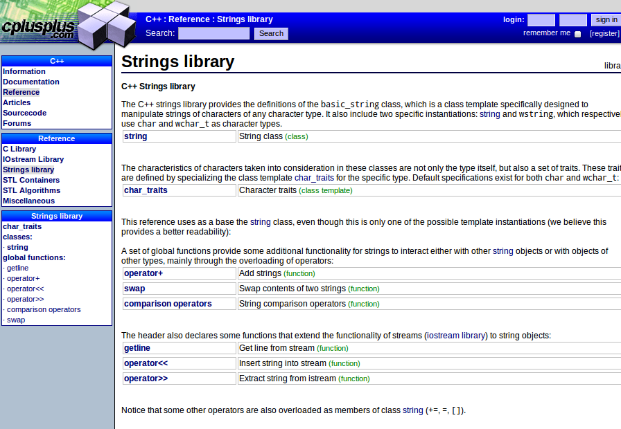

==============
Classes
==============

.. tema:: lab.cl

.. rubric:: Objectius

- Fer servir mètodes de classes de la llibreria estàndar.

- Passar de TAD a classe.

- Dividir un programa en diferents fitxers.

- Implementar constructors.

.. contents:: Contingut 
   :depth: 2
   :local:

En la pràctica anterior hem obtingut un programa que permet invertir
una imatge en color. En aquesta pràctica veurem com ampliar el
programa i afegir alguna funcionalitat fent servir classes.

Utilització de classes
======================

El treball amb classes té dues vessants: 

- o bé som "usuaris" de classes, i per tant fem servir classes que han
  fet altres (com ara ``string`` i ``ofstream``);

- o bé som "creadors" de classes, i ens toca fer noves classes
  i per tant hem d'escriure la declaració de la classe i implementar
  tots els seus mètodes.

En aquesta secció ens situarem a la primera opció, és a dir, mirarem
quins mètodes existeixen (i estan documentats) per classes que hem fet
servir fins ara. 

La classe ``string``
--------------------

A la pàgina web:

  `http://cplusplus.com/reference <http://cplusplus.com/reference>`_

hi ha una llista dels possibles fitxers "``#include``" que hi ha a la
llibreria estàndar de C++. Per exemple, clica a l'"``string``" per
veure què hi ha disponible quan posem "``#include <string>``". La
documentació ens descriu les classes que hi ha i quins mètodes
tenen. La pàgina principal de l'ajuda per ``#include <string>`` és,
aproximadament:

Si mires la classe ``string`` en concret (el primer link), veuràs els
mètodes de la classe y què signifiquen.

.. exercici::

   Consulta la documentació dels mètodes ``find``, ``find_last_of``, i
   ``insert``. Mira els exemples i si no els entens fes proves fins
   que vegis com utilitzar aquests mètodes.

.. exercici::

   Afegeix una funció al programa (l'inversor d'imatges) que es digui
   ``es_fitxer_ppm`` que rep un ``string`` anomenat ``nom`` i retorna
   cert si ``nom`` és de la forma: "``groucho.ppm``" o
   "``imatge.ppm``", és a dir, té un punt al final i l'extensió és
   "ppm". 

   Ara modifica el ``main`` per tal de comprovar si el fitxer que ha
   indicat l'usuari és PPM (fent servir la funció ``es_fitxer_ppm``) i
   si no ho és, mostra un missatge i acaba el programa (amb
   ``exit(1);``). Això fa que el programa sigui més robust i si li
   poses un fitxer que d'entrada es veu que no serà compatible no
   s'executi.

.. exercici::
   
   Fes una funció ``nom_fitxer_de_sortida`` que rebi un ``string``
   anomenat ``nom`` i retorni un altre ``string`` seguint la regla
   següent:

     ================ =================
     Nom entrada      Nom sortida    
     ================ =================
     ``groucho.ppm``  ``groucho_i.ppm``
     ---------------- -----------------
     ``imatge.ppm``   ``imatge_i.ppm``
     ---------------- -----------------
     ``chico.ppm``    ``chico_i.ppm``
     ================ =================

   És a dir, cal intercalar "``_i``" entre el nom i l'extensió. 

   Aquest nom amb la "``_i``" el farem servir de ``nomfout`` (el nom
   del fitxer de sortida). 

   Treu del ``main``, doncs, la pregunta sobre el nom del fitxer de
   sortida i genera el nom amb la funció
   ``nom_fitxer_de_sortida``. Això ens evita haver d'entrar el nom de
   sortida cada cop.

.. exercici::

   Consulta la documentació sobre la classe ``ifstream`` i busca el
   mètode ``is_open``.

   Ara afegeix al ``main`` un ``if`` a on es miri si el fitxer d'entrada
   s'ha pogut obrir i si no s'ha pogut, mostri per pantalla un
   missatge de "No s'ha pogut obrir el fitxer X" i acabi el programa.

   Fes el mateix per al fitxer de sortida (per controlar el cas en
   què no pots escriure el fitxer per algun motiu). El mètode
   ``is_open`` també existeix a la classe ``ofstream``.

Amb aquests canvis, el programa és molt més robust a possibles
contingències, ja sigui noms de fitxer mal posats, fitxers que no es
poden obrir o fitxers que no es poden escriure.

De struct a class
=================

Ara podem transformar el TAD ``Pixel`` en una classe. Cal recordar que
el canvi ha de mantenir les funcions membre com a públiques per a que
siguin accessibles des de la funció ``main``.

.. exercici::

   Converteix el TAD ``Pixel`` en una classe. Per a fer-ho caldrà
   canviar de ``struct`` a ``class`` a la seva declaració. A més
   caldrà utilitzar la directiva ``public:`` amb les funcions membre.
   Afegeix també un constructor per defecte que ompli un ``Pixel`` de
   color negre (tot zeros).

.. exercici::

   Converteix el TAD ``Imatge`` en una classe. Afegeix també un
   constructor per defecte, que posi el tamany de la imatge a zero (no
   cal omplir la taula de ``Pixel``\s).

Ara el programa ha de seguir funcionant però està cada cop millor
organitzat.

Partim el programa en diferents fitxers
=======================================

Ara cal dividir el programa en fitxers, posant cada classe en un
fitxer apart. Cal crear:

  - ``pixel.h``, amb la declaració de la classe ``Pixel``,
  - ``pixel.cpp``, amb la *implementació* de la classe ``Pixel``,
  - ``imatge.h``, amb la declaració de la classe ``Imatge``,
  - ``imatge.cpp``, amb la *implementació* de la classe ``Imatge``,
  - ``inverteix.cpp``, amb el programa principal.

Tots els fitxers han d'estar en un mateix directori. El fitxer
``pixel.cpp`` a dalt de tot ha de tenir::

  #include "pixel.h"

i el fitxer ``imatge.cpp`` a dalt de tot ha de tenir::

  #include "pixel.h"
  #include "imatge.h"

i finalment, el programa principal ha de tenir::

  #include "pixel.h"
  #include "imatge.h"

.. exercici::

   Busca la manera de crear un "projecte" amb el teu editor de codi i
   posa els 3 fitxers "``.cpp``" a dins del projecte (normalment no
   cal posar els "``.h``"). Compila el programa.

Separar els fitxer té l'avantatge de que podem crear nous programes
que fan servir la classe ``Imatge`` i la classe ``Pixel`` fàcilment.

.. exercici::

   Crea un nou programa que crea una imatge (és a dir, declara un
   objecte ``I`` de la classe ``Imatge``, com en el programa anterior)
   i després la guarda directament en un fitxer (sense haver-la
   llegit). Quins valors contindrà el fitxer de sortida? Què creus es
   veurà en aquesta imatge?
   

Constructor de còpia
====================

Per millorar la classe ``Imatge``, li afegirem un constructor de
còpia. Així si hem llegit una imatge podem fer-ne una còpia en memòria
fàcilment. 

.. exercici::

   Afegeix el constructor de còpia a la classe ``Imatge`` i
   implementa'l. Cal que el constructor faci una còpia de *tots* els
   atributs de l'estructura ``Imatge``.
   
