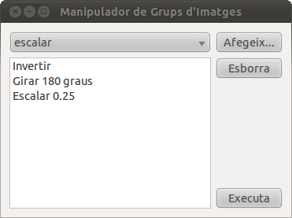

.. tema:: lab.poli

.. Polimorfismo

=======================================
Qt: Editor automàtic de grups d'imatges
=======================================

.. rubric:: Objectius

- Aplicar el polimorfisme per fer llistes heterogènies.

Una ampliació de l'inversor d'imatges
=====================================

En una pràctica anterior hem fet un inversor d'imatges que permetia
seleccionar vàries imatges i guardar al disc les imatges
invertides. Però, i si volguéssim fer manipulacions més complexes, com
ara escalar, girar, etc? En general és molt feixuc fer la mateixa
manipulació a moltes imatges alhora perquè has d'anar una per una i
pren molt temps. Podem ampliar, doncs, el programa que invertia
imatges perquè apliqui una seqüència de transformacions a un grup
d'imatges.

El programa tindrà la finestra principal com la següent:

La llista de dalt permet seleccionar una de les manipulacions
disponibles. Al costat hi ha un botó que l'afegeix a la llista (amb
fons blanc). Per exemple, si afegim una inversió, un gir i un escalat,
la finestra seria:

Per esborrar elements de la llista de manipulacions tenim el botó
"Esborrar". Finalment, el botó "Executa" ens obrirà un quadre per
seleccionar fitxers d'imatges i executarà les operacions indicades a
la llista.

Part 1: GUI de l'aplicació
==========================

GUI
  *Graphical User Interface*, o interfície gràfica d'usuari.

Creació d'un projecte Qt d'entorn gràfic
----------------------------------------

Fins ara hem estat creant projectes Qt buits, a on escriviem tot el
codi nosaltres. Ara en crearem un en què Qt Creator ens escrivirà la
part més repetitiva del codi. Hem de crear un projecte nou (s'ha de
buscar un nom descriptiu, com ara ``image_edit`` o ``image_manip``,
etc) i farem servir la opció *File* |-->| *New File or project...*, i
escollirem *Qt GUI Application*, tal com es mostra a la imatge següent

.. image:: img/qt_gui_application.png
   :scale: 80
   :align: center

La creació del projecte té 3 passos:

- Primer haurem de posar el nom del projecte i situar-lo en un
  directori adequat.

- Després haurem de dir de quina classe heredarà la nostra finestra
  principal i com es dirà. Li direm ``Finestra`` i farem que heredi de
  ``QWidget``. És important desmarcar la casella "*Generate form*",
  perquè no el necessitem.

- Finalment, se'ns fa un resum de la classe que es generarà. Cliquem a
  "*Finish*".

Això ens generarà 3 fitxers:

- ``main.cpp``, que ja té un objecte ``QApplication`` i un objecte
  ``Finestra`` i ja crida a ``show`` i ``exec`` (tot això que ens
  estalviem d'escriure).

- ``finestra.h``, que declara una classe derivada de ``QWidget``, ens
  posa els ``#ifndef``\-``#endif`` i la marca ``Q_OBJECT``, etc.

- ``finestra.cpp``, a on s'implementa un constructor que com a mínim
  s'encarrega de cridar al constructor de ``QWidget``.

Tot això gratis. Hi ha algunes coses en aquest codi interessants. Per
exemple, la declaració del constructor de ``Finestra`` és::

  Finestra(QWidget *parent = 0);

Què significa el "``= 0``"? Doncs és el valor del *paràmetre per
defecte*. Si posem això, el constructor pot rebre 1 paràmetre o
cap. Si en posem un, s'aplica el mètode tal com està definit. Si no en
posem cap, realment el mètode es cridarà amb un paràmetre, però
valdrà 0. Còmode, no?

Després hi ha un mètode extrany anomenat ``~Finestra``. Aquest mètode
s'anomena el "destructor" i és l'invers del constructor: s'encarrega
de fer les operacions necessàries per destruir un objecte. Molt sovint
no és necessari definir-lo perquè no cal fer res quan una ``Finestra``
desapareix, però Qt ens el posa per si l'hem d'utilitzar. De moment no
el tocarem.

Total, que sense escriure una línia de codi, podem compilar el
programa i executar-lo i sortirà una la nostra ``Finestra``. 

Elements de la finestra
-----------------------

Ara cal afegir els elements de la finestra. Necessitem els següents:

- ``_seleccio``: un ``QComboBox``, nom divertit que tenen les llistes
  desplegables.

- ``_llista``: un ``QListWidget``, la llista a on aniran les
  manipulacions.

- ``_afegeix``, ``_esborra``, ``_executa``: tres botons
  ``QPushButton``.

Tots ells seran punters i s'han de posar com a atributs de la classe
``Finestra.h``. Això implica que al costat de la línia::

  #include <QtGui/QWidget>

S'han de posar els ``#include``\s corresponents per a cada classe
que es fa servir. 

Posa'ls i compila el programa. Casi no hem fet res, però cada cop que facis
una modificació, encara que sigui petita, compila el programa, a veure
si surten errors. Si en surten, serà perquè la última cosa que has
escrit està malament, i com que has escrit poca cosa, de seguida podràs
veure què falla. D'aquesta manera pots tenir el programa sempre
funcionant i net d'errors.

Hem d'anar al constructor i inicialitzar els elements:

.. literalinclude:: src/qt_editor_grups_imatges/imagemanip-1/finestra.cpp
   :start-after: //+1
   :end-before:  //-1

Després els hem de posar en un *layout*. En aquest cas farem servir un
``QGridLayout``, perquè ens permet distribuir els elements com en una
taula:

.. literalinclude:: src/qt_editor_grups_imatges/imagemanip-1/finestra.cpp
   :start-after: //+2
   :end-before:  //-2

En afegir la llista es fan servir 4 paràmetres perquè se situa a la
fila 1 i columna 0 però ocupa 4 files i 1 columna.

Després omplirem la ``_seleccio`` amb 2 manipuladors: "inverteix" (que
era la implementació original del programa), i "gira" que serà la nova
operació:

.. literalinclude:: src/qt_editor_grups_imatges/imagemanip-1/finestra.cpp
   :start-after: //+3
   :end-before:  //-3

De moment ens quedarem amb aquestes dues i més endavant prepararem el
programa per poder afegir-ne d'altres.

Torna a compilar el programa i veuràs que tot està al seu lloc, però
si cliques qualsevol botó no funcionarà, perquè ens falta connectar el
*signals* i *slots*.

Connexió dels elements: nous events
-----------------------------------

Per poder respondre als senyals que envien els elements de la
finestra, hem de crear *slots* a la nostra classe ``Finestra`` ja que
serà el receptor dels events. En Qt això es pot fer afegint a la
declaració de la classe una "secció" així::

  public slots:
    void afegeix();
    void esborra();
    void executa();

La secció ``public slots`` és completament particular de Qt, no és del
llenguatge C++. El que fa és declara mètodes ``public`` però que es
poden fer servir com a receptors de senyals.

Ara caldria implementar-los. En el *slot* ``afegeix`` responem al botó
"Afegeix...", que el que fa és afegir a la llista d'operacions la
operació que està seleccionada al ``QComboBox``::

  void Finestra::afegeix() {
    _llista->addItem(_seleccio->currentText());
  }

Fem servir el mètode ``QListWidget::addItem`` que permet afegir un
element basant-se amb un text, i traiem el text amb el mètode
``QComboBox::currentText``, que agafa el text que hi ha seleccionat a
la ``_seleccio``.

Al *slot* ``esborra`` hem d'esborrar l'element seleccionat a la
llista, si n'hi ha un::

  void Finestra::esborra() {
    _llista->takeItem(_llista->currentRow());
  }  

Fem servir el mètode ``QListWidget::takeItem`` que treu un element de
la llista escollit amb un enter (l'índex de l'element) i traiem aquest
índex amb ``QListWidget::currentRow`` (o sigui, la fila actual).

El *slot* ``executa`` quedarà buit de moment perquè és la part més
complicada. De moment volem veure si els events funcionen.

L'últim pas és connectar els *signals* i *slots*. Essencialment volem
respondre als 3 botons, de manera que cal afegir al constructor de
``Finestra`` el següent::

  connect(_afegeix, SIGNAL(clicked()), this, SLOT(afegeix()));
  connect(_esborra, SIGNAL(clicked()), this, SLOT(esborra()));
  connect(_executa, SIGNAL(clicked()), this, SLOT(executa()));

És interessant que Qt Creator, quan escrivim ``SIGNAL`` o ``SLOT`` ens
suggereix els possibles *signals* o *slots* que hi ha, i efectivament,
apareixen ``afegeix``, ``esborra`` i ``executa``.

Ara compila el programa i prova de clicar els botons, i veure si
funcionen correctament. Prova també d'afegir molts elements a la
llista i a redimensionar la finestra. Veuràs que surten barres de
*scroll* al costat de la llista o no en funció de si es poden mostrar
tots els elements. Tot això és gratis, també.

Implementació del mètode ``executa``
------------------------------------

En aquest mètode hem de fer el següent:

- Invocar el quadre de diàleg de fitxers, perquè l'usuari esculli el
  grup de fitxers als quals vol aplicar les manipulacions. Això donarà
  lloc a una llista de tipus ``QStringList``, com haviem vist.

- Fer una iteració d'aquesta llista i per a cada nom de fitxer,
  aplicar les operacions en ordre. Les operacions, però, estan
  guardades al ``QListWidget`` (l'atribut ``_llista``) i per tant hem
  de recórrer els ítems d'aquest objecte. Per a cada element, mirem
  quina paraula és i si és "Inverteix" invertim la imatge que hem
  llegit i si és "Gira" girem la imatge.

Com que això és molta feina, primer farem un mètode privat a la classe
``Finestra`` que ens permetrà aplicar les transformacions a només un
sol nom de fitxer (en aquest mètode farem el recorregut de les
operacions). 

El mètode ``_executa_un``
"""""""""""""""""""""""""

Al nou mètode li direm ``_executa_un``, i rebrà un paràmetre
``QString`` que serà ``nomfitxer``. El nom comença amb "``_``"
perquè així recordem que és privat, tal com amb els atributs. La
implementació serà aquesta:

.. literalinclude:: src/qt_editor_grups_imatges/imagemanip-1/finestra.cpp
   :linenos:
   :start-after: //+8
   :end-before:  //-8

Aquest mètode obre primer el fitxer amb la imatge (línia 1). Després
realitza una iteració començant a 0 i acabant al nombre d'elements de
``_llista`` (que obtenim amb el mètode ``count``, línia 2). A la línia
3 hi ha una expressió força interessant::
  
   _llista->item(i)->text();

Aquesta expressió encadena dos crides a mètodes. La primera és
``_llista->item`` que crida el mètode ``QListWidget`` per obtenir
l'ítem ``i``\-èssim. El que passa és que aquest mètode no retorna un
``QString``, retorna un punter a un ``QListWidgetItem``. Aquest
objecte té un mètode ``text`` que finalment ens permet saber el text
que té l'ítem en concret. Així doncs, la línia 3 és totalment equivalent a
les dues línies següents::
 
   QListWidgetItem *elem = _llista->item(i);
   QString operacio = elem->text();

En comptes d'haver de crear una variable ``elem`` només per guardar
temporalment el resultat de la crida a ``QListWidget::item``, podem
posar una altra fletxa i cridem a ``text`` directament. El resultat és
una expressió molt més curta i entenedora, de fet.

Un cop tenim el nom de la operació, hi ha un ``if`` que decideix què
s'ha de fer amb la imatge. La inversió ens és coneguda (línia 5), el
gir és una mica diferent (línies 7 a 9). Fa servir el mètode
``QImage::transformed``, que rep una matriu ``QMatrix`` que és la que
especifica la transformació. A la matriu se li aplica la rotació amb
``QMatrix::rotate`` i el mètode ``QImage::transformed`` retorna una
*nova imatge* que assignem a ``I`` un altre cop per quedar-nos amb la
imatge girada (a diferència del mètode ``QImage::invertPixels`` que
modifica la imatge *in situ*).

De qualsevol manera, se surt de l'``if`` (línia 10) amb la imatge
modificada, a punt per fer la pròxima iteració del ``for``.

Finalment, es guarda la imatge amb un nom que afegeix ``"_m"`` abans
de l'extensió (``jpg``, ``png``, ``gif`` o el que sigui). Primer es
busca l'últim ``"."`` del nom del fitxer amb ``QString::lastIndexOf``:

- Si es troba el punt, es crida una versió de ``replace`` que
  substitueix a partir de l'índex trobat i un cert número de caracters
  (en aquest cas només 1) amb el text que posis (línia 14).

- Si no es troba, simplement s'afegeix ``"_m"`` al final del fitxer
  (línia 16).

Sobretot, compila el programa per veure que no té errors.

El mètode ``executa``
"""""""""""""""""""""

Ara ja podem implementar el mètode ``executa`` que teniem pendent. El
cos del mètode és:

.. literalinclude:: src/qt_editor_grups_imatges/imagemanip-1/finestra.cpp
   :start-after: //+6
   :end-before:  //-6

Aquesta part s'assembla molt al codi que haviem escrit per fer
l'inversor original. Només que ara, en comptes d'invertir la imatge
directament, cridem al mètode privat ``_executa_un`` i li passem el
nom del fitxer que cal manipular. El mètode ``_executa_un`` no té
utilitat des del punt de vista dels TADs, només serveix per dividir
millor la feina, per no haver d'implementar tot el mètode ``executa``
d'un sol cop, que és més difícil.

Ara sí, el programa hauria de funcionar i permetre girar i invertir un
grup d'imatges. 

Compila'l i comprova-ho.

Part 2: aplicació del polimorfisme
==================================

La part del programa que ara ens aniria bé ampliar és, clarament, les
operacions que volem realitzar sobre les imatges. La idea del programa
està implementada ja, que és escollir unes operacions i aplicar-les
sobre un grup de fitxers. Seria interessant poder afegir operacions
com: tallar un tros de la imatge, escalar la imatge, passar-la a blanc
i negre, etc. [1]_

La idea és, doncs, que tenim un conjunt d'operacions similars que
operen sobre un objecte ``QImage`` i disposem d'una llista d'aquestes
operacions: clarament una llista heterogènia.

La classe ``Transformacio``
---------------------------

La primera fase dels canvis que introduirem és fer una classe base per
a totes les operacions, que anomenarem ``Transformacio``, que sona
prou general. El punt del codi a on hem d'introduir els canvis més
importants és el mètode ``Finestra::executa_un``, i el bloc en concret
que haurem de canviar és::

  for (int i = 0; i < _llista.count(); i++) {
    QString operacio = _llista->item(i)->text();
    if (operacio == "inverteix") { 
      ...
    } else if (...) {
      ...
    }
  }
 
Aquest ``for`` s'hauria de poder transformar en una cosa com::

  for (int i = 0; i < _llista.count(); i++) {
    Transformacio *t = _llista->item(i);  // aproximadament
    t->executa(I);
  }

El ``if`` amb totes les alternatives es queda en la crida a
``executa``, simplement. I a part, l'objecte que hem d'obtenir de la
llista és un punter a una transformació.

El problema és que un ``QWidgetList`` conté punters del tipus
``QWidgetListItem``, per tant, com ho podem fer?

La resposta és que la nostra classe ``Transformacio`` serà una
derivada de ``QWidgetListItem``, així podrem posar
``Transformacio``\ns a dins de la ``_llista``.

Amb aquests dos requisits, la declaració de la classe ``Transformacio`` serà la següent::

  class Transformacio : public QListWidgetItem {
  public:
    virtual void executa(QImage& I) const = 0;
  };

L'hem fet abstracta perquè una ``Transformacio``, de per sí, no es pot
implementar, fins que no creem alguna classe derivada més
concreta. També hem posat ``const`` al final perquè l'objecte
``Transformacio`` no es modifica (costa veure-ho amb el nom que té,
no?), el que es modifica és la imatge que rep en el mètode ``executa``
(que *no* porta ``const``). 

Així doncs, afegirem una classe al projecte, clicant amb el botó dret al projecte:

I escollint *C++ Class* 

En el següent quadre cal indicar el nom de la classe ``Transformacio``
i la base, ``QListWidgetItem``. A la part *Type Information*, posarem
*None*. Això crearà dos fitxers i els afegirà al projecte:
``transformacio.h`` i ``transformacio.cpp``. Tot seguit cal editar-los
i afegir el que ens interessi. Per començar esborrarem el constructor
de ``Transformacio`` perquè no el necessitarem. Després cal afegir la
declaració del mètode ``executa``. Per tal que funcioni bé, cal afegir
l'include de ``QImage`` a dalt del fitxer ``transformacio.h``. Un cop
fet això és un bon moment per compilar i comprovar que els canvis no
introdueixen errors nous.

Per tenir algun tipus de ``Transformacio`` farem també la classe
``Inversio``, però aquest cop no afegirem més fitxers, farem servir
els dos que ja tenim. Per tant, posarem la declaració a
``transformacio.h``:

.. literalinclude:: src/qt_editor_grups_imatges/imagemanip-2/transformacio.h
   :start-after: //+1
   :end-before:  //-1

i la implementació del mètode ``Inversio::executa`` a
``transformacio.cpp`` (que ara estava buit):

.. literalinclude:: src/qt_editor_grups_imatges/imagemanip-2/transformacio.cpp
   :start-after: //+1
   :end-before:  //-1

Fins aquí fàcil. Finalment afegirem la classe ``Rotacio``, tal com hem
fet amb ``Inversio``:

.. literalinclude:: src/qt_editor_grups_imatges/imagemanip-2/transformacio.h
   :start-after: //+2
   :end-before:  //-2

.. literalinclude:: src/qt_editor_grups_imatges/imagemanip-2/transformacio.cpp
   :start-after: //+2
   :end-before:  //-2

Ara és quan podem canviar el mètode ``executa_un`` i també
``afegeix``, ja que quan afegim ítems a la ``_llista``, han de ser
``Transformacio``\ns, no pas ``QString``\s com són ara. El mètode
``executa_un`` quedarà així:

.. literalinclude:: src/qt_editor_grups_imatges/imagemanip-2/finestra.cpp
   :linenos:
   :start-after: //+1
   :end-before:  //-1

És molt destacable la línia 4, a on es fa servir ``dynamic_cast`` per
passar el punter d'un ``QListWidgetItem`` a una
``Transformacio``. Malgrat esperem que la conversió funcioni sempre,
ja que sempre afegirem ``Transformacio``\ns a la llista, comprovem el
punter a la línia 5. Si fos 0 i intentéssim accedir-hi, el programa
s'acabarà abruptament amb el famós error "Este programa ha realizado
una operacion no válida y se cerrará...". No està malament prendre
precaucions.

I el mètode ``afegeix`` quedarà així:

.. literalinclude:: src/qt_editor_grups_imatges/imagemanip-2/finestra.cpp
   :linenos:
   :start-after: //+2
   :end-before:  //-2

Primer es mira quina opció està seleccionada a la llista (línia
2). Després crea l'objecte ``Transformacio`` que correspon amb la
selecció i es deixa a la variable ``nova`` (línies 4 a 8). A la línia
9 es posa el text del nou ítem (ja que una ``Transformacio`` és un
``QListWidgetItem``), que abans ens estalviavem. Finalment s'afegeix
``nova`` amb el mètode ``QListWidget::addItem``\ [2]_ (línia 10). 

Compila el programa i prova'l. Una prova interessant és posar dues
``Rotacio``\ns i mirar com les fotos han girat 180 graus.

.. exercici::

   Implementa les ``Transformacio``\ns "Mirall horitzontal" i "Mirall
   vertical" fent servir el mètode ``QImage::mirrored``. Integra-les al
   programa i comprova que funcionen.

Transformacions configurables
-----------------------------

Arribats aquí potser podriem començar a implementar altres
transformacions interessants. Però potser podem acabar de polir la
classe ``Transformacio`` per tal que pugui acomodar el màxim de
transformacions possibles.

Un problema que tenim ara és que hi ha transformacions que són
paramètriques, és a dir, que depenen d'un valor. El cas de la rotació
és força clar: malgrat podem posar vàries transformacions de 90 graus
per rotar diferents angles, seria ideal que poguéssim configurar
l'angle en particular que volem girar la foto. D'aquesta manera
podriem rotar 3 graus o 45 graus, i no sempre múltiples de 90. Hi ha
altres exemples de transformacions paramètriques, tals com ``Escalat``
(redueix el tamany per un factor), ``Tallat`` (talla un tros de la
imatge a certes coordenades), etc.

La forma en què el programa gestiona això és la següent:

- Quan afegeixes una transformació, si és configurable, s'invoca la
  configuració (un quadre de diàleg, bàsicament).

- Quan doble-cliques una transformació, també s'invoca la configuració. 

- El text de la transformació s'ha de canviar per indicar quin valor
  tenen els paràmetres configurables, així la configuració serà
  visible. Això ho podem fer amb ``setText``, com hem fet abans.

En resum, necessitem un mètode ``Transformacio::configura`` que també
serà ``virtual`` (perquè cada ``Transformacio`` tindrà el seu). Aquest
mètode retornarà ``bool``, i retornarà el mateix valor que el quadre
de diàleg que s'invoqui, així podrem evitar afegir una transformació i
l'usuari prem "Cancel·la", per exemple. Per simplificar, les
transformacions que no tinguin configuració tindran un mètode que
retornarà ``true`` simplement.

La modificació principal és posar la declaració::

  virtual bool configura();

a la classe ``Transformacio``. Aquest mètode és virtual però no
abstracte. La implementació per defecte serà::

  bool Transformacio::configura() {
    return true;
  }

Aquesta implementació és la que volem que tinguin totes les classes no
configurables, així que si la posem a la classe base, totes les
classes l'heredaran (excepte si redefineixen el mètode, es clar).

Ara modificarem els dos moments a on necessitem cridar el
configurador. El primer és el mètode (i *slot*) ``afegeix``. Just
després de crear l'objecte ``Transformacio`` i posar-li el text amb
``setText``, cridarem ``configura``. Si es retorna ``true``,
l'afegirem, si no destruirem l'objecte::

  if (nova->configura()) {
    _llista->addItem(nova);
  } else {
    delete nova;
  }

Resposta al doble-clic
""""""""""""""""""""""

Per respondre al doble clic també ho farem amb *signals* i *slots*, es
clar. Però aquest cop, el senyal emès per la llista és diferent,
perquè té un paràmetre. Quan doble-cliques a la llista, el senyal que
s'emet és ``itemDoubleClicked``, i ha de dir també quin element s'ha
clicat, i això es fa posant un paràmetre al senyal. El nostre *slot*
haurà de tenir el mateix paràmetre perquè l'ha de rebre per saber quin
element s'ha clicat.  Com que els elements de la ``_llista`` són
punters a ``QListWidgetItem``, el paràmetre que rebrem serà
precisament aquest.

Hem de declarar doncs, un *slot* a la classe ``Finestra``::

  public slots:
    // altres slots
    void doble_clic(QListWidgetItem* item);

I després implementar-lo::

  void Finestra::doble_clic(QListWidgetItem* item) {
    Transformacio *t = dynamic_cast<Transformacio *>(item);
    t->configura();
  }

Aquí tornem a trobar ``dynamic_cast`` per passar de
``QListWidgetItem*`` a ``Transformacio*``. Finalment, el connectarem,
tal com hem fet abans::

  connect(_llista, SIGNAL(itemDoubleClicked(QListWidgetItem*)),
          this, SLOT(doble_clic(QListWidgetItem*)));

Un cop arribats aquí cal compilar per veure que el programa funciona
com ho feia abans, tot i que ara està preparat per
``Transformacio``\ns configurables. Si feu doble-clic a un element,
realment s'executa la funció ``doble_clic`` però donat que el mètode
``configura`` de totes les classes derivades només retorna ``true``, no es
notarà res.

Fem la ``Rotacio`` configurable
"""""""""""""""""""""""""""""""

Ja està tot preparat, doncs, i només falta treure profit del que hem
deixat a punt.  Anem, doncs, a canviar la implementació de ``Rotacio``
perquè tingui un angle:

- Afegim un atribut ``_angle`` de tipus ``double`` a la classe.

- Afegim un constructor a ``Rotacio`` i en el constructor posem l'``_angle`` a 0.

- Modifiquem ``Rotacio::executa`` per fer servir l'``_angle`` i no el valor fix 90.

- Afegim la declaració del mètode ``Rotacio::configura``.

Abans d'implementar el mètode ``Rotacio::configura``, farem una cosa
interessant. Cal *copiar* els fitxers :download:`textdialog.h
<src/qt_textdialog/textdialog.h>` i :download:`textdialog.cpp
<src/qt_textdialog/textdialog.cpp>` del projecte "TextDialog" de la
pràctica anterior a la carpeta del projecte, i després afegir els
fitxers al projecte fent clic amb el botó dret i seleccionant la opcio
*Add Existing Files...*

Llavors, al fitxer ``transformacio.cpp`` afegim l'``#include`` del
fitxer ``textdialog.h`` i ja tenim disponible el quadre de diàleg que
teniem fet. L'utilitzarem ara. La implementació de ``Rotacio::configura`` és:

.. literalinclude:: src/qt_editor_grups_imatges/imagemanip-3/transformacio.cpp
   :linenos:
   :start-after: //+1
   :end-before:  //-1

Aquí es veu clarament perquè necessitavem que el constructor de
``TextDialog`` rebés el títol com a paràmetre (línia 1). Ara, podem
posar un títol que estigui d'acord amb el que volem obtenir, en aquest
cas "Posa un angle". Quan el quadre de diàleg retorna ``true`` (o
sigui l'usuari prem "D'acord"), primer es recupera l'angle en dues
crides encadenades (línia 3). El mètode ``TextDialog::text`` recupera
el text de la caixeta del quadre (retorna un ``QString``) i tot seguit
el mètode ``QString::toDouble`` converteix el text en un real. Igual
que abans, ens estalviem una variable intermitja. 

Les línies 4 i 5 posen el text "Rotacio (23 graus)" si l'angle
és 23. Per fer-ho fan servir una propietat dels ``QString``\s que és
que es poden fer plantilles. Primer es crea un ``QString`` amb el text
``"Rotacio (%1 graus)"`` a on ``"%1"`` indica un "forat" a omplir i el
mètode ``QString::arg`` l'omple amb el valor de l'``_angle``,
retornant un ``QString`` nou. Aquesta substitució és la que es passa a
``setText``, que posa el text de l'ítem de la ``_llista``. Tot seguit
es retorna ``true``. I si l'usuari cancel·la la configuració, es
retorna ``false``.

Compila, doncs, el programa i comprova que pots configurar l'angle de
la ``Rotacio``. Prova una rotació de 45 graus, per exemple.

.. exercici::
   
   Afegeix una nova ``Transformacio`` que es digui ``Escalat``. Fent
   servir el mètode ``QImage::scaled``, aquest mètode ha d'escalar la
   imatge per un factor (menor que 1).

.. |-->| unicode:: U+2192

.. [1] Seria interessant mirar quines coses es poden fer amb un
       objecte ``QImage``, mirant els mètodes documentats a Qt, ja 
       que d'aquí sortiràn les operacions possibles, és a dir, que 
       siguin gairebé immediats d'implementar.

.. [2] Aquest ``addItem`` és diferent del d'abans perquè rep un punter 
       a un ``QListWidgetItem``, que és correcte perquè és una classe 
       base de ``Transformacio``.
