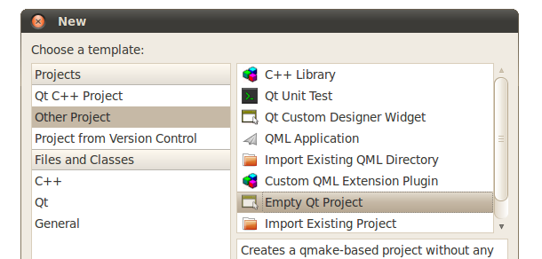
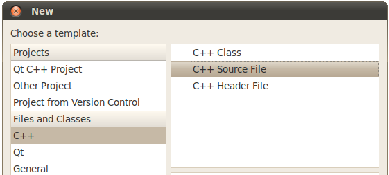
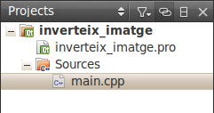
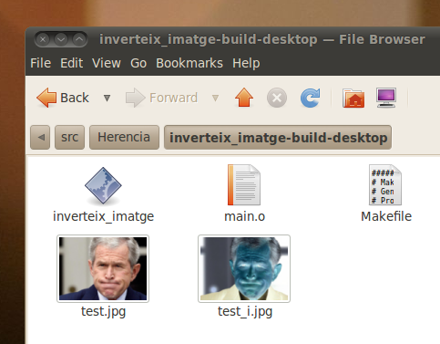
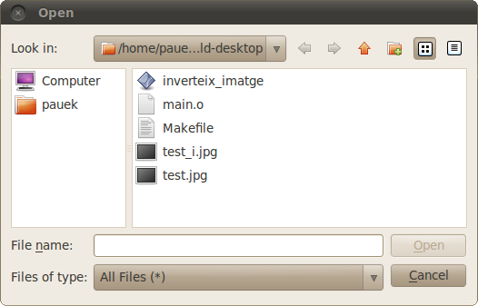
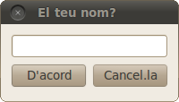
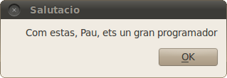

.. tema:: lab.he

=======================================
Qt: inversió d'imatges i ``TextDialog``
=======================================

.. rubric:: Objectius

- Fer un programa Qt mínim que utilitzi finestres.
- Implementar una classe que derivi d'una classe de Qt.

Inversió d'imatges super-fàcil
==============================

En aquesta sessió de pràctiques, farem un programa molt senzill amb Qt
que inverteix una imatge, és a dir, inverteix el color de cada píxel
(si un píxel és blanc passa a negre, si és groc passa a blau, etc). 

El primer que hem de fer és crear un projecte amb Qt fent servir la
opció de menú *File* |-->| *New file or project...*. Això mostra el
quadre de diàleg següent, a on hem d'escollir "Empty Qt Project":

El projecte s'ha de situar en algun directori i li direm
``inverteix_imatge`` (el nom del projecte no pot tenir espais ni
caràcters extranys).

Ara cal afegir un fitxer codi nou, també amb *File* |-->| *New file or
project...*. Ara caldrà escollir la opció de "C++ Source File" (un
fitxer .cpp). 

Al nou fitxer li hem de posar de nom ``main.cpp`` i l'afegim al
projecte.

El resultat és un projecte com el següent:

En el fitxer main posarem el següent codi::

   #include <QImage>
   
   int main() {
     QImage I("test.jpg");
     I.invertPixels();
     I.save("test_i.jpg");
   }

Ara compila el projecte amb ``Ctrl+B`` o amb *Build* |-->| *Build
Project ``inverteix_imatge``*. Si executes el projecte (amb
``Ctrl+R``) el programa no farà res, perquè no hi ha cap imatge
``test.jpg``. Per poder veure el resultat del programa has d'anar a un
directori que hi haurà al costat del directori del projecte amb un
sufix ``-build-desktop`` (si has seguit els passos fins aquí serà
``inverteix_imatge-build-desktop``) i a dins veuràs que hi ha un
executable anomenat ``inverteix_imatge``. Copia una imatge de prova
amb el nom ``test.jpg`` en aquest directori i executa el programa fent
doble clic. Veuràs que apareixerà una nova imatge invertida amb el nom
``test_i.jpg``.

No és fantàstic? El programa ocupa només 3 línies: es construeix un
object ``QImage``, i en el constructor se li diu de quin fitxer ha de
treure la imatge, i es crida a un parell de mètodes que la inverteixen
i la guarden amb un altre nom. Aquest programa treu partit la classe
``QImage`` de la llibreria Qt per fer una operació força complexa.

.. exercici::
   
   Si situes el cursor sobre de la paraula ``QImage`` en el codi font
   i prems la tecla F1, veuràs que surt l'ajuda de la classe
   ``QImage``. Busca un mètode ``copy`` (el que rep 4 enters). Observa
   el tipus de retorn. Modifica el programa, doncs, per guardar una
   zona de 100x100 píxels de la part esquerra a dalt de la imatge
   ``test.jpg``. Guarda-la amb el nom ``tros.jpg``.

Escollir el fitxer amb un quadre de diàleg
==========================================

Pel fet que el programa és senzill, cada cop que volguem aplicar-lo a
una imatge nova, hem de posar el nom  ``test.jpg`` a la imatge o
recompilar el programa posant un nom diferent. No estaria millor que
el programa ens demani quin fitxer volem invertir?

Per fer això amb Qt haurem de fer dues modificacions:

- La primera té a veure amb el fet que si volem que surtin finestres
  en el nostre programa, hem de crear un objecte ``QApplication``.

- La segona és l'ús del quadre de diàleg de fitxers en sí.

Primera modificació: afegir un ``QApplication``
-----------------------------------------------

Anem per la primera. Cal afegir el següent:

- Modificar la funció ``main`` perquè tingui dos paràmetres així::

     int main(int argc, char *argv[]) {
       // ...
     }

- Crear un objecte al principi del ``main`` de la classe
  ``QApplication`` (i per tant afegir ``#include <QApplication>`` a
  dalt de tot)::

       QApplication app(argc, argv);

  Aquest objecte rep en el seu constructor els paràmetres que hem
  posat al ``main``.

Segona modificació: fer servir ``QFileDialog``
----------------------------------------------

Un quadre de diàleg per a fitxers ens permet escollir un fitxer, i té
la següent pinta:

Des del programa, obrim el quadre i si l'usuari escull un fitxer, el
quadre ens retorna el nom del fitxer complet. Si l'usuari prem
"Cancel", el quadre ens informa que s'ha cancel·lat la tria.

Per posar el quadre s'han de seguir els passos següents:

- Crear un objecte ``QFileDialog`` (mai abans de ``QApplication``), i
  per tant hem de posar a dalt de tot ``#include
  <QFileDialog>``. Anomena l'objecte ``F``.

- Invocar el mètode ``exec`` del quadre, i mirar el valor que
  retorna. Es pot considerar com un ``bool``: si ``exec`` retorna ``true``,
  l'usuari ha escollit un fitxer; si retorna ``false``, ha cancel·lat.
  En el nostre cas, si l'usuari cancel·la, no hem de fer res, per tant
  posarem::

     if (F.exec()) {
       // codi per invertir la imatge escollida
     }

- Obtenir el nom del fitxer que s'ha seleccionat. Per fer això hem de
  cridar el mètode ``seletedFiles`` de ``QFileDialog``. Aquest mètode
  retorna una llista de fitxers (un objecte ``QStringList``), ja que
  un quadre de diàleg en general permet seleccionar més d'un
  fitxer. Per tant, posarem::

     QStringList fitxers = F.selectedFiles();
     
- Per obtenir un ``QString`` que és el nom del fitxer seleccionat, hem
  de mirar el primer element de la llista, el de la posició 0, amb el
  mètode ``at``::

     QString nom = fitxers.at(0);

- Ara ja podem crear l'objecte ``QImage`` com abans, però posant
  ``nom`` com a paràmetre del constructor, en comptes de
  ``test.jpg``::
    
     QImage I(nom);

- Ara vindria la inversió com abans, i finalment hem de guardar la
  imatge amb un nom diferent (perquè si no ens carreguem la imatge
  original). Per fer això hem d'afegir al nom una ``"_i"``. La manera
  més fàcil és cridar al mètode ``replace`` de ``QString`` (n'hi ha
  vàrios), que permet reemplaçar un tros del ``nom`` amb un altre. Si
  fem::

     nom.replace(".", "_i.");

  estem canviant allà on posa ``"."`` per ``"_i."``, que té l'efecte
  desitjat. Si el nom era ``gat.jpg``, ara serà ``gat_i.jpg``. Un cop
  fet això, podem cridar el mètode ``QImage::save`` com abans.

Invertir múltiples imatges
==========================

Ja posats, podem fer que el programa inverteixi vàries imatges, no
només una. En un quadre de diàleg de fitxers, en general, per
seleccionar més d'un fitxer s'ha de clicar el nom del fitxer mentre es
prem la tecla ``Ctrl``.

Per modificar el programa, haurem de:

- Indicar al ``QFileDialog`` que volem poder seleccionar més d'una
  imatge.

- Fer una iteració amb cada una de les imatges seleccionades i
  invertir-la, tal com fem ara amb una de sola.

Seleccionar vàries imatges a un ``QFileDialog``
-----------------------------------------------

Això és senzill, només hem de "configurar" el ``QFileDialog`` abans de
cridar-lo amb ``exec``. Just després de ser creat, al principi del
programa, posem::

  F.setFileMode(QFileDialog::ExistingFiles);

Mira l'ajuda per al mètode ``setFileMode`` i veuràs que accepta un
paràmetre de tipus ``QFileDialog::FileMode``, que és un enumerat. La
opció per múltiples fitxers és el número 3,
``QFileDialog::ExistingFiles``.

Fer una iteració amb les imatges
--------------------------------

Un cop el quadre de diàleg ha retornat, en comptes d'invertir una
imatge, la idea és fer una iteració com::

  for (int i = 0; i < ...; i++) {
    QString nom = ...; // nom de la imatge 'i'
    QImage I(nom);
    ...
  }

La llista té un mètode ``at`` que ja hem vist que permet obtenir
l'element ``i``-èssim, però ens faltaria un mètode per determinar el
tamany de la llista. Aquest mètode és ``QStringList::size``. Modifica
doncs el programa i compila'l. Comprova que pots invertir almenys 2
imatges.

Un quadre de diàleg personalitzat
=================================

En aquesta secció farem un programa que ens demana el nom i ens
saluda, fent servir un quadre de diàleg fet per nosaltres. El programa
principal serà molt senzill::

  #include <QApplication>
  #include <QMessageBox>
  #include "textdialog.h"
  
  int main(int argc, char *argv[]) {
    QApplication app(argc, argv);
    TextDialog td("Escriu el teu nom");

    if (td.exec()) {
      QString salutacio = "Com estàs, ";
      salutacio += td.text();
      salutacio += ", ets un gran programador";
  
      QMessageBox missatge;
      missatge.setWindowTitle("Salutacio");
      missatge.setText(salutacio);
      missatge.exec();
    }
  }

Aquest programa fa servir 3 classes: ``QApplication``, que coneixem;
``QMessageBox``, que serveix per mostrar missatges; i
finalment, ``TextDialog`` que és la que farem nosaltres.

La idea del programa és fer sortir una finestra com

i un cop has posat el nom, apareix un missatge

que et dóna una petita alegria (si bé menor, ja que t'has posat tu
mateix el missatge, ejem). Si prems "Cancel·la" quan se't pregunta el
nom, no apareix cap missatge després.

El primer quadre de diàleg, el que et pregunta el nom, és un
``TextDialog`` i és el que farem nosaltres. El segon és el
``QMessageBox`` i és part de la llibreria de classes Qt (com indica la
``Q`` de davant del nom).

La part d'utilització de ``QMessageBox`` és força
auto-explicativa. ``QMessageBox`` és un quadre de diàleg a on
típicament només pots prémer un botó i acceptar el misstage que se't
presenta. Aquest tipus de quadres es fan servir per alertar l'usuari
d'alguna cosa que ha succeït. En el nostre cas se li posa un títol
(amb ``setWindowTitle``) i un text (amb ``setText``). Finalment es
mostra amb ``exec``, que és la forma estàndar de mostrar els quadres
de diàleg.

El nostre quadre ``TextDialog``
-------------------------------

Per començar crearem dos fitxers de codi font nous: ``textdialog.h`` i
``textdialog.cpp``. La declaració de la classe serà (situada al fitxer
``textdialog.h``)::

  class TextDialog : public QDialog {
    QLineEdit *_edit;
    QPushButton *_ok, *_cancel;
  public:
    TextDialog(QString titol, QWidget *parent);
    QString text() const;
  };

La declaració és simple, el nostre quadre té 3 atributs: una caixeta
d'edició (que servirà per posar el nom) i dos botons (el d'acceptar i
el de cancel·lar), tots ells punters. El constructor rep 2 paràmetres,
un *string* (el text del títol) i el ``QWidget`` pare. Totes els
elements en Qt tenen un punter a la finestra pare (que és la finestra
"responsable"), tot i que aquest pot ser 0 (que vol dir que no apunta
enlloc, o sigui que no té pare). Com que la classe ``QDialog`` rep
aquest punter com a paràmetre del constructor, nosaltres l'hem de
posar al nostre constructor, també.

La implementació de la classe comença amb els ``#include``\s::

  #include <QDialog>
  #include <QLineEdit>
  #include <QPushButton>
  #include <QGridLayout>

Ens cal implementar 2 mètodes: el constructor i ``text``. Comencem amb
el constructor::

  TextDialog::TextDialog(QString titol, QWidget *parent) 
    : QDialog(parent)
  {
    setWindowTitle(titol);
    
    _edit = new QLineEdit;
    _ok = new QPushButton("D'acord");
    _cancel = new QPushButton("Cancel.la");

    QGridLayout *graella = new QGridLayout;
    graella->addWidget(_edit, 0, 0, 1, 2);
    graella->addWidget(_ok, 1, 0);
    graella->addWidget(_cancel, 1, 1);
    setLayout(graella);
  }

Abans de començar, es fa servir una llista d'inicialització per cridar
el constructor de la classe ``QDialog`` amb el paràmetre ``parent``
que hem comentat abans. La primera instrucció invoca un mètode de la
classe ``QDialog``, que permet canviar el títol, i posa el títol
passat com a paràmetre.

Les tres següents línies reserven memòria i inicialitzen els 3
atributs, i les següents 5 línies creen un ``QGridLayout`` (un
distribuidor de tipus graella) i col·loquen els objectes en les seves
caselles. Les crides indiquen el número de casella començant
per 0. L'objecte ``_edit`` és especial: es col·loca a la casella (0,
0) però en comptes d'ocupar només una casella n'ocupa 1 en vertical i
2 en horitzontal, per això la crida té 4 números. La crida a
``setLayout`` assigna el distribuidor al quadre de diàleg que estem
construint.

La implementació del mètode ``text`` és senzilla, només s'ha de
retornar el valor que conté la caixeta d'edició ``_edit``. Si mirem la
classe ``QLineEdit``, aquesta té un membre ``text`` que permet obtenir
el text que hi ha a la caixeta d'edició. Aquest és precisament el text
que hem de retornar::

  QString TextDialog::text() const {
    return _edit->text();
  }

Si intentem compilar el programa, però, no funcionarà. L'error apareix
en el programa principal, com a resultat d'haver-hi posat
l'``#include`` del nostre quadre ``TextDialog``. Com que el fitxer
``textdialog.h`` fa servir ``QLineEdit`` però la declaració d'aquesta
classe no està disponible quan compilem ``main.cpp``, el compilador
diu que no sap què és ``QLineEdit``. Per arreglar-ho hem de posar,
*abans* de ``textdialog.h`` els tres ``#include``\s següents::
  
  #include <QDialog>
  #include <QLineEdit>
  #include <QPushButton>

Repetició en els includes: les macros ``#ifndef`` i ``#endif``
""""""""""""""""""""""""""""""""""""""""""""""""""""""""""""""

Tal com està ara, el programa compila correctament\ [1]_. Ara bé: està clar
que aquesta solució està lluny de ser la millor perquè ara, quan fem
``#include "textdialog.h"``, hem d'acompanyar-lo posant 3
``#include``\s just abans. Aquesta tipus de repetició és precisament
el que volem evitar quan fem programes, perquè dóna lloc a errors que
ens prenen temps i ens desconcentren. Per arreglar el problema farem
el següent:

- Posarem els 3 includes en el fitxer ``textdialog.h``. Es tracta de
  esborrar els 3 includes tant de ``main.cpp`` com de ``textdialog.cpp``
  i posar-los abans de la declaració de la classe a
  ``textdialog.h``. Bàsicament estem posant ``#include``\s dins d'un
  fitxer de capçalera, cosa que no hem fet mai.

- Encerclarem tot el contingut del fitxer ``textdialog.h`` entre dos
  macros ``#ifndef`` i ``#endif``. En concret, hem de posar, just al
  principi i al final, el següent::

    #ifndef TEXTDIALOG_H
    #define TEXTDIALOG_H

    // Cos del fitxer

    #endif

  La macro ``#define`` el que fa és "definir" un nou símbol
  ``TEXTDIALOG_H``, de forma que a partir d'aquell moment
  existeixi. Les macros ``#ifndef``\-``#endif`` encerclen un tros de
  codi que s'ha de compilar només quan el símbol ``TEXTDIALOG_H``
  **no** està definit (observa la ``n`` de ``ifndef``). Aquesta
  tècnica el que fa és evitar que el contingut d'un fitxer de
  capçalera (amb extensió ``.h``) pugui aparèixer 2 o més cops en un
  programa. El símbol s'escull perquè tingui un nom molt semblant al
  nom del fitxer a on apareix i sigui únic dins del programa.

Amb aquesta modificació, el programa compilarà igualment i en canvi,
quan fem servir ``textdialog.h`` en qualsevol altre lloc, no caldrà
posar cap ``#include`` més. És recomanable posar aquestes macros a
tots els fitxers de capçalera a partir d'ara.

Conectem els botons: *signals* i *slots*
""""""""""""""""""""""""""""""""""""""""

Bé, el programa compila, però no fa el que ha de fer. Quan prems
"D'acord" o "Cancel·la" no reacciona. Només pots tancar la finestra
del quadre i això no fa aparèixer el missatge d'autoestima.

La qüestió és que hem de dir a algun lloc que quan es prem el botó
"D'acord" s'ha d'acceptar el nom i quan es prem "Cancel·la" s'ha de
rebutjar. 

*Signals* i *Slots*
'''''''''''''''''''

En Qt, per comunicar "events" com el click en un botó es fa servir un
mecanisme molt general d'events. La idea és que els objectes de Qt
poden tenir:

- *signals*, que vol dir que són **emissors** d'events, i/o
- *slots*, que vol dir que són **receptors** d'events.

Per poder treure profit d'aquest sistema, però, hem de fer una primera
modificació l'objecte ``TextDialog``, que és l'única classe que hem
creat nosaltres. La modificació consisteix en posar, *a la part privada de la
declaració*, la paraula següent::

   Q_OBJECT

Va sense punt i coma, tal com està escrit. És difícil explicar què
significa exactament perquè no és cap declaració de variables, ni un
atribut, ni un mètode. És com una "marca" que indica al compilador que
``TextDialog`` és un objecte Qt i per tant és potencialment un emissor
o receptor d'events. Com que ``TextDialog`` deriva de ``QDialog``
heredarà 2 senyals: ``accept`` i ``reject``. A la declaració de
``TextDialog``, per tant, no hem de declarar *signals* ni *slots*, perquè
``QDialog`` ja els té\ [2]_.

Connexió entre emissors i receptors
'''''''''''''''''''''''''''''''''''

Així doncs, fent servir aquest sistema d'events, volem fer que quan el
botó "D'acord" es premi, el quadre ``TextDialog`` accepti el nom i
quan es premi "Cancel·la", es rebutgi. Per ser objectes de Qt, els
botons tenen un senyal molt lògic que és ``clicked``, que ens avisa
d'un click. Hem de fer, doncs, les següents dues connexions:

  ============ ========= =============== ========    
  Emissor      *Signal*  Receptor        *Slot*
  ============ ========= =============== ========
  ``_ok``      clicked   ``TextDialog``  accept
  ``_cancel``  clicked   ``TextDialog``  reject
  ============ ========= =============== ========

La funció que realitza la connexió és ``connect`` i rep 4 paràmetres,
just en el mateix ordre en què surten a la taula anterior::

   connect(<punter a l'emissor>, <senyal>, 
           <punter al receptor>, <slot>);

La forma d'indicar un senyal és encerclant la crida amb
``SIGNAL(...)`` i per als *slots* el mateix amb ``SLOT(...)``. La
connexió l'hem de fer quan construïm el ``TextDialog``, per tant, al
final de tot del constructor hem de posar les següents 2 línies::

  connect(_ok, SIGNAL(clicked()), ???, SLOT(accept()));
  connect(_cancel, SIGNAL(clicked()), ???, SLOT(reject()));

El problema que sorgeix ara és: com obtenim un punter al
``TextDialog``?? Donat que el quadre ``TextDialog`` és el receptor i
``connect`` ens demana un punter, hauriem de posar com a tercer
paràmetre (a on hi ha ``???``) una expressió que doni com a resultat
l'objecte que estem construint.

Aquesta expressió és especial de C++ i és: ``this``. El valor ``this``
sempre està disponible en mètodes i és un punter a l'objecte sobre el
que s'ha cridat el mètode. En el nostre cas, doncs, haurem de posar
``this`` substituint els tres interrogants.

Un cop fetes les connexions, el programa funciona
correctament. Comprova-ho.

.. |-->| unicode:: U+2192

.. [1] Malgrat dóna un error que diu una cosa com: "No relevant
       classes found, no output generated".

.. [2] És interessant mirar la documentació de ``QDialog`` per veure
       quins *signals* i *slots* té.
