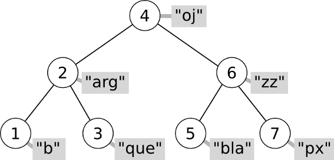

========================
STL: Taules associatives
========================

.. tema:: lab.map

Objectius
=========

- Utilitzar estructures map de STL.

- Familiaritzar-se amb les operacions d'inserció i cerca a un map.

- Recorregut de contenidors STL del tipus map.

Taules associatives
===================

Una taula associativa és un contenidor de parelles de valors. Cada parella està composada d’una **clau** (*key*) i un **valor** (*value*). El contenidor està organitzat especialment per buscar eficientment aquestes parelles fent servir la clau. Les claus no poden estar mai repetides, ja que una clau s’associarà a un valor.

Les taules associatives són força diferents dels contenidors seqüencials com la llista o el vector. La principal diferència és que els elements es guarden en un arbre i es mantenen en un ordre concret que permet la cerca ràpida.

Cada node de l’arbre té una clau, dues branques i el valor associat (en el dibuix és un *string* i està en gris). Tenint en compte la clau de qualsevol node de l’arbre, per la branca de l’esquerra es pot accedir a aquells elements amb clau menor i per la de la dreta als elements amb una clau major. Per exemple, el node del dibuix que es troba a l’arrel (el que conté un 4), té a l’esquerra els nodes 1, 2 i 3, i a la dreta el 5, 6 i 7.

La cerca en un arbre amb aquesta estructura és força ràpida. La cerca comença al node “arrel” (el 4 en el dibuix). Es tracta de mirar si la clau que busquem és més gran, més petita o igual que 4. Suposem que és més gran. Llavors hem de situar-nos a la branca de la dreta (que té un 6), i tornar a fer la mateixa pregunta. És fàcil veure que, si l’arbre està equilibrat, cada cop de escollim una branca estem descartant la meitat dels elements del contenidor. Això fa que la cerca en un arbre així tingui un cost logarítmic.

Declaració
==========

En STL una taula associativa es declara fent servir la paraula clau **map**. Si, per exemple, volguèssim declarar una taula d'alumnes fent servir com a *clau* el seu DNI faríem el següent::

  map<string, Alumne> alumnes;

Però per a poder fer-ho primer hem de incloure::

  #include <iostream>
  #include <map>
  
  using namespace std;

La inclusió de la llibreria **iostream** es necessària ja que volem fer servir el tipus *string*.

Operacions
==========

Les operacions bàsiques d’una taula associativa són:

- **Inserció** d’una nova parella (associació d’una clau i un valor).

- **Cerca** del valor associat a una clau (alhora determinació de la seva existència en la taula).

- **Esborrat** d’una parella clau-valor.

Les taules associatives també admeten recorreguts amb *iterators*, que visiten els elements en l’ordre de les claus. Quan recorrem un *map*, els elements són parelles (pair<K, V>), per tant les claus les podem accedir a través del mètode *first()*, i els valors associats a través del mètode *second()*.

Ús en STL
=========

Les operacions anteriors corresponen als següents mètodes:

- **Inserció**: insert(make_pair(k, v)).

- **Cerca**: find(k).

- **Esborrat**: erase(it).

on **k** és un valor, **v** és un valor i **it** és un iterador que apunta a la posició a esborrar.

.. exercici::

   Fes un programa que gestioni les notes d'uns alumnes. El programa ha de donar a l'usuari dues opcions: afegir un nou alumne i sortir del programa. Fes servir un mapa com a contenidor dels alumnes i la classe *Alumne* que es proporciona junt amb aquest guió de la sessió.
   
.. exercici::

   Afegeix al programa una tercera opció que escrigui per pantalla tots els alumnes que s'han afegit a la taula associativa. Fes servir iteradors per a fer el recorregut.
   
.. exercici::

   Afegeix una quarta opció que demani a l'usuari el dni d'un alumne, el busqui a la taula associativa i escrigui les seves dades si el troba. Si no el troba el programa haurà d'escriure un missatge indicant que no hi ha cap alumne amb aquell dni a la taula.
   

