.. include:: isoamsa.txt

.. tema:: eclipse

=====================
Introducció a Eclipse
=====================

Eclipse
-------

Eclipse és un entorn gràfic de desenvolupament per programar en C++. L'objectiu principal d'aquesta sessió és familiaritzar-se amb aquest entorn i crear els nostres primers programes en C++.

Eclipse és una eina que integra diferents components que permeten realitzar les tasques d'edició, compilació, execució i depuració de programes d'una forma senzilla i amigable. Aquests tipus d'aplicacions es coneixen amb el nom d'*Entorn Integrat de Desenvolupament* (en anglès, IDE - Integrated Development Environment). Encara que amb els *plug-ins* adequats suporta qualsevol tipus de desenvolupament de software, majoritàriament s'utilitza per desenvolupar aplicacions en Java. Altres aplicacions, no incloses a la distribució estàndard d'Eclipse, es poden afegir en forma de *plug-ins*, i són reconegudes automàticament per la plataforma. 

Eclipse és una aplicació desenvolupada en Java i per tant per utilitzar-la hem de tenir instal·lada la versió 1.3 del JDK o posterior. Es recomana tenir instalada la versió 1.4 o superior.

Podeu trobar informació de l'eina i descarregar-la de:

* **http://www.eclipse.org/**: Pàgina web d'Eclipse.

* **http://help.eclipse.org/galileo/index.jsp**: Tutorials sobre els diferents mòduls de l'eina. Aquests tutorials estan inclosos al help d'Eclipse i es poden consultar seleccionant l'opció *Help* |srarr| *Help* Contents.

* **http://www.eclipseplugincentral.com/**: *Plug-ins* d'Eclipse.

Primers passos
--------------

Configuració
""""""""""""

En aquesta secció us explicarem com posar en marxa l'entorn de desenvolupament Eclipse per al seu funcionament amb el llenguatge C++. Noteu que alguns dels passos que us explicarem només cal fer-los la primera vegada que arranqueu el programa. Com veureu, un cop configurat Eclipse per al seu funcionament amb C++ no caldrà tornar-ho a fer.

En arrencar l'aplicació Eclipse apareix la finestra següent amb el logo d'Eclipse:

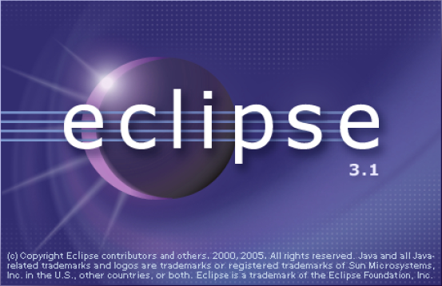

A continuació apareix un quadre de diàleg que ens demana la carpeta on crear els nostres projectes (el que s'anomena el *workspace* d'Eclipse). Seleccioneu la carpeta on voleu emmagatzemar els vostres projectes; si la carpeta no existeix es crearà automàticament.

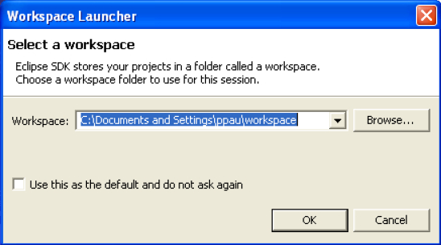

Una vegada seleccionada la carpeta de treball apareix la pantalla de benvinguda.

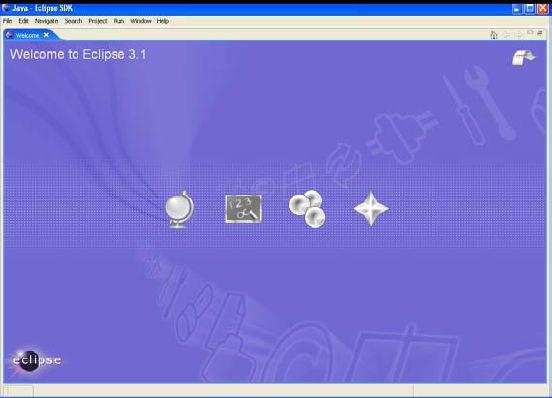

Cliqueu la icona *Go to the Workbench*, que és la fletxa situada a dalt a la dreta de la pantalla de benvinguda per entrar a la finestra de treball. El *workbench* d'Eclipse ofereix diferents perspectives per realitzar diferents tasques, com poden ser escriure o depurar (eliminar errors de) un programa en C++. La primera vegada que entrem a Eclipse aquest presenta la perspectiva de recursos (*Resource perspective*). Aquesta és una perspectiva de propòsit general per crear, veure i manipular tot tipus de recursos.

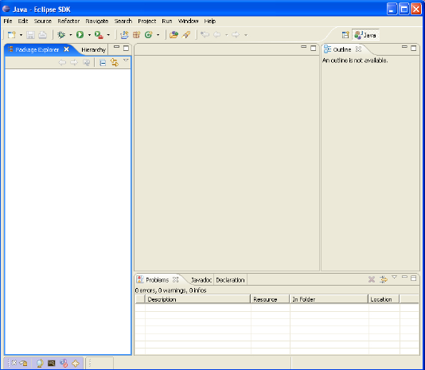

En el nostre cas treballarem amb una perspectiva específica de C++. Per a canviar a aquesta perspectiva seleccioneu *Window* |srarr| *Open perspective* |srarr| *Other...*, com es mostra a la següent figura. 

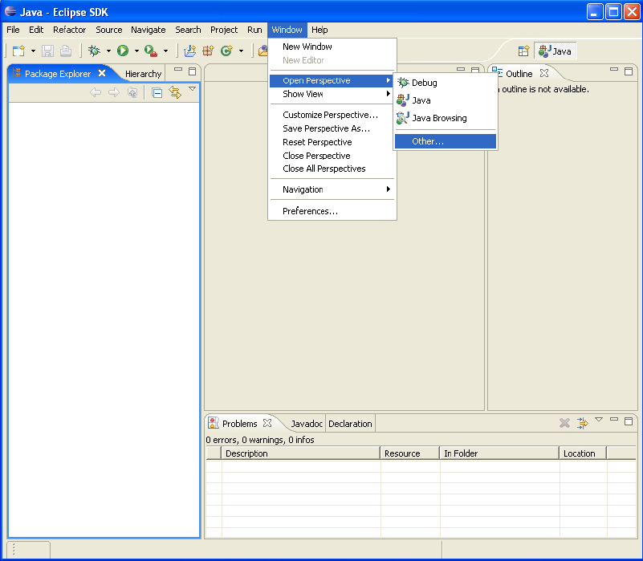

Un cop fet això se us obrirà un menú on heu de seleccionar l'opció C/C++. Com a resultat, la finestra d'Eclipse quedarà com segueix.

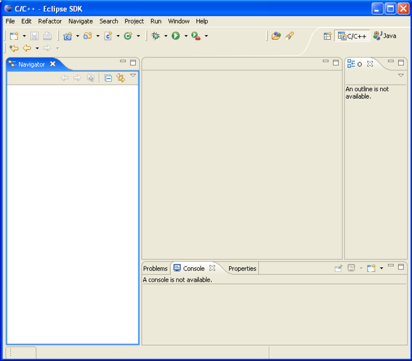

Creació i execució d'un programa
""""""""""""""""""""""""""""""""

Després d’aquesta petita introducció a Eclipse anem a veure com crear i executar un programa en C++
utilitzant el clàssic programa d’exemple “Hola, món”. Abans de fer qualsevol altra cosa en Eclipse, tal
com editar un programa en C++, necessitem crear un projecte. Per crear un projecte seguiu els següents
passos:

1. Seleccioneu l’opció *File* |srarr| *New* |srarr| *Managed Make C++ Project*, tal com es mostra a la següent figura.

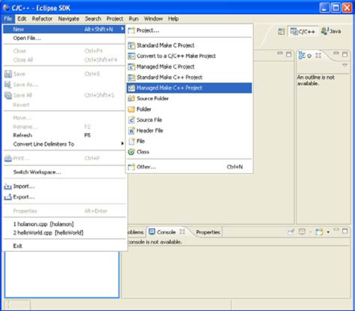

2. A continuació apareix una pantalla de diàleg que demana el nom del projecte. En el nostre cas podem introduir com a nom del projecte “HolaMon”.

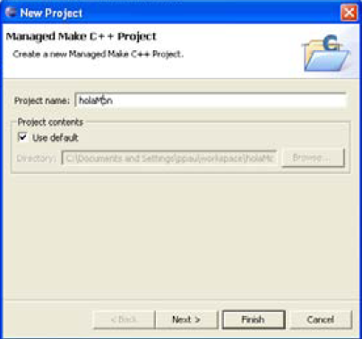

3. Premeu el botó *Finish* i es crearà el projecte. La finestra *package explorer* de la pantalla principal mostrarà la carpeta del nou projecte tal com es pot veure a la figura següent.

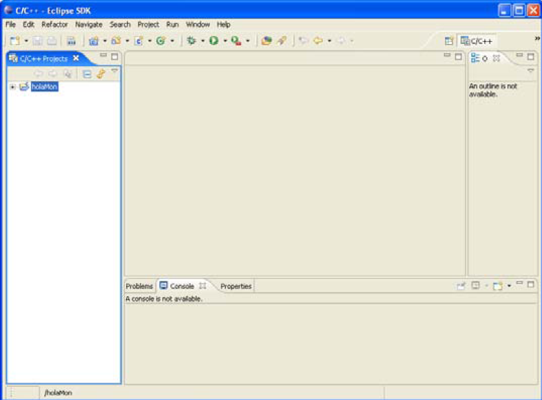

Una vegada creat el nou projecte podem editar el codi font corresponent al programa “Hola, món”. Per fer-ho seguiu els següents passos:

1. Seleccioneu l’opció *File* |srarr| *New* |srarr| *Source File*.

2. La pantalla de diàleg *New File Source*, us demanarà el nom del fitxer font. En el nostre cas podem introduir com a nom de fitxer “HolaMon.cpp”

3. Premeu el botó Finish i es crearà el fitxer. La pantalla principal mostrarà l’aspecte de la figura que segueix, on a la finestra *package explorer* veureu que s’ha afegit el fitxer HolaMon.cpp al projecte i que la finestra d’edició mostra el contingut d’aquest fitxer que inicialment està buit.

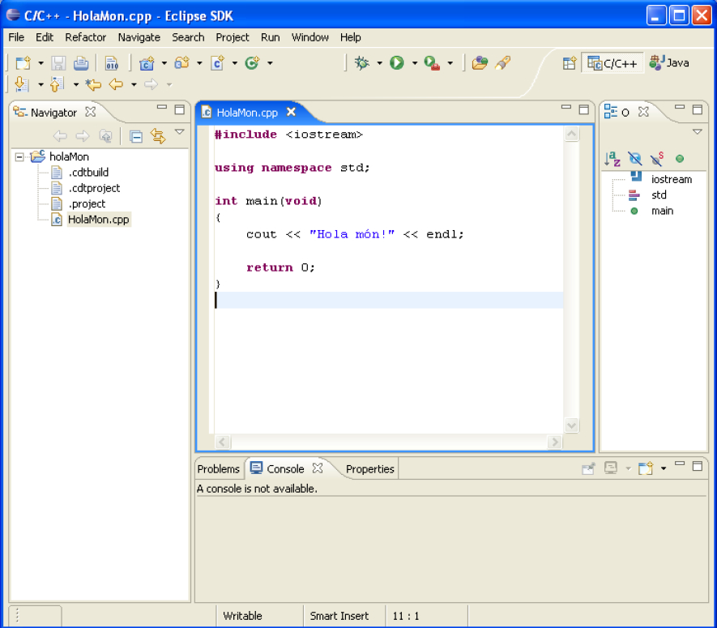

Ara podem afegir el codi corresponent al programa “Hola, món”, que es mostra a continuació::

   #include <iostream>
   using namespace std;

   int main(void)
   {
     cout << "Hola món!"<< endl;
     return 0;
   }

Una vegada afegit el codi caldrà gravar el fitxer. En gravar el fitxer, Eclipse compila automàticament el programa i avisa dels errors. Normalment és aconsellable desactivar l’opció de compilació automàtica (desactivant l’opció *Build automatically* del menú *Project*) i, en aquest cas, la compilació es fa mitjançant *Project* |srarr| *Build Project*. El programa informa dels errors que s’hagin pogut detectar en la compilació del programa. En aquest cas no n’hi ha hauria d'haver cap. Una vegada el programa compila sense errors, podem passar a executar-lo. Per fer-ho, seleccioneu l’opció *Run* |srarr| *Run As* |srarr| *Run Local C/C++ Application*.

El resultat de l’execució es pot veure a la finestra consola de la pantalla principal.

El depurador
""""""""""""

Depurar (en anglès *debug*) és el procés de detectar, aïllar i eliminar els errors (d’un programa) o les  fallades (d’un sistema informàtic) de manera que el seu comportament sigui l’esperat. El depurador (en anglès *debugger*) és l’eina que permet fer el seguiment de l’execució d’un programa de forma que es puguin detectar i corregir els errors.

El depurador permet executar un programa línia a línia i la consulta interactiva dels valors de les variables de l’entorn. Permet a més fixar punts crítics on detenir l’execució del programa (breakpoints) i possibilita executar aquestes instàncies crítiques pas a pas.

Dintre de l’entorn de desenvolupament d’Eclipse es poden depurar programes desenvolupats en C++. Per fer-ho cal canviar a la perspectiva de depuració (*debug perspective*). Per canviar a aquesta perspectiva seleccioneu *Window* |srarr| *Open perspective* |srarr| *Debug*.

Una vegada hem obert la perspectiva de depuració podem parar l’execució del programa en una determinada línia (posant un breakpoint) i inspeccionar les variables locals. Per posar un breakpoint, en la vista on es troba el codi font seleccionem la línia on volem que es detingui l’execució i seleccionem *Run* |srarr| *Toggle Line Breakpoint*. Veiem que es mostra un punt blau en la part esquerra de la línia. Ara ja podem llançar el depurador. Seleccionem en el menú *Run* |srarr| *Debug As* |srarr| *C++ Application*. L’execució del programa es deté al primer breakpoint. Una vegada el programa està detingut, en una de les vistes podem veure el valor de les variables o veure els breakpoints que hem definit. Una vegada inspeccionat el codi on és el problema es pot optar per executar el programa fins que acabi (*Resume*), acabar el programa immediatament (*Terminate*), executar pas a pas el programa sense entrar al codi dels mètodes (*Step Over*) o executar pas a pas entrant en el codi dels mètodes (*Step Into*). Totes aquestes opcions es troben al menú *Run*.

Recordeu que, com en altres casos, Eclipse recorda la perspectiva en què estem per a la propera sessió; per aquesta raó; si no sortim d’aquesta perspectiva, serà la que ens trobarem la propera vegada que arrenquem Eclipse.

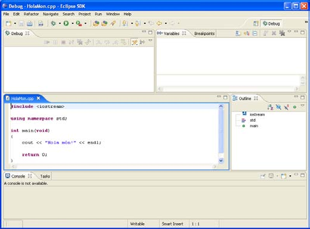

