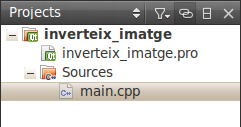

.. tema:: lab.he

===============================
Guió de pràctiques: Herència
===============================

.. rubric:: Objectius

   - Crear programes senzills amb Qt.

Inversió d'imatges super-fàcil
=================================

En aquesta sessió de pràctiques, farem un programa molt senzill amb Qt
que inverteix una imatge, és a dir, inverteix el color de cada píxel
(si un píxel és blanc, passa a negre i si és groc, passa a blau). 

El primer que hem de fer és crear un projecte amb Qt fent servir la
opció de menú *File* |-->| *New file or project...*. Això mostra el
quadre de diàleg següent, a on hem d'escollir "Empty Qt Project":

.. image:: img/qt_new_empty_project.png
   :align: center
   :scale: 75

El projecte s'ha de situar en algun directori i li direm
``inverteix_imatge`` (el nom del projecte no pot tenir espais ni
caracters extranys).

Ara cal afegir un fitxer codi nou, també amb *File* |-->| *New file or
project...*. Ara caldrà escollir la opció de "C++ Source File" (un
fitxer .cpp). 

.. image:: img/qt_new_cpp_source_file.png
   :align: center
   :scale: 75

Al nou fitxer li hem de posar de nom ``main.cpp`` i l'afegim al
projecte.

El resultat és un projecte com el següent:

En el fitxer main posarem el següent codi::

   #include <QImage>
   
   int main() {
     QImage I("test.jpg");
     I.invertPixels();
     I.save("test_i.jpg");
   }

Ara compila el projecte amb ``Ctrl+B`` o amb *Build* |-->| *Build
Project ``inverteix_imatge``*. Si executes el projecte (amb
``Ctrl+R``) el programa no farà res, perquè no hi ha cap imatge
``test.jpg``. Per poder veure el resultat del programa has d'anar a un
directori que hi haurà al costat del directori del projecte amb un
sufix ``-build-desktop`` (si has seguit els passos fins aquí serà
``inverteix_imatge-build-desktop``) i a dins veuràs que hi ha un
executable anomenat ``inverteix_imatge``. Copia una imatge de prova
amb el nom ``test.jpg`` en aquest directori i executa el programa fent
doble clic. Veuràs que apareixerà una nova imatge invertida amb el nom
``test_i.jpg``.

.. image:: img/qt_exec_inverteix_imatge.png
   :align: center
   :scale: 75

No és fantàstic? El programa ocupa només 3 línies: es construeix un
object ``QImage``, i en el constructor se li diu de quin fitxer ha de
treure la imatge, i es crida a un parell de mètodes que la inverteixen
i la guarden amb un altre nom. Aquest programa treu partit la classe
``QImage`` de la llibreria Qt per fer una operació força complexa.

.. exercici::
   
   Si situes el cursor sobre de la paraula ``QImage`` en el codi font
   i prems la tecla F1, veuràs que surt l'ajuda de la classe
   ``QImage``. Busca un mètode ``copy`` (el que rep 4 enters). Observa
   el tipus de retorn. Modifica el programa, doncs, per guardar una
   zona de 100x100 píxels de la part esquerra a dalt de la imatge
   ``test.jpg``. Guarda-la amb el nom ``tros.jpg``.

Escollir el fitxer amb un quadre de diàleg
==========================================

Pel fet que el programa és senzill, cada cop que volguem aplicar-lo a
una imatge nova, hem de posar el nom  ``test.jpg`` a la imatge o
recompilar el programa posant un nom diferent. No estaria millor que
el programa ens demani quin fitxer volem invertir?

Per fer això amb Qt haurem de fer dues modificacions:

- La primera té a veure amb el fet que si volem que surtin finestres
  en el nostre programa, hem de crear un objecte ``QApplication``.

.. |-->| unicode:: U+2192

   

