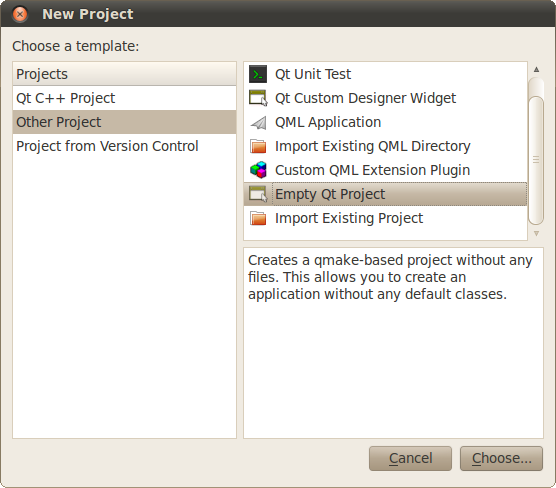
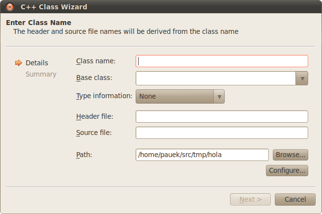

.. tema:: he

=============
Herència
=============

.. rubric:: Objectius

- Identificar la declaració d'una classe derivada.

- Determinar si és possible l'accés a membres d'una classe i de les
  seves bases.

- Implementar noves classes que hereden d'una classe base donada.

- Utilitzar llibreries en C++ heredant de les classes existents.

L'herència permet el reaprofitament de classes
==============================================

Imaginem que volem fer un programa que treballi amb les dades dels
soldats d'un exèrcit. Podem començar amb la classe ``Soldat``::

  class Soldat {
    string DNI, nom, cognoms;
    Data   data_incorporacio;
    int    seccio;
  public:
    // ...
  }

Alhora, volem que el programa pugui tractar amb els tinents, que són
responsables dels soldats de la seva secció (i en el programa volem
saber de quins). Si féssim la classe ``Tinent`` desde zero, seria així::

  class Tinent {
    string   DNI, nom, cognoms;
    Data     data_incorporacio;
    int      seccio;
    string   DNI_subordinats[50];
  public:
    // ...
  }

Els tinents tenen una llista dels soldats al seu càrrec
(``DNI_subordinats``), però com que també són soldats, tenen les dades
típiques dels soldats. El problema amb aquesta implementació, de fet,
és la *repetició*. Per fer la classe ``Tinent`` seria interessant poder
aprofitar la classe ``Soldat`` i estalviar-nos haver de tornar a
escriure els 4 camps de les dades del soldat.

Per fer això, fem que ``Soldat`` sigui la classe base, i
``Tinent`` la classe derivada i fem així::

  class Tinent : public Soldat {
    string dni_subordinats[50];
  public:
    // ...
  }

Pel sol fet d'afegir "``: public Soldat``" després de "``class
Tinent``", estem dient que *un ``Tinent`` és un ``Soldat``* i
per tant tots els camps de ``Soldat`` han d'estar a ``Tinent``.

.. exercici::

   Donada la classe ``Animal`` amb els atributs següents::

     class Animal {
       int color;
       float pes, velocitat_maxima;
       bool pelut;
     public:
       //...
     };

   Declara una classe ``Girafa`` que derivi d'``Animal``, i que tingui
   un atribut ``llargada_coll`` de tipus real. No cal que declaris cap
   mètode, és un exemple totalment acadèmic.

   .. solucio::
      ::

         class Girafa : public Animal {
           float longitud_coll;
         };

Terminologia
------------

Classe base
  La classe que representa un concepte general, que emmagatzema les
  parts comunes d'un conjunt d'objectes.

Classe derivada
  Una classe que representa una ampliació de la classe
  base, un cas particular del concepte. La classe derivada hereda tots
  els membres de la classe base.

Heredar
  Obtenir automàticament els membres d'una classe base en una
  derivada. A la declaració d'una classe derivada només s'han
  d'especificar els membres que *afegim* (o *redefinim*), que han de
  representar les diferències entre el concepte general i el
  particular.

Classes derivades: els detalls
==============================

Les classes derivades acumulen els atributs i mètodes de totes les bases
------------------------------------------------------------------------

Si tenim 3 classes [1]_ com::

  struct A {
    int x;
    void f();
  };

  struct B : public A {
    char y;
    void g(int n);
  };
  
  struct C : public B {
    float z;  
    bool h() const;
  };

Un objecte de la classe ``A`` té un atribut ``x`` i un mètode ``f``,
un objecte de classe ``B`` té 2 atributs (``x`` i ``y``) i dos mètodes
(``f`` i ``g``), i un objecte de classe ``C`` té 3 atributs (``x``,
``y`` i ``z``) i 3 mètodes (``f``, ``g`` i ``h``). Si tenim les
següents declaracions::

   A a;
   B b;
   C c;

el dibuix següent mostra l'estructura interna de cada objecte.

.. image:: img/herencia_ABC.*
   :align: center
   :scale: 70

Com és natural, intentar accedir a atributs o mètodes que no són
membres de la classe és un error::

   a.y = 'Q';   // error, la classe A no té atribut 'y'
   c.x = 1024;  // correcte
   b.z = 2.55;  // error, la classe B no té atribut 'z'
   c.f();       // correcte
   a.g(1);      // error, la classe A no té mètode 'g'
   if (b.h()) { // error, la classe B no té mètode 'h'
     //... 
   }

.. exercici::

   Donades les següents declaracions::

      struct X {
        char a;
        int b;
      };
      
      struct Y : public X {
        string s;  
      };
    
      struct W : public X {
        float x;
      };
 
      struct V : public W {
        bool p, q;
      };
  
      struct Z : public Y {
        double c, d;
      };

   i els objectes següents::
  
      X x;
      Y y;
      W w;
      V v;
      Z z;

   digues quins dels següents accessos a atributs són erronis. Indica
   també aquells en que l'error està en el tipus::

      w.x = 'e';
      y.s = "qwerty";
      v.q = 3;
      w.p = true;
      v.b = 81;
      z.d = 5.01;
      v.x = 55.34;
      y.x = 0.7;
      x.a = 'A';
      z.a = '$';
      x.b = 1;
      y.b = 3;

   .. exercici::
      ::

         w.x = 'e';      // error (tipus)
         y.s = "qwerty"; // ok
         v.q = 3;        // error (tipus)
         w.p = true;     // error
         v.b = 81;       // ok
         z.d = 5.01;     // ok
         v.x = 55.34;    // ok
         y.x = 0.7;      // error
         x.a = 'A';      // ok
         z.a = '$';      // ok
         x.b = 1;        // ok
         y.b = 3;        // ok
      

A la classe derivada es pot redefinir un mètode de la classe base
-----------------------------------------------------------------

Malgrat les classes derivades típicament defineixen atributs i mètodes
nous, també poden *redefinir* mètodes de la classe base. Per exemple,
partint de la classe ``Gos``::

  class Gos {
  public:
    void borda() const;
  };

  void Gos::borda() const {
    cout << "guau!";
  }

la classe ``Chihuahua`` redefineix el mètode ``borda``::

  class Chihuahua : public Gos {
  public:
    void borda() const;
  }
  
  void Chihuahua::borda() {
    cout << "cri-cri";
  }

Si creem els objectes::

  Gos g;
  Chihuahua c;

i cridem el mètode ``borda``::

  g.borda();
  c.borda();

apareixerà lògicament per pantalla::

  guau!
  cri-cri

La crida al mètode base es fa posant el prefix de la classe base
""""""""""""""""""""""""""""""""""""""""""""""""""""""""""""""""

De vegades ens pot interessar cridar el mètode de la classe base desde
la classe derivada. En aquest cas partim d'``Adjectiu``::

  class Adjectiu {
    string adj;
  public:
    Adjectiu(string s);
    void escriu(ostream& o) const;
  };

  void Adjectiu::escriu(ostream& o) const {
    o << adj;
  }

i volem implementar ``SuperAdjectiu``, que és simplement un adjectiu
amb "súper-" a davant. Per implementar ``escriu`` a la classe
``SuperAdjectiu`` podem escriure primer "súper-" i després cridar al
mètode base per escriure l'adjectiu::

  class SuperAdjectiu : public Adjectiu {
  public:
    SuperAdjectiu(string s);
    void escriu(ostream& o) const;
  };
    
  void SuperAdjectiu::escriu(ostream& o) const {
    o << "súper-";
    Adjectiu::escriu(o);  // <== Crida al mètode base
  }

La crida a ``Adjectiu::escriu`` es fa posant el prefix per distingir-lo
de ``SuperAdjectiu::escriu``.

Així, doncs, si tenim::

  Adjectiu a("bonic");
  SuperAdjectiu sa("bonic");
  a.escriu(cout);
  cout << ' ';
  sa.escriu(cout);

mostrarà per pantalla::

  bonic súper-bonic  
  

Els atributs privats són inaccessibles fins i tot a les classes derivades
-------------------------------------------------------------------------

Malgrat les classes derivades modifiquen les classes base i *són* de
fet un cas particular d'elles, el següent codi produeix un error::

   class Numero {
     int _n;
   public:
     Numero(int n);
     int num() const;
     void escriu(ostream& o) const;
   };

   Numero::Numero(int n) {
     _n = n;
   }

   int Numero::num() const {
     return _n;
   }
 
   class NIF : public Numero {
     char _lletra;
   public:
     NIF(int n, char c);
     void escriu(ostream& o) const;
   };

   NIF::NIF(int n, char c) {
     _n = n; // '_n' és privat a la classe Numero!!
     _lletra = c;
   }

Així doncs, els atributs privats ho segueixen sent en classes
derivades. Si volem accedir a la informació de les classes base, ho
hem de fer com fins ara fent servir els mètodes pertinents (al cap i a
la fi, un TAD és un TAD). Si afegim un mètode ``escriu`` a ``NIF``::

   void NIF::escriu(ostream& o) {
     o << num() << '-' << _lletra;
   }

Per obtenir el número del NIF, hem de cridar al mètode ``Numero::num``
[2]_, que és públic. Cal veure que la crida es fa sense fer servir el
punt (``.``) perquè ``escriu`` rep el paràmetre implícit de tipus
``NIF`` habitual i és el mateix que se li passa a ``num`` sense haver
de fer servir cap notació especial.

Cas dels constructors: llistes d'inicialització
"""""""""""""""""""""""""""""""""""""""""""""""

Per resoldre el problema amb el constructor de ``NIF``, s'ha de cridar
el constructor d'una manera nova, fent servir el que s'anomena una
*llista d'inicialització*::
  
   NIF::NIF(int n, char c) 
     : Numero(n)   // <== Llista d'inicialització
   {
     _lletra = c;
   }

La llista d'inicialització és la part "``: Numero(n)``". Aquesta
notació ens ve a dir que: "per inicialitzar un objecte derivat, cal
cridar primer el constructor de la classe base". La crida al
constructor base (en aquest cas ``Numero``) es fa "abans" d'entrar al
constructor de ``NIF`` (abans de les claus), i es posen dos punts i
una llista de crides als constructors necessaris, separats per comes
(en aquest cas només n'hi ha un, o sigui que no calen). Aquesta crida
inicialitza la part privada de ``Numero`` (a la que no tenim accés), i
després s'inicialitza ``_lletra``.

És interessant observar que ``NIF`` rep com a paràmetres un
enter ``n`` i un caràcter ``c``, i ``n`` el passa al constructor de
``Numero`` i el caràcter el fa servir per inicialitzar ``_lletra``.

.. exercici::

   Tenim una classe ``Gadget`` com la següent::

     class Gadget {
       float _pes;
     public:
       Gadget(float pes);
     };

   Declara una classe ``Camera`` que deriva de ``Gadget``, amb un
   atribut enter que valgui el número de megapixels que té. Implementa
   un constructor de ``Camera`` que rebi com a paràmetres un real pel
   pes i un enter pel número de megapíxels.

   .. solucio::
      ::

         class Camera : public Gadget {
           int _megapixels;
         public:
           Camera(float pes, int Mpx);
         };

         Camera::Camera(float pes, int Mpx)
           : Gadget(pes)
         {
           _megapixels = Mpx;
         }

Objectes membre
'''''''''''''''

La mateixa sintaxi es fa servir quan una classe conté objectes
d'altres classes a dins::

   class NumeroDeCompte {
     Numero _entitat, _oficina, _num;
     int _DC;
   public:
     NumeroDeCompte(int e, int o, int dc, int n);
   };

   NumeroDeCompte::NumeroDeCompte(int e, int o, int dc, int n) 
     : _entitat(e), _oficina(o), _num(n)
   {
     _DC = dc;
   }

En aquest cas, però la crida als constructors dels objectes
``_entitat``, ``_oficina``, i ``_num`` s'ha de fer posant el *nom* de
l'atribut i no el nom de la classe [3]_. Entre parèntesis van els
paràmetres del constructor, com és habitual.

.. exercici::

   Donada les següents declaracions::

      class X {
        //...
      public:
        X(int a, char b);
      };
 
      class Y {
        //...
      public:
        Y(string s);
      };
   
      class Z : public Y {
        X _x;
        float _f;
      public:
        Y(int a, char b, string s, float f);
      };
  
   implementa el constructor de la classe ``Z``.

   .. solucio::
      ::

         Z::Z(int a, char b, string s, float f) 
           : Y(s), _x(a, b)
         {
           _f = f;
         }
   

Exemple d'utilització de l'herència
===================================

En aquesta secció farem un programa amb l'entorn Qt que mostri una
finestra amb el text "Hola món!".

Cal crear un projecte Qt de tipus "Other Project" i en la subcategoria
"Empty Qt Project" (un projecte buit).

Llavors afegim un fitxer ``main.cpp`` amb *File* |-->| *New File or
Project...*, escollint "C++ Source File" i afegint el fitxer al
projecte.

En aquest fitxer escriurem::

  #include <QApplication>
  
  int main(int argc, char *argv[]) {
    QApplication app(argc, argv);
    // crear la finstra HolaMon  
    app.exec();
  }

Aquest és el programa mínim en Qt, però no fa res i no es pot aturar,
perquè no hi ha cap finestra (per aturar el programa hauriem de tancar
la aquesta finestra). Hem posat un comentari a on anirà el codi que
posarem després. Ara afegirem una classe nova amb *File* |-->| *New
File or Project...*, escollint *C++ Class*. Surt el quadre:

El nom de la classe serà ``HolaWindow`` i la classe base
``QWidget``. El Qt Creator proposa crear 2 fitxers ``holawindow.h`` i
``holawindow.cpp``, que podem acceptar com a bons, i afegir-los al
projecte en la finestra següent. És interessant observar el codi que
genera Qt Creator quan fem aquesta classe nova. En el constructor de
``HolaWindow`` hem de posar::

  QVBoxLayout *layout = new QVBoxLayout();
  QLabel *etiqueta = new QLabel("Hola, mon!");
  layout->addWidget(etiqueta);
  setLayout(layout);

Aquest codi fa 4 coses:

- Crea un nou *layout*, un "distribuidor d'elements", per dir-ho
  així. Amb un layout es pot fer que els elements de dins de la
  finestra se situin horitzontalment, verticalment, en
  forma de graella, etc. ``QVBoxLayout`` és vertical, malgrat en
  aquest cas només contindrà un sol element i per tant això no és gaire
  rellevant.

- Crea un nou ``QLabel``, una etiqueta que pot tenir el text que
  vulguem. En aquest cas volem que posi el text "Hola, mon!".

- Afegim l'etiqueta al layout (que és com un contenidor).

- Diem a la finestra ``HolaWindow`` que estem construint que volem el
  distribuidor d'elements ``layout`` (que apunta al distribuidor que
  hem creat abans).

Aquesta última crida és interessant perquè és una crida a un mètode de
la classe ``QWidget``.

Com que les classes ``QVBoxLayout`` i ``QLabel`` no les hem creat
nosaltres, haurem de posar l'``#include`` corresponent a dalt de tot::

  #include <QVBoxLayout>
  #include <QLabel>

La llibreria Qt no és estàndar i per tant no és necessari posar
``using namespace std`` ni res d'això.

Ara al fitxer ``main.cpp`` hem d'afegir, a on hi havia el comentari::

  HolaWindow w;
  w.show();

amb el corresponent::

  #include "holawindow.h"

al principi. Un cop fet això, es pot compilar el programa, i sortirà
una finestra com la següent:

.. exercici::

   Segueix els passos que indica l'exemple i compila el
   programa. Modifica el text "Hola mon" i posa'n un altre per veure
   que realment canvia.

.. [1] Recordem que un ``struct`` és com una classe amb tots els
       membres ``public``.

.. [2] Posem el prefix ``Numero::`` per aclarir a quina classe pertany
       el mètode.

.. [3] Si poséssim el nom de la classe, ``Numero`` en aquest cas, hi
       hauria 3 crides al constructor de ``Numero`` i no sabríem a quin
       atribut es refereixen.

.. |-->| unicode:: U+2192
