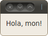

Exemple d'utilització de l'herència
===================================

En aquesta secció farem un programa amb l'entorn Qt que mostri una
finestra amb el text "Hola món!".

Cal crear un projecte Qt de tipus "Other Project" i en la subcategoria
"Empty Qt Project" (un projecte buit).

.. image:: img/qt_new_project.png
   :scale: 70
   :align: center

Llavors afegim un fitxer ``main.cpp`` amb *File* |-->| *New File or
Project...*, escollint "C++ Source File" i afegint el fitxer al
projecte.

En aquest fitxer escriurem::

  #include <QApplication>
  
  int main(int argc, char *argv[]) {
    QApplication app(argc, argv);
    // crear la finstra HolaMon  
    app.exec();
  }

Aquest és el programa mínim en Qt, però no fa res i no es pot aturar,
perquè no hi ha cap finestra (per aturar el programa hauriem de tancar
la aquesta finestra). Hem posat un comentari a on anirà el codi que
posarem després. Ara afegirem una classe nova amb *File* |-->| *New
File or Project...*, escollint *C++ Class*. Surt el quadre:

.. image:: img/qt_new_class.png
   :scale: 70
   :align: center

El nom de la classe serà ``HolaWindow`` i la classe base
``QWidget``. El Qt Creator proposa crear 2 fitxers ``holawindow.h`` i
``holawindow.cpp``, que podem acceptar com a bons, i afegir-los al
projecte en la finestra següent. És interessant observar el codi que
genera Qt Creator quan fem aquesta classe nova. En el constructor de
``HolaWindow`` hem de posar::

  QVBoxLayout *layout = new QVBoxLayout();
  QLabel *etiqueta = new QLabel("Hola, mon!");
  layout->addWidget(etiqueta);
  setLayout(layout);

Aquest codi fa 4 coses:

- Crea un nou *layout*, un "distribuidor d'elements", per dir-ho
  així. Amb un layout es pot fer que els elements de dins de la
  finestra se situin horitzontalment, verticalment, en
  forma de graella, etc. ``QVBoxLayout`` és vertical, malgrat en
  aquest cas només contindrà un sol element i per tant això no és gaire
  rellevant.

- Crea un nou ``QLabel``, una etiqueta que pot tenir el text que
  vulguem. En aquest cas volem que posi el text "Hola, mon!".

- Afegim l'etiqueta al layout (que és com un contenidor).

- Diem a la finestra ``HolaWindow`` que estem construint que volem el
  distribuidor d'elements ``layout`` (que apunta al distribuidor que
  hem creat abans).

Aquesta última crida és interessant perquè és una crida a un mètode de
la classe ``QWidget``.

Com que les classes ``QVBoxLayout`` i ``QLabel`` no les hem creat
nosaltres, haurem de posar l'``#include`` corresponent a dalt de tot::

  #include <QVBoxLayout>
  #include <QLabel>

La llibreria Qt no és estàndar i per tant no és necessari posar
``using namespace std`` ni res d'això.

Ara al fitxer ``main.cpp`` hem d'afegir, a on hi havia el comentari::

  HolaWindow w;
  w.show();

amb el corresponent::

  #include "holawindow.h"

al principi. Un cop fet això, es pot compilar el programa, i sortirà
una finestra com la següent:

.. exercici::

   Segueix els passos que indica l'exemple i compila el
   programa. Modifica el text "Hola mon" i posa'n un altre per veure
   que realment canvia.

   .. solucio::

      Aquest exercici no té solució.
