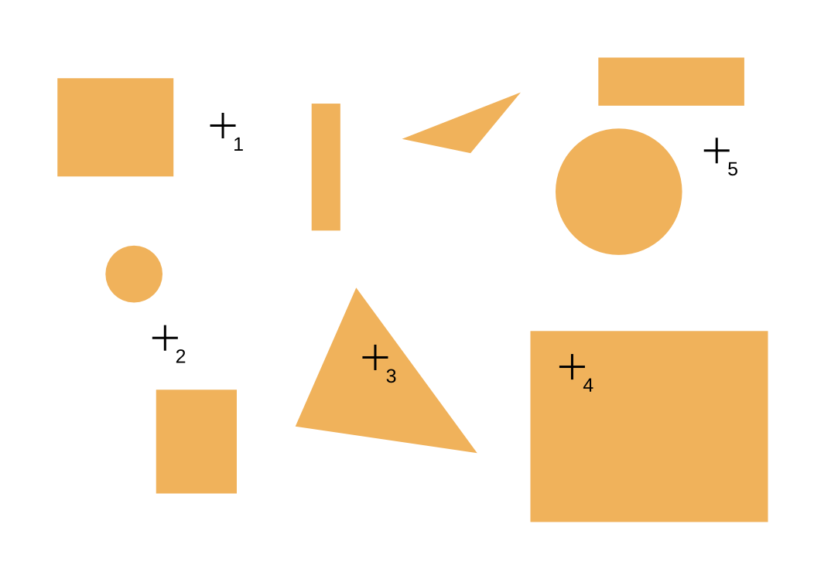

.. tema:: poli

==============
Polimorfisme
==============

.. rubric:: Objectius

- Identificar quins mètodes es cridaran en una crida a mètode ``virtual``.

- Implementar llistes heterogènies.

.. contents:: Contingut 
   :depth: 2
   :local:

.. El punter ``this``
.. ==================
.. .. Un buen ejemplo donde necesitas esto? Que no sea Qt?

Punters a objectes de classes derivades
=======================================

Suposem que tenim una classe ``Instrument`` com la següent\ [1]_::

  class Instrument {
  public:
    void toca(int freq) const;
  };
  
  void Instrument::toca(int freq) const {
    cout << "Instrument::toca: " << freq << endl;
  }

Donada la classe ``Instrument``, declarem llavors la classe ``Flauta``::

  class Flauta : public Instrument {
  public:
    void toca(int freq) const;
  };
  
  void Flauta::toca(int freq) const {
    cout << "Flauta::toca: " << freq << endl;
  }

La classe ``Flauta`` simplement redefineix el mètode ``toca`` de forma diferent
que ``Instrument``. Pel fet que és una classe derivada, però, diem que
una ``Flauta`` **és** un ``Instrument``.

Aquest fet, però, té conseqüències en relació als punters: si una
``Flauta`` és un ``Instrument``, llavors podem fer que un punter a un
``Instrument`` apunti a una ``Flauta``. En la pràctica és correcte,
per tant, escriure el següent::

  Flauta f;
  Instrument *i;
  
  i = &f;

O també::

  Instrument *i = new Flauta;

El recíproc, però, no és tant cert. Imaginem que ara tenim una altra
classe::

  class Guitarra : public Instrument {
  public:
    void toca(int freq) const;
  };
  
  void Guitarra::toca(int freq) const {
    cout << "Guitarra:toca: " << freq << endl;
  }

Si en un programa escrivim el següent::

  Instrument *i = new Guitarra;
  Flauta *f;
  
  f = i; // error

Això succeeix perquè en general, si tenim un punter a un
``Instrument`` no tenim perquè suposar que és una ``Flauta``, com
implica l'assignació "``f = i``". De fet, en l'exemple, el punter
``i`` apunta a una ``Guitarra``, que clarament no és una
``Flauta``. Per tant, quan fem servir punters, podem transformar
punters a les classes base (més generals) lliurement, però no a la
inversa. La regla general és que una assignació de punters com::

  X *a;
  Y *b;
  a = b;

és correcta només quan ``X`` és una classe base de ``Y``.

.. exercici::

   Suposant les declaracions següents::

     class A { ... };
     class B : public A { ... };
     class C : public A { ... };
     class D : public C { ... };
     class E : public C { ... };

   indica quines instruccions són incorrectes::
    
     A *x = new B;
     B *y = new C;
     B *z = x;
     C *t = new A;
     D *u = new E;
     E *v = t;
     B *w = y;
   
   .. solucio::

      Per fer aquest exercici ens hem de fixar an l'assignació localment
      (no en les instruccions prèvies, a on es pot haver posat un valor
      que finalment sí que concorda). Si un punter potencialment pot
      tenir un objecte d'un tipus que no concorda amb el punter al que
      assignem, estarà malament::

        A *x = new B;  
        B *y = new C;  // error
        B *z = x;      // error (veure comentari)
        A *t = new D;
        C *u = new E;
        E *v = t;      // error
        B *w = y;

      El cas ``z = x`` mereix un comentari. Malgrat en principi veiem que
      l'assignació seria correcta (perquè ``x`` apunta a un objecte de tipus
      ``B``), en el moment que el compilador veu una assignació d'un
      punter d'una classe base a una derivada ho considerarà un error.
 

``dynamic_cast`` converteix punters a classes derivades
-------------------------------------------------------

Malgrat normalment no es pot assegurar que un punter a una classe base
es pugui transformar a un punter d'una classe derivada, C++ introdueix
un operador que intenta fer la transformació i si no és vàlida,
retorna el punter 0 (que no apunta enlloc). L'operador és ``dynamic_cast``::
  
  X *p;
  Y *q = dynamic_cast<Y *>(p);

i s'aplica com si fos una funció sobre punters de tipus que s'indica a
dins dels angles (important observar la presència de l'asterisc
``*``).

L'exemple, en el cas dels ``Instruments``, seria::

  Instrument *i = new Guitarra;
  Guitarra *g = dynamic_cast<Guitarra *>(i);

A dins dels angles ("``<``" i "``>``") hi va la classe derivada a la
que volem transformar el punter, en aquest cas ``Guitarra``. Com que en
aquest cas la transformació és vàlida, el punter ``g`` serà diferent
de 0. En el cas següent, però::

  Instrument *i = new Flauta;
  Guitarra *g = dynamic_cast<Guitarra *>(i);

el punter ``g`` valdrà 0 perquè clarament ``i`` apunta a una
``Flauta`` que no es pot transformar en una ``Guitarra``.

Detecció de tipus en temps d'execució
-------------------------------------

Seguint amb l'exemple dels instruments podem fer sel següent programa
per comprovar com "sonen" els instruments::

  int main() {
    Flauta f;
    Guitarra g;
    f.toca(440); // un La 3
    g.toca(880); // un La 4
  }

Si executem aquest programa, per pantalla sortirà::

  Flauta::toca: 440
  Guitarra::toca: 880

Fins aquí, res de nou, en principi. El problema apareix si fem un
programa lleugerament diferent::

  int main() {
    Flauta f;
    Guitarra g;
    Instrument *i = f, *j = g; // accedim a f, g a través de i, j
    i->toca(440);
    j->toca(880);
  }

Ara, si executem el programa, esperem la mateixa sortida i en
canvi la sortida és::

  Instrument::toca: 440
  Instrument::toca: 880

que conceptualment és incorrecte, ja que els objectes apuntats per
``i`` i ``j`` no són de classe ``Instrument``, sinó de classe
``Flauta`` i ``Guitarra`` respectivament, i les dues classes han
redefinit el mètode ``toca``!

La idea subjacent és que el compilador de C++, quan té un punter a un
``Instrument`` no s'ho pensa dos cops i crida el mètode
``Instrument::toca`` sense parar atenció a si l'objecte és *realment*
un ``Instrument`` o una classe derivada.

El modificador ``virtual``
""""""""""""""""""""""""""

Per tal que el compilador de C++ faci l'"esforç" de mirar si un mètode
cridat està o no redefinit a una classe derivada en temps d'execució
hem d'indicar-li nosaltres explícitament. Per fer-ho hem de modificar
una mica la declaració de la classe ``Instrument``::

  class Instrument {
  public:
    virtual void toca(int freq) const;
  };

Simplement hem afegit ``virtual`` com a prefix al mètode ``toca``. El
modificador ``virtual`` és com una marca amb la missió d'alertar el
compilador. En un mètode ``virtual`` el compilador es *mira realment
quin és el tipus de l'objecte apuntat, i crida el mètode
corresponent*.  La definició del mètode no cal que porti
``virtual``, només és necessari posar ``virtual`` a la declaració.

Amb aquest simple canvi, ara el segon programa es comportarà correctament::

  Flauta::toca: 440
  Guitarra::toca: 880

Així doncs, donat que tenim la opció de no posar-lo, és la nostra
responsabilitat marcar els mètodes amb ``virtual`` quan això sigui
necessari\ [2]_.

.. exercici::

   Determina la sortida d'aquest programa:

   .. literalinclude:: ../src/Polimorfisme/exercici_virtual.cc
      :start-after: <<<
      :end-before: >>>

   .. solucio::

      La sortida del programa és::
      
        $$##$${x}{y}{z}
   

Terminologia
------------

polimorfisme 
  De *poli* (múltiples) i *morf* (forma), o sigui "vàries formes". El
  terme es refereix a que tenint un punter a una classe base, podem
  tenir un objecte de qualsevol de les classes derivades i per tant
  aquest punter pot referirse a una d'entre vàries formes.

Llistes heterogènies
====================

En aquesta secció farem un programa sencer que fa servir el
polimorfisme. Es tracta d'un programa que primer llegeix una llista de
figures bidimensionals (rectangles, cercles, etc.) situades en el pla,
tretes d'un fitxer ``figures.txt``. Després llegeix una seqüència de
punts bidimensionals, del fitxer ``punts.txt``, i per a cada un d'ells
determina si estan *a dins* d'alguna de les figures o no. El programa
ha de mostar només els punts interiors per pantalla.

La representació gràfica seria la següent:

Les figures estan pintades en taronja i els punts són les creus. Els
punts 1, 2 i 5 no estan a dins de cap figura, però el 3 i 4 sí. És com
una versió del joc "Hundir la Flota" a on els vaixells són rectangles,
cercles, etc.

Primer farem el programa suposant que només tenim rectangles\
[3]_. Després anirem afegint les altres figures.

El format del fitxer ``figures.txt`` és el següent::

  rectangle 0.0 0.0 10.0 10.0
  cercle 50.0 50.0 10.0
  ...
  final

Cada línia és una figura:

- en els rectangles s'indiquen a continuació les coordenades de cada
  costat, 

- en el cercle s'indiquen les coordenades del centre i del radi, etc.

Per a les altres figures ja decidirem després el format, però en
principi serà molt semblant.

Plantejarem el problema en tres subprogrames:

- ``legeix_figures``, que realitza la lectura de les figures, i

- ``punt_a_dins``, que mira si un punt és interior a les figures, i

- ``processa_punts``, que processa tots els punts.

El programa principal, de fet, és aquest:

.. literalinclude:: ../src/Polimorfisme/teoria_llistes_heterogenies.cc
   :start-after: +main
   :end-before: -main

La declaració de ``TaulaFigures`` és un simple ``struct``:

.. literalinclude:: ../src/Polimorfisme/teoria_llistes_heterogenies.cc
   :start-after: +taula
   :end-before: -taula

que és una taula parcialment ocupada (amb un màxim de 200
elements). La part interessant és el fet que la taula és de punters a
una classe que no hem definit: ``Figura``. Abans de definir-la, podem
implementar ``punt_a_dins`` suposant que ja hem llegit les figures
i així podem escriure el programa que ens agradaria. Després
implementarem la classe ``Figura`` per fer-la quadrar amb el model que
ens hem pensat:

.. literalinclude:: ../src/Polimorfisme/teoria_llistes_heterogenies.cc
   :start-after: +a_dins
   :end-before: -a_dins

Aquest subprograma rep el punt i la taula i fa una cerca. El resultat
final és cert o fals (si el punt és interior a una figura o no). La
part important és com es determina si un punt és interior a una figura
concreta o no: amb el mètode ``a_dins``. O sigui, com es mira si un
punt està o no dins d'una figura depèn clarament de la figura, i cada
figura té un mètode ``a_dins`` corresponent.

Aquest mètode pel que es veu retorna ``bool``, ja que es fa servir en
un ``if``, i rep el punt en qüestió com a paràmetre. Per tant, la
nostra classe ``Figura`` haurà de tenir un mètode com aquest. A part,
suposem que volem posar figures de diferents tipus. Llavors el mètode
haurà de ser ``virtual`` perquè volem que en cada figura es cridi el
mètode adequat.

Així doncs, podem començar a declarar la classe ``Figura``::

  class Figura {
  public:
    virtual bool a_dins(const Punt& p) const;
  };

Ara mateix, no sembla que poguem afegir res més, perquè aquesta classe
és molt general, quan fem la classe ``Rectangle`` o ``Cercle`` podrem
entrar en detalls. De totes maneres, sí que podem definir el mètode
``a_dins`` per a la classe ``Figura``, fent la interpretació que una ``Figura``
genèrica no té àrea i per tant, cap punt pot ser interior::

  bool Figura::a_dins(const Punt& p) const {
    return false;
  }

Anem, doncs, a implementar el subprograma ``processa_punts``. Aquest
s'encarrega de llegir el fitxer i mostrar per pantalla aquells punts
que siguin interiors a una figura. Fent servir la funció
``punt_a_dins`` es tracta d'un recorregut:

.. literalinclude:: ../src/Polimorfisme/teoria_llistes_heterogenies.cc
   :start-after: +processa
   :end-before: -processa

Aquesta acció rep la taula omplerta i mira cada punt. Per llegir la
taula, ens falta l'acció ``llegeix_figures``:

.. literalinclude:: ../src/Polimorfisme/teoria_llistes_heterogenies.cc
   :start-after: +llegeix
   :end-before: -llegeix

Aquesta acció és interessant: va llegint línies del fitxer i en funció
de la paraula que troba al principi de cada línia, crea l'objecte
corresponent. Per ara només podem crear ``Rectangle``\s, i en la crida
al constructor del ``Rectangle`` es veu com es passa el fitxer per tal
que el ``Rectangle`` ompli els seus atributs amb dades tretes del
fitxer. Això ens tocarà implementar-ho després.

A cada línia del fitxer, doncs, s'afegeix una figura reservada en
memòria dinàmica a la taula, que pot ser diferent cada cop.

Finalment, ens toca implementar el ``Rectangle``:

.. literalinclude:: ../src/Polimorfisme/teoria_llistes_heterogenies.cc
   :start-after: +rectangle
   :end-before: -rectangle

Per compilar el programa haurem de posar els ``#include``\s següents::

   #include <iostream>
   #include <fstream>
   #include <cstdlib> // per la funcio exit
   using namespace std;

.. exercici::

   Reconstrueix el programa a partir dels trossos presentats i
   executa'l amb els fitxers següents:
   
   - :download:`figures.txt <../src/Polimorfisme/figures.txt>`.

   - :download:`punts.txt <../src/Polimorfisme/punts.txt>`.

   El programa ha de donar com a sortida::
   
     5 5
     25 25

   .. solucio::

      El programa sencer (que pots :download:`descarregar <../src/Polimorfisme/teoria_llistes_heterogenies.cc>`) és:

      .. literalinclude:: ../src/Polimorfisme/teoria_llistes_heterogenies.cc

.. exercici::

   Afegeix la classe ``Cercle``. Per saber si un punt està dins d'un
   cercle has de calcular la distància al centre del cercle i mirar si
   és més petita que el radi. 

   .. solucio::

      Primer hem de declarar i implementar la classe ``Cercle``
      ::

         class Cercle {
           float x, y, radi;
         public:
           Cercle(istream& i);
           bool a_dins(const Punt& p) const;
         };
      
         Cercle::Cercle(istream& i) {
           i >> x >> y >> radi;
         }

         Cercle::a_dins(const Punt& p) const {
           float dx = p.x - x;
           float dy = p.y - y;
           return sqrt(dx*dx + dy*dy) < radi;
         }

      Després hem de modificar ``llegeix_figures`` per tenir en compte
      els cercles::

         if (tipus == "rectangle") {
           ...   
         }
         else if (tipus == "cercle") {  // +
           nova = new Cercle(Ff);       // +
         }                              // +
         else {
           ...
         }

      Les línies noves estan marcades amb "``// +``".

.. exercici::

   Afegeix la classe ``Triangle``.

   .. solucio::

      [Triangle]

  

Una classe abstracta té algun mètode ``virtual`` sense implementació
--------------------------------------------------------------------

Per acabar de polir el programa, farem un petit canvi. És petit en
relació als canvis al codi font, però conceptualment és important. Es
tracta de polir una mica la classe ``Figura``. Quan hem definit el
mètode ``a_dins`` per la classe figura, hem adoptat la postura que les
figures no tenen àrea i per tant aquest mètode retorna ``false``. Però
en realitat la implementació ideal no hauria d'existir, ja que una
``Figura`` és una idea abstracta i no té sentit definir el mètode
``a_dins`` si no tenim una figura concreta.

De fet, en tot el programa no hi ha cap lloc on es creï un objecte de
tipus ``Figura``. Les figures que es creen són totes ``Rectangle``\s,
``Cercle``\s i ``Triangles``\s. Per tant, el mètode ``Figura::a_dins``
no s'utilitza. El problema és que si el declarem i no l'implementem,
el compilador donarà un error

.. exercici::

   Esborra la implementació del mètode ``Figura::a_dins`` i observa el
   tipus d'error que resulta.

   .. solucio::

      En Linux, la compilació retorna els següents errors::

        /tmp/cco9EMxp.o: In function `Figura::Figura()':
        teoria_llistes_heterogenies.cc:(.text._ZN6FiguraC2Ev[Figura::Figura()]+0xf): undefined reference to `vtable for Figura'
        /tmp/cco9EMxp.o:(.rodata._ZTI9Rectangle[typeinfo for Rectangle]+0x10): undefined reference to `typeinfo for Figura'
        collect2: ld returned 1 exit status
      

La solució a aquest problema seria fer explícit el fet que
``Figura::a_dins`` no existeix, perquè una ``Figura`` és un concepte
"abstracte". Per indicar això la declaració del mètode a ``a_dins`` ha
de ser::

   virtual bool a_dins(const Punt& p) const = 0;

El que hem fet és afegir un "``= 0``" al final, que dóna a entendre
que el mètode no té implementació. La conseqüència d'això és que:

- ``Figura`` passa a ser una *classe abstracta*, i 

- no podem construïr objectes de tipus ``Figura``.

Com que en el programa no hem construït cap ``Figura`` directament
això no representa cap problema.

.. exercici::

   Modifica el programa per fer la classe ``Figura`` abstracta i
   comprova que compila correctament.

   .. solucio::

      Només cal afegir (un cop esborrada la implementació del mètode
      ``Figura::a_dins``) un "``= 0``" al final de la declaració i el
      programa compila correctament.

.. exercici:: 
   
   Indica quin és el problema a la classe següent::

     class A {
     public:
       void metode() = 0;
     }

   .. solucio::
   
      El problema és que s'ha fet servir el sufix "``= 0``" en un
      mètode que no és ``virtual`` i això no té sentit.

.. [1] Aquesta classe no té cap utilitat real, és només una excusa per
       explicar el tema actual.

.. [2] En altres llenguatges, com per exemple Java o Python, no és
       necessari posar ``virtual`` perquè es considera normal que el
       llenguatge cridi els mètodes redefinits per defecte. En això
       C++ és força especial.

.. [3] El programa final tindrà molts més tipus de figures
