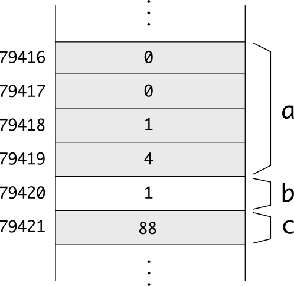
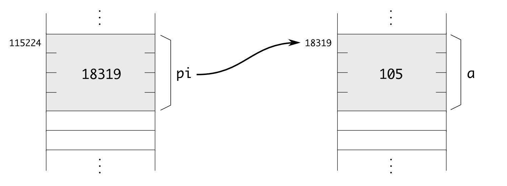

.. tema:: pt

=====================
Punters i Referències
=====================

.. rubric:: Objectius

- Descriure què és una adreça de memòria i un punter.

- Declarar punters a un tipus qualsevol. Accedir al valor apuntat,
  incloent camps d'estructures.

- Iterar posicions de memòria consecutives fent servir punters.

- Passar paràmetres per referència fent servir punters.

Punters
=======

La memòria és una gran taula de *bytes*
---------------------------------------

La memòria d'un ordinador és una taula molt gran (amb milions de
caselles), i a on cada casella conté un *byte* [#nota1]_. Si un
ordinador té 512Mb de memòria, aquesta taula té :math:`512 \times
1024^2` caselles de 1 byte, que són 536870912. 

Per accedir a una posició de memòria, doncs, hem d'especificar quina
casella volem. El número de la casella (el seu índex), és el que
s'anomena l'**adreça de memòria**. En el cas d'un ordinador amb 512Mb,
l'adreça és, doncs, un enter entre 0 i 536870911. El tamany en bits
d'una adreça és molt important. En un ordinador de 32 bits, la màxima
adreça que es pot manipular és precisament un enter amb 32 bits.

.. exercici::

   En un ordinador amb 4Gb de memòria (:math:`4 \times 1024^3`), quina
   és la primera i la última adreça de memòria?

   Quants bits es necessiten per emmagatzemar l'enter que representa
   l'adreça?

   .. solucio::
   
      La primera adreça d'un ordinador amb 4Gb de memòria és 0 i la
      última és :math:`4 \times 1024^3`, és a dir 4294967296.
   
      Es necessiten 32 bits per emmagatzemar una adreça d'aquest tamany,
      10 bits per a cada 1024 (n'hi ha 3) i 2 bits més (pel 4). En un
      ordinador amb 32 bits, la màxima memòria adreçable és 4Gb, doncs.
   

Quan en un programa es reserva espai per a una variable, realment
s'estan agafant unes quantes caselles consecutives de la memòria amb
espai suficient per contenir un valor d'aquell tipus. Per exemple, si
en un programa declarem les variables::

  int a = 260;
  bool b = true;
  char c = 'X';

A la memòria hi haurà

És a dir, ``a`` ocupa les caselles 79416 a 79419, la ``b`` ocupa la
79420 i la ``c`` ocupa la 79421. No podem saber quines seran
exactament les caselles que es faran servir (cada cop que s'executa el
programa poden ser diferents), però sí que estaran més o menys juntes
i el seu tamany [#nota2]_. L'adreça d'una variable és, de fet l'índex
de la *primera casella* (si en té més d'una) que ocupa. En el programa
anterior, l'adreça de ``a`` seria 79416, la de ``b`` 79420 i la de
``c`` 79421.

.. rubric:: L'operador ``sizeof``

La següent taula mostra el tamany que tenen els tipus bàsics:

========== ===================
*Tipus*    *Tamany*
---------- -------------------
``bool``   1 byte
``char``   1 byte
``int``    4 bytes
``float``  4 bytes
``double`` 8 bytes
``string`` 4 o 8 bytes
========== ===================

Però com podem saber el tamany que ocupa un cert tipus? Doncs fent
servir l'operador ``sizeof``, que rep entre parèntesis un tipus, i
retorna una constant que representa el número de bytes que ocupa el
tipus posat. Aquest operador *no* és una funció. Un senzill programa que
permet obtenir la informació de la taula anterior és el següent:

.. literalinclude:: ../src/05_Punters/sizeof.cpp

Aquest programa fa servir l'operador ``sizeof`` de C++ que permet obtenir el
tamany en memòria (en bytes) d'un tipus qualsevol. El tipus ``string``
ocupa diferent en funció de si l'ordinador és de 32 o 64 bits.

L'operador ``&`` permet obtenir l'adreça d'una variable
-------------------------------------------------------

En un programa podem obtenir l'adreça d'una variable ``a`` posant
``&a``. Per exemple, el programa següent mostra les adreces reals en
que ``a``, ``b`` i ``f`` resideixen:

.. literalinclude:: ../src/05_Punters/cout_addr.cpp

.. exercici::

   Compila el :download:`programa anterior <../src/05_Punters/cout_addr.cpp>` 
   i mira quines adreces surten.
 
   .. solucio::
   
      Les adreces que surten si executem el programa depenen tant de
      l'ordinador que es fa servir. Si l'ordinador és de 64 bits (el
      meu cas), surten 3 adreces de 64 bits::
  
        0x7fff6755d918 0x7fff6755d91f 0x7fff6755d914
  
      El format en què es representen aquestes adreces és 
      `hexadecimal <http://en.wikipedia.org/wiki/Hexadecimal>`_. 
      Cada vegada que s'executa el programa poden sortir adreces
      diferents. No es pot saber a on exactament el compilador
      col·locarà les dades.
   
Un punter és una variable que conté una adreça
----------------------------------------------

En C++ no només podem obtenir una adreça d'una variable, també la
podem emmagatzemar. El valor de l'adreça, però, no el podem guardar en
una variable de tipus enter (malgrat és cert que una adreça *és* un
enter). Per emmagatzemar adreces, hem de declarar variables de tipus
especial ja que les adreces a dades de tipus enter són diferents
de les adreces a dades de tipus caràcter (la memòria, cal
recordar-ho, és completament uniforme i sense cap pista, no podem
saber de quin tipus és un grup de *bytes*).

Per exemple, el següent codi declara un punter a enters::

  int *pi;

Els punters es declaren amb un tipus normal però posant asterisc
(``*``) enganxat a davant del nom de la variable. La variable
``pi``, doncs, pot emmagatzemar adreces de variables que siguin enters
(només!). Per tant, en un programa podem fer el següent::

  int a = 105;
  int *pi;
  pi = &a;

L'assignació del final omple la variable ``pi`` amb l'adreça de la
variable ``a``. Aquesta situació es representa així:

Es diu que el punter ``pi`` apunta a la variable ``a``, perquè conté
l'adreça d'aquesta variable, i es posa una fletxa desde ``pi`` a ``a``.

Cada tipus "``X``" té associat un tipus punter "``X *``", per a
variables que contenen adreces a dades tipus "``X``". El següent codi
declara punters de diferents tipus, i els assigna adreces::

  int a, b, c;
  float x, y, z;
  char c, d;

  char *pc, *pd;
  float *pf1, *pf2;
  int *p1, *p2;
  ostream *pos;

  pc = &c;
  pd = &d;
  pf1 = &x;
  pf2 = &x;
  p1 = &a;
  pos = &cout;

.. exercici::

   Declara dos punters de nom ``pc1`` i ``pc2`` a variables de la
   classe ``Complex``.

   .. solucio::

      La declaració serà

      ::

        Complex *pc1, *pc2;

L'operador ``*`` obté el valor que hi ha en una adreça
------------------------------------------------------

Si disposem d'un punter, això ens dóna accés (indirectament) a una
posició de memòria que conté algun valor. Per accedir a aquest valor a
partir del punter, ja sigui per consultar-lo o modificar-lo, farem
servir l'operador ``*`` (unari!), que es diu "operador d'indirecció" o
"operador de desdirecció". Si tenim un punter ``pi`` que apunta a un
valor enter, per obtenir aquest enter s'escriu ``*pi``
[#nota3]_. L'expressió ``*pi`` és substituible per la variable
original (d'on hem tret l'adreça), i podem fer amb ella el que hem fet
sempre amb les variables.

El següent programa mostra la utilització d'aquest operador::

  int a = 5;
  int *pi = &a; // pi apunta a 'a'  
  *pi = 3;
  cout << "La variable 'a' val: " << a << endl;

El programa mostrarà per pantalla un ``3``, ja que hem modificat, amb
la instrucció ``*pi = 3`` el valor enter a la posició de memòria a on
``a`` residia, i per tant el seu valor ha canviat. És com si haguéssim
posat la instrucció "``a = 3``".

.. exercici::

   Digues quina és la sortida del següent programa::

     int a = 1;
     int *p1 = &a, *p2 = &a;
     *p1 += 1;
     *p2 += 1;
     cout << a << endl;

   .. solucio::
   
      La sortida del programa serà "3". La variable ``a`` ocupa certa
      posició de memòria que estem incrementant indirectament a través
      de dos punters que apunten a la posició de ``a``.

.. exercici::

   Digues quina és la sortida del següent programa::

     float x = 1.0, y = 2.0;
     float *pf1 = &x, *pf2 = &y, *pf3;
     pf3 = pf1;
     pf1 = pf2;
     pf2 = pf3;
     *pf1 += 0.5;
     *pf2 = *pf2 / 2.0;
     cout << x << ' ' << y << endl;

   .. exercici::
   
      La sortida del programa serà::
   
        0.5 1.5
   
      El resultat s'explica perquè els punters ``pf1`` i ``pf2``
      contenen, inicialment, les adreces de ``x`` i ``y`` respectivament,
      i després, utilitzant ``pf3`` com a variable temporal, aquestes
      adreces s'intercanvien, de manera que ``pf1`` apuntarà a ``y`` i
      ``pf2`` apuntarà a ``x``. Llavors se suma 0.5 a ``*pf1`` (que és
      ``y``), i ``*pf2`` (que és ``x``) es divideix per 2.

La prioritat de l'operador ``*`` respecte a altres operadors
------------------------------------------------------------

Si escrivim un programa com::

  int a = 1;
  int *pa = &a;
  *pa++;
  cout << a << endl;

la sortida pot sembla sorprenent. Un espera que per la pantalla surti
un 2, però no és així. Surt un 1. La raó és que la instrucció
"``*pa++``" s'interpreta com "``*(pa++)``", i no com "``(*pa)++``" que
és el que volem nosaltres. En el programa, doncs, el que s'incrementa
és el punter mateix (l'adreça!), i no pas el valor enter al que
apunta. Això succeeix perquè l'operador d'increment ``++`` és més fort
que l'operador d'indirecció ``*``.

S'ha d'anar amb compte, doncs, a l'hora de manipular punters. Això
també afecta l'accés a tuples::

  struct Punt {
    double x, y;
  };

  int main() {
    Punt a;
    Punt *pa = &a;
    *p.x = 0.0; // error, 'p' no té camps
    *p.y = 1.0; // error, 'p' no té camps
  }

Com que l'operador d'accés a tuples és el més fort de tots, s'aplica
primer i per tant el codi dona un error de compilació. Per arreglar-ho
podem fer servir parèntesis::

    (*p).x = 0.0;
    (*p).y = 1.0;

Així el codi funcionaria perfectament.

.. rubric:: L'operador ``->``

El fet d'haver de posar "``(*p).``" per accedir als camps d'una tupla de
seguida és fa feixuc, i per això C++ té una sintaxi equivalent:
"``p->``". La fletxa es pot interpretar com "accedeix al camp de la
tupla a la que apunta ``p``".  En un programa com l'anterior, doncs,
podriem escriure::

   p->x = 0.0;
   p->y = 0.0;
 
Aquesta notació és més clara (i més fàcil d'escriure) i és utilitzada
majoritàriament.

.. TODO ejercicio sobre acceder a métodos de clases a través de un puntero!!

Els punters permeten fer pas per referència de paràmetres a accions
-------------------------------------------------------------------

Suposem que tenim una acció com la següent::

  void suma5(int& a) {
    a += 5;
  }

Aquesta acció es crida desde un programa principal com::

  int main() {
    int x;
    cout << "Un enter? ";
    cin >> x;
    suma5(x);
    cout << "Més 5 dóna: " << x << endl;
  }

El main, doncs, té una variable ``x`` que conté el valor al que volem
sumar 5. Si fem una acció ``suma5p`` que rebi un punter en comptes
d'un valor per referència, es pot aconseguir el mateix resultat, ja
que el punter contindrà l'adreça de la variable que s'ha de modificar
i en el ``main`` passarem l'adreça de ``x`` a ``suma5p``. La nova
implementació és::

  void suma5p(int *a) {
    *a += 5;
  }

I per invocar l'acció ``suma5p`` ara haurem de posar l'adreça de ``x``
en el ``main``::

  int main() {
    int x;
    cout << "Un enter? ";
    cin >> x;
    suma5p(&x);
    cout << "Més 5 dóna: " << x << endl;
  }

.. exercici::
   
   Digues quina és la sortida del següent programa si l'entrada és "7 11"::

     void f(int *a, int *b) {
       int x = *a;
       *a = *b;
       *b = x;
     }

     int main() {
       int i, j;
       cout << "Dos enters? ";
       cin >> i >> j;
       f(&i, &j);
       cout << "Ara són: " << i << ' ' << j << endl;
     }

   .. exercici::
   
      La sortida serà "11 7". L'acció ``f`` en realitat intercanvia els
      valors continguts a les adreces ``a`` i ``b``. El programa
      principal simplement crida la funció amb valors llegits del teclat.

.. include:: Punters_a_Taules.rst

Problemes
=========

.. problema::

   *[Aquest problema és opcional]*

   Modifica el programa de la pràctica 1 per tal que inverteixi la
   imatge que se li passa com a primer argument. Fes servir un nom fix
   per a la imatge de sortida (per exemple, ``sortida.pgm``).

.. problema::

   *[Aquest problema és opcional]*

   Modifica el programa anterior per tal que inverteixi un grup
   d'imatges que es passen com a arguments. Fes una funció que per a
   un nom d'imatge donat (posem ``"groucho.pgm"``), produeixi un nom
   com ``"groucho_inv.pgm"``, i fes servir aquest nom per a la imatge
   guardada (si poses un nom fix per a la sortida, se sobreescriurà).

.. rubric:: Bibliografia

.. Añadir el libro nuesto!!

Bruce Eckel, `Thinking in C++ <http://www.mindview.net/Books/TICPP/ThinkingInCPP2e.html>`_, Volume
1, 2nd Edition. Prentice Hall, 2000. **Seccions 4.4, 4.5, 4.6 i 4.7**. Aquest llibre és de
lliure distribució i d'aquestes seccions existeix una 
`traducció al castellà <http://arco.esi.uclm.es/~david.villa/pensar_en_C++/products/vol1/ch03s04s04.html>`_.

.. [#nota1] Un valor de 8 bits, com un enter entre 0 i 255. El tipus
            ``char`` té aquest tamany.

.. [#nota2] El tamany pot dependre de l'ordinador en concret que es
            faci servir (en concret si és de 32 o 64 bits).

.. [#nota3] El fet que es reaprofita la mateixa notació tant per a la
            declaració com per a l'ús és una font de confusió al
            principi.

.. [#nota4] En Windows, quan arrossegues un fitxer a sobre d'un
            programa executable, el nom del fitxer arrossegat es posa
            com a argument del programa. Si arrossegues un grup de
            fitxers, es posen tots com a arguments.
