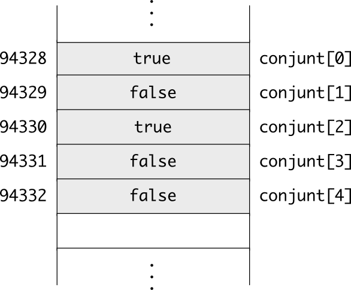

Organització de taules en memòria
=================================

A un punter se li pot sumar i restar un enter
---------------------------------------------

Els punters, donat que són variables, també es poden modificar. Fins
ara hem vist que els podem assignar l'adreça d'una variable. Però
també se'ls pot sumar i restar un enter. Per exemple, si un punter
``pc`` conté l'adreça d'un caràcter ``c`` (que suposem que val
``13925``)::

  char c;
  char *pc = &c;

i li sumem 1::

  pc += 1;

llavors a la variable ``pc`` tindrem l'adreça ``13926``, que seria
l'adreça del caràcter situat just al després de ``c`` a la memòria.

Però com hem vist abans, no tots els tipus de dades tenen el mateix
tamany. Llavors, si tenim un punter ``px`` que apunta a una variable
``x``::

  int x;
  int *px = &x;

i volem fer-lo apuntar a l'adreça de memòria de l'enter del costat,
hauríem de sumar 4 en comptes de 1 (ja que els enters ocupen 4 bytes i
cada adreça individual és refereix a 1 byte). El propi C++, però, ja
controla aquest fet, i quan sumem 1 a un punter a enters, realment a
l'adreça **se li suma 4**. És per això que els punters tenen un tipus.

.. exercici::

   Compila el següent programa:

   .. literalinclude:: ../src/05_Punters/ptr_inc.cpp

   i observa les adreces que surten per pantalla:

   .. solucio::
   
      Tal com deiem abans, aquest programa pot donar diferents
      resultats en funció de la màquina en què estiguem. En el meu
      ordinador el resultat és::
   
        0x7fff80ae1e9c
        0x7fff80ae1ea0
   
      Que indica que un enter ocupa 4 bytes (de ``9c`` a ``a0`` hi ha
      una distància de 4 en 
      `hexadecimal <http://en.wikipedia.org/wiki/Hexadecimal>`_ ).

Les caselles de les taules ocupen posicions de memòria consecutives
-------------------------------------------------------------------

En C++, les taules no són més que posicions de memòria consecutives
que contenen valors d'un mateix tipus. Quan declarem una taula, es
reserva un bloc en memòria amb tants bytes com el tipus de la casella
multiplicat pel tamany de la taula. Per exemple::

  bool conjunt[5] = { true, false, true, false, false };

reserva 5 bytes consecutius en memòria (el tipus ``bool`` ocupa 1
byte), i els inicialitza amb 5 valors concrets. La representació d'aquesta
taula seria:

Quan fem servir un índex a una casella, doncs, el que succeeix és que
es fa servir la primera adreça de la taula i se li suma un enter que
és l'índex que posem, per tant escriure::

  conjunt[2]

vol dir agafar l'adreça base, sumar 2 (tercera casella), i accedir a
la posició resultant (ja sigui per modificar o per consultar). El fet
que els índexs de les taules facin servir com a primer element el 0
prové d'aquesta manera de emmagatzemar taules en memòria, si sumem 0 a
l'adreça base *anirem a l'element número 1*.

.. exercici::

   Quants bytes ocupa una taula de 10 floats?

   .. solucio::

      Si un ``float`` ocupa 4 bytes, una taula de 10 floats n'ocupa 40,
      tots seguits en memòria.

El nom d'una taula és un punter al seu primer element
-----------------------------------------------------

Quan declarem una taula, per obtenir la seva adreça (la primera adreça
que conté dades de la taula) tenim dues opcions. Una de senzilla, pel
que hem vist, seria treure l'adreça de la primera casella::

  int prim[5] = { 2, 3, 5, 7, 11 };
  int *p1;
  p1 = &prim[0];

Al cap i a la fi, ``prim[0]`` és com una variable entera normal i
corrent i per tant podem obtenir l'adreça amb l'operador
``&``. 

Però hi ha una altra manera: fer servir el nom de la taula sense
corxets::
 
  int *p2 = prim; // igual que p2 = &prim[0]

En C++, se segueix la convenció que el nom d'una taula s'avalua com
*un punter a la seva primera casella*. De fet, això implica que una
instrucció com::

  prim[2] = 5;

és equivalent a::

  int *p3 = prim;
  p3 += 2;
  *p3 = 5;

O, si ho posem tot junt::

  *(prim + 2) = 5;

.. exercici::
   
   Digues quina serà la sortida del següent programa::

     int main() {
       char T[4] = { 'a', 'b', 'c', 'd' };
       char *p = T + 3;
       cout << *(p - 1) << endl;
     }

   .. solucio::
   
      La sortida serà "c". El punter ``p`` s'inicialitza a la 4 casella
      de la taula (``'d'``), però al mostrar-lo per pantalla se li resta 1
      i es mira el valor d'aquella posició.

.. exercici::

   Digues quina serà la sortida del següent programa::

     int main() {
       int T[3] = { 5, 10, 15 };
       int *p = T;
       p += 2;
       *p = *p / 3;
       p--;
       *p = *p - 1;
       cout << T[0] << ", " << T[1] << ", " << T[2] << endl;
     }

   .. solucio::
   
      La sortida serà::
   
         5 9 5
   
      La raó és que ``p`` primer es posa a la primera casella, però de
      seguida se li suma 2 (i es coloca a la tercera). Llavors es
      divideix per 3 el valor de la casella (el 15), es decrementa ``p``
      (estem a la segona casella) i se li resta 1 al valor al que apunta
      ``p`` (el 10).

Un punter es pot fer servir com una taula
-----------------------------------------

Si el nom d'una taula és un punter al seu primer element, ens pot
sorgir el dubte de si un punter es pot utilitzar com si fos una
taula. La resposta és afirmativa::

  int taula[3] = { 5, 10, 15 };
  int *p;
  p = taula;
  cout << p[0] << ' ' << p[1] << ' ' << p[2] << endl;

Les expressions ``p[0]``, ``p[1]`` i ``p[2]`` són les que escriuriem
si ``p`` fos una taula, però realment és un punter. Així doncs, el
programa anterior mostrarà per pantalla::

  5 10 15

tal com esperem. Llavors, ``p`` és com un nom alternatiu per a la
variable ``taula``. La diferència entre els dos és que l'adreça de
``taula`` no es pot modificar mentre que la de ``p`` sí.

.. exercici::

   Determina la sortida del següent programa::

      char paraula[5] = { 'H', 'e', 'l', 'l', 'o' };
      char *p = paraula;
      p[1] = 'a';
      for (int i = 0; i < 5; i++) cout << p[i];
      cout << endl;

   .. solucio::

      La sortida serà::
     
        Hallo

.. exercici::

   Determina la sortida del següent programa::

      char paraula[5] = { 'H', 'e', 'l', 'l', 'o' };
      char *p = paraula + 1;
      p[2] = 'o';
      p[0] = 'a';
      p += 3;
      *p = ' ';
      for (int i = 0; i < 5; i++) cout << p[i];
      cout << endl;

   .. solucio::

      La sortida serà::

         Halo 

      En aquest exercici la part crucial és veure que el punter ``p``
      apunta a la *segona* casella de ``paraula`` i llavors la
      correspondència entre índexs i caselles es calcula amb la "base"
      situada a la segona casella.

Els *strings* de C són punters a caràcters
------------------------------------------

El llenguatge C++ prové del llenguatge C, i en C els punters a
caràcter tenen un significat especial. En C, s'assumeix que si tenim
un punter a caràcters, aquest punter apunta a una **taula de caràcters
acabada amb un caracter de codi 0**. Aquest caracter final és realment
un sentinella, ja que mai es mostra per pantalla. Si no hi hagués
sentinella, no es podria saber el tamany de la taula només amb el
punter (que és una simple adreça).

Quan escrivim en un programa una paraula entre cometes dobles (``"``),
es crea una taula de caràcters amb un caràcter més del compte (per
posar el sentinella), i es retorna un punter a la primera casella::

  int main() {
    char *paraula = "hola";
  }

Les cadenes de caracters com aquestes són més bàsiques que el tipus
``string`` (que és una classe de C++). Però una cadena de caracters es
pot mostrar per pantalla tal com hem fet fins ara amb els objectes de
tipus ``string``::

  int main() {
    char *paraula = "hola";
    cout << paraula << endl;
  }

La instrucció "``cout << paraula``" és com "``cout << "hola"``", que
hem fet servir sempre abans. Ara sabem, però, que realment ``cout``
rep un punter a caracter i l'interpreta com una taula.

.. exercici::

   Determina la sortida del següent programa:

   .. literalinclude:: ../src/05_Punters/petita_gran_frase.cpp

   .. solucio::

      La sortida del programa serà::
   
        Gran Frase
   
      La raó és que ``pf`` s'inicialitza al principi de la frase ``F``,
      però després se li sumen 7 valors (salta 7 lletres). Llavors el
      punter que rep ``cout`` és d'una taula acabada en 0 a partir de la
      ``'G'``, i per això mostra només aquesta part.

La classe ``string`` de C++, doncs, té un constructor que permet crear
un string a partir d'una cadena de caràcters de C, tal com en::

  string R("Rosebud");

i també té un mètode ``c_str`` que permet obtenir un punter a
caràcters a partir d'un ``string``::

  const char *p = R.c_str();

El tipus del punter no és "``char *``", però, ja que això ens permetria
modificar els caracters individuals. El punter és, de fet, a una taula
de caràcters constants (no modificables), per això el ``const``.

Els arguments d'un programa són strings de C
--------------------------------------------

Quan executem un programa, aquest pot rebre arguments (com si fós una
"funció del sistema operatiu"). Per exemple, si tenim un programa
anomenat ``img_invert`` que inverteix una imatge, per dir-li al
programa quina imatge ha d'invertir, podem posar en la comanda, al
costat del nom del programa, un nom de fitxer [#nota4]_::

  C:\Mis Documentos\PBD\05_Punters> img_invert groucho.pgm

Aquests arguments (en aquest cas només ``groucho.pgm``) els rep la
funció ``main``, però amb la declaració de la funció que hem fet
servir fins ara no es poden obtenir, ja que declarem ``main`` sense
paràmetres (``int main()``). La declaració de ``main`` si volem
tenir accés als arguments és::

  int main(int argc, char *argv[]);

En aquesta versió, ``main`` rep un enter (``argc``, el número
d'arguments) i una taula ``argv`` de cadenes de caracters (paraules),
que són els arguments en sí. De fet, ``argv`` és una taula de punters,
ja que cada cadena és un punter. Els arguments, de fet, comencen a la
casella 1, ja que el primer argument (el 0) és el nom del programa.

El següent programa ``hola`` fa servir el primer argument
(``argv[1]``) i fa una salutació suposant que se li passa un nom:

.. literalinclude:: ../src/05_Punters/hola.cpp

.. exercici::

   Compila :download:`el programa anterior <../src/05_Punters/hola.cpp>` i
   executa'l de manera que mostri per pantalla el següent::

     Hola, Groucho, què tal estàs?

   Com s'hauria d'executar per produir::

     Hola, Groucho Marx, què tal estàs?

   .. solucio::
 
      *[Aquesta solució està per fer...]*

.. exercici::

   Canvia el programa anterior perquè saludi a tots els noms que rep
   com a arguments. Si l'executem com::

     hola Groucho Chicco Harpo

   he de dir::

     Hola, Groucho, què tal estàs?
     Hola, Chicco, què tal estàs?
     Hola, Harpo, què tal estàs?

   .. solucio::
 
      *[Aquesta solució està per fer...]*

.. exercici::

   Fes un programa que mostri el número d'arguments i els arguments
   per pantalla, de manera que puguis comprovar quins arguments rep el
   programa. Anomena el programa ``see_args``. Comprova la sortida per
   a les següents comandes::

      see_args a1 a2 a3
      see_args "a1 a2 a3"
      see_args /x /w

   .. solucio::
 
      *[Aquesta solució està per fer...]*

.. 
   Saltamos esto
   include:: Punters_a_Taules_Recorreguts.rst

.. [#nota4] En Windows, quan arrossegues un fitxer a sobre d'un
            programa executable, el nom del fitxer arrossegat es posa
            com a argument del programa. Si arrossegues un grup de
            fitxers, es posen tots com a arguments.
