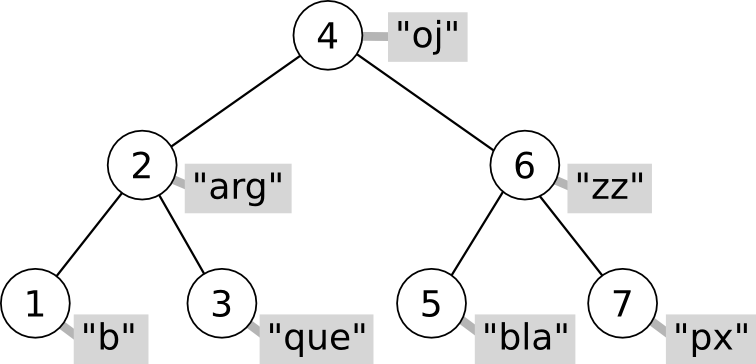

.. tema:: map

=================================
Taules Associatives
=================================

.. contents:: Contingut 
   :depth: 2
   :local:

taula associativa
  Una taula associativa és un contenidor de parelles de valors. Cada
  parella està composada d'una **clau** (o *key*, en anglès) i un
  **valor** (o *value*). El contenidor està organitzat especialment
  per buscar eficientment aquestes parelles fent servir la clau.

Parelles
--------

La STL ofereix una plantilla per crear tuples de 2 valors (o parelles)
de forma molt senzilla. El tipus parella s'anomena ``pair<A,B>`` a on
``A`` i ``B`` són tipus qualssevol. Les taules associatives fan servir
``pair`` per emmagatzemar els elements. Declarar parelles és tan
senzill com::

   pair<int,char> p1, p2;
  
Aquest codi declara dues variables (``p1`` i ``p2``) que contenen,
cadascuna, un valor ``int`` i un valor ``char``. Els camps de la
parella tenen els noms ``first`` i ``second`` per definició, i tenen
els tipus ``int`` i ``char`` en aquest cas (``first`` tindrà el primer
tipus i ``second`` el segon). Per tant, si volem que ``p1`` contingui
els valors ``12`` i ``'q'`` farem::

   p1.first = 12;
   p1.second = 'q';

En definitiva, quan declarem una variable de tipus ``pair<int,char>`` ens
estem *estalviant* haver de declarar primer una tupla com la següent::

   struct tParella {
     int first;	   
     char second;
   };

Els tipus de la parella poden ser qualssevol, i com en tots els altres
contenidors de la STL, podem crear parelles de tipus (i per tant,
classes) que haguem definit nosaltres::

   pair<string,Data> p;

Per omplir la parella en el moment de la construcció, es pot fer
servir un constructor amb dos paràmetres::
 
   pair<int,string> q(10, "Satriani");

.. exercici::

   Declara el següent:

   - Una parella amb un real i un Booleà.
   - Una parella amb dos enters, inicializats a -1 i 13 (fent servir
     el constructor).

   .. solucio::
      ::

         pair<float,bool> p;
         pair<int,int> p2(-1, 13);
      

.. exercici::

   Declara un vector de 3 caselles de parelles d'un enter i un
   caràcter i omple el vector amb les parelles (``'a'``, 1), (``'b'``,
   2) i (``'c'``, 3).

   .. solucio::
      ::

         vector< pair<int,char> > v(3);

         v[0].first = 'a'; // una manera d'omplir cada parell
         v[0].second = 1; 

         v[1] = make_pair('b', 2); // una altra manera
         v[2] = make_pair('c', 3);

      És important recordar que va un espai entre els ``'>'`` de
      ``vector`` i ``pair``.
   

.. exercici::

   Fes una funció que rebi una llista de parelles d'un ``string`` i un
   enter i esborri de la llista aquelles parelles a on l'enter sigui
   negatiu.

   .. solucio::

      ::
   
         void esborra_negatius(const list< pair<string,int> >& L) {
           list< pair<string,int> >::iterator i = L.begin();
           while (i != L.end()) {
             if (i->second < 0) {
               i = L.erase(i);
             }
             else i++;
           }
         }

Construcció ràpida (``make_pair``)
""""""""""""""""""""""""""""""""""

Sovint sorgeix la necessitat de passar parelles de valors com a
paràmetres. Per exemple, suposem la funció::

   bool func_X(const pair<string,int>& p) {
     // ...
   }

I suposem que la volem cridar amb una parella amb els valors ``"Oh!"``
i 5. Podem declarar primer una parella amb aquests valors i
passar-la com a paràmetre::

  pair<string,int> oh("Oh!", 5);
  func_X(oh);

o podem crear amb ``make_pair`` una parella només per poder cridar la
funció. La funció ``make_pair`` es crida amb 2
valors i retorna un ``pair`` del tipus dels valors que hem passat::

  func_X(make_pair("Oh!", 5));

.. exercici::
   
   Suposa que tens una acció com::
  
     void resultat_partit(const pair<string,int>& local,
                          const pair<string,int>& visitant) {
       // ...
     }

   Cada paràmetre és un dels equips, amb el seu nom i el número de
   gols. Fent servir ``make_pair``, crida l'acció ``resultat_partit``
   amb el següent resultat: (Matalascanyas, 5), (Zurrianico, 1).

   .. solucio::
      ::

         resultat_partit(make_pair("Matalascanyas", 5),
                         make_pair("Zurrianico", 1));
      

Taules associatives
-------------------

Les taules associatives són força diferents dels contenidors
seqüencials com la llista o el vector. La principal diferència és que
els elements es guarden en un arbre i es mantenen en un ordre concret
que permet la cerca ràpida.

Cada node de l'arbre té una clau, dues branques i el valor associat
(en el dibuix és un ``string`` i està en gris). Tenint en compte la
clau de qualsevol node de l'arbre, per la branca de l'esquerra es pot
accedir a aquells elements amb clau *menor* i per la de la dreta als
elements amb una clau *major*. Per exemple, el node del dibuix que es
troba a l'arrel (el que conté un 4), té a l'esquerra els nodes 1, 2 i
3, i a la dreta el 5, 6 i 7.

La cerca en un arbre amb aquesta estructura és força ràpida. La cerca
comença al node "arrel" (el 4 en el dibuix). Es tracta de mirar si la
clau que busquem és més gran, més petita o igual que 4. Suposem que és
més gran. Llavors hem de situar-nos a la branca de la dreta (que té un
6), i tornar a fer la mateixa pregunta. És fàcil veure que, si l'arbre
està equilibrat, cada cop de escollim una branca estem descartant la
*meitat* dels elements del contenidor. Això fa que la cerca en un
arbre així tingui un cost logarítmic.

.. exercici::

   Quantes vegades haig de dividir per 2 el número 2048 per tal que
   sigui igual que 1? 

   .. solucio::
   
      11 vegades, ja que 2048 és 2 elevat a 11.
      

.. exercici::

   Quantes iteracions (com a màxim) hauré de fer en una taula
   associativa (perfectament equilibrada) de 512 elements per tal de
   trobar un element?

   .. solucio::

      Degut a què 512 és 2 elevat a 9, doncs 9 iteracions.

.. exercici::

   Quantes iteracions (com a màxim) hauré de fer en una taula
   associativa de ``n`` elements per trobar-ne un.

   .. solucio::

      :math:`\log_2(n)` vegades, o equivalentment, :math:`O(\log n)` vegades.

La classe ``map``
-----------------

La classe ``map`` implementa una taula associativa fent servir un
arbre que emmagatzema parelles de valors (de tipus ``pair``). Per fer
servir la classe ``map`` és necessari fer l'include següent::

   #include <map>

Per declarar un ``map`` hem d'especificar dos tipus: el tipus de la
clau i el tipus del valor associat a aquesta clau::

   map<string, int> dies_mes;

En aquest cas, declarem una taula associativa que associa ``string``\s
amb enters. 

Les taules associatives imposen certs **requeriments sobre el tipus de
la clau**:

- Constructor per defecte.
- Operador d'assigació (``operator=``).
- Operador de comparació (``operator<``). Aquest últim és molt
  important ja que la taula associativa ordena implícitament els
  elements fent servir la clau.
- Cada clau diferent es pot associar només a *un* valor.

Accéss simple als valors
""""""""""""""""""""""""

L'accés als valors de la taula es pot fer amb l'operador ``[]``, tal
com en el vector. Tenint en compte la declaració de ``dies_mes``
anterior, per associar els noms dels mesos amb el número de dies que
tenen, faríem::

   dies_mes["gener"] = 31;
   dies_mes["febrer"] = 28;
   dies_mes["març"] = 31;
   dies_mes["abril"] = 30;
   dies_mes["maig"] = 31;
   ...

La notació amb el corxet és anàloga a la del vector, si bé és
important remarcar dues diferències importants:

- En les taules associatives, el valor que va entre corxets *no és
  necessàriament un enter*, com en els vectors.

- Una taula associativa que contingui 10 elements i que faci servir
  enters com a clau *no té perquè contenir totes les claus
  desde 0 fins a 9*. Les claus d'aquesta taula poden molt bé ser,
  simplement: 2, 5, 15, 20, 21, 22, 30, 40, 100, i 101.

A part d'aquestes diferències amb el vector, un aspecte sobre
l'operador corxet és de gran importància:

.. note::

   Quan accedim amb el corxet a un element amb una clau que no
   existeix en la taula associativa, es crearà l'element amb el valor
   per defecte

Això implica que si fem::

   map<string, int> M;
   int x = M["hola"];
   cout << x << endl;

per pantalla sortirà un ``0``, i el ``map`` contindrà una parella que
associa ``"hola"`` amb el valor 0, malgrat no l'hem insertat
explícitament. Aquesta forma d'accés a les parelles de la taula
associativa és còmoda però n'estudiarem d'altres que ofereixen un
major control sobre la inserció.

.. exercici::

   Declara una taula associativa amb clau ``string`` i valors reals i
   posa-hi els valors: (``"pi"``, 3.14159), (``"e"``, 2.71828),
   (``"arrel2"``, 1.41421).

   .. solucio::

      ::

        map<string,double> M;
        M["pi"] = 3.14159;
        M["e"] = 2.71828;
        M["arrel2"] = 1.41421;

      També es pot fer::

        map<string,double> M;
        M.insert(make_pair("pi", 3.14159));
        M.insert(make_pair("e", 2.71828));
        M.insert(make_pair("arrel2", 1.41421));
      

Operacions en taules associatives
---------------------------------

Les operacions bàsiques d'una taula associativa són:

- **Inserció** d'una nova parella (associació d'una clau i un valor).

- **Cerca** del valor associat a una clau (alhora determinació de la seva
  existència en la taula).

- **Esborrat** d'una parella clau-valor.

Les taules associatives també admeten recorreguts amb ``iterators``,
que visiten els elements per l'ordre de les claus. Quan recorrem un
``map``, els elements són parelles, per tant les claus les trobem en
el camp ``first``, i els valors associats al camp ``second``.

Inserció
""""""""

Per insertar una parella en una taula associativa, primer s'ha de
crear la parella amb el constructor ``make_pair``, i cridar el mètode
``insert`` (suposant la declaració de ``dies_mes`` de més amunt)::

   dies_mes.insert(make_pair("juny", 30));
   dies_mes.insert(make_pair("juliol", 31));

Malgrat no és necessari guardar-la, el mètode ``insert`` retorna una
parella (``pair<iterator, bool>``) d'un iterador i un Booleà (cal anar
amb compte perquè aquesta parella no té a veure amb les parelles que
el map fa servir internament). L'iterador (el ``first``) apunta a
l'element que hem insertat, per si necessitem aquest iterador. El
Booleà (el ``second``) indica si la inserció s'ha fet realment (potser
la clau ja existia). Per exemple, el següent codi inserta la parella
(``"desembre"``, 30) i després canvia els dies a 31::

   pair<map<string,int>::iterator, bool> p;
   p = dies_mes.insert(make_pair("desembre", 30));
   p.first->second = 31;  // canvia els dies de "desembre"
   

Cerca
"""""

Per saber si una taula associativa conté un cert element, farem servir
el mètode ``find``. Aquest mètode retorna un iterador a l'element, si
s'ha trobat, o un iterador al final del contenidor (l'``end()``), si
no s'ha trobat. Per exemple::

   map<string,int>::iterator i = dies_mes.find("març");
   if (i != dies_mes.end()) {
     cout << i->first << "té " << i->second << " dies" << endl;
   }

Esborrat
""""""""

Donat un iterador a un element d'un ``map``, el mètode ``erase``
esborra l'element del ``map``. Obtenir l'iterador pot implicar fer una
cerca abans, per esborrar el mes de Novembre farem::

   map<string,int>::iterator i = dies_mes.find("novembre");
   if (i != dies_mes.end()) {
     dies_mes.erase(i);
   }

Una altra versió de ``erase`` *només requereix l'ús de la clau*, i
esborra l'element amb aquella clau (si hi és). El següent codi, doncs,
fa el mateix que l'exemple anterior::

   dies_mes.erase("novembre");

.. exercici::

   Fes un programa que llegeixi una seqüència d'enters d'un fitxer
   ``"enters.txt"`` i mostri per pantalla un histograma. L'histograma
   ha de comptar quantes vegades ha aparegut cada enter a la
   seqüència.

   .. solucio::

      Per fer aquest problema, haurem de fer servir un ``map`` que ens
      emmagatzemi l'histograma. Les claus seran els enters que han sortit
      a la seqüència, i els valors associats a cada clau els comptadors
      que ens diuen quantes vegades ha sortit cada element.
      ::
    
         #include <fstream>                                        
         #include <iostream>				    
         #include <map>					    
         using namespace std;				    
      						    
         int main() {					    
           map<int,int> H;				    
           ifstream fin("enters.txt");			    
           int n;					    
      						    
           // Llegeix les dades				    
           fin >> n;					    
           while (!fin.eof()) {				    
             H[n]++;					    
             fin >> n;					    
           }						    
      						    
           // Mostra l'histograma			    
           map<int,int>::iterator i;			    
           for (i = H.begin(); i != H.end(); i++)	    
             cout << i->first << ' ' << i->second << endl;   
         }

      La instrucció més important del programa és ``H[n]++`` que té, de
      fet, una doble funció. Quan un enter surt per primera vegada, el
      fet d'accedir a ``H[n]`` crea un ``pair`` buit amb l'enter i un
      comptador a 0, i tot seguit s'incrementa. Quan l'enter ja existia,
      ``H[n]`` retorna el comptador en sí i s'incrementa normalment. La
      mateixa instrucció ens serveix per crear nous elements i per
      incrementar els que ja teníem.
   

.. exercici::

   Fes un programa que llegeixi un fitxer ``"fruites.txt"`` amb una
   llista de fruites i quantitats com la següent::

      peres 10 pomes 5 plàtans 15 kiwis 13 pomes 2 peres 4 plàtans 3
      maduixes 5 kiwis 1 maduixes 7 peres 2 ...

   i mostri per pantalla la suma de quantitats de cada fruita i també
   el total.

   .. solucio::

      Aquest exercici es resol de forma molt semblant a l'anterior. Ara
      les fruites seran la clau i el valor que acompanya cada clau és un
      comptador de les unitats de fruita.
      ::

        #include <fstream>
        #include <iostream>
        #include <map>
        using namespace std;
   
        int main() {
          map<string,int> F; // per comptar fruites
          ifstream fin("fruites.txt");
          string fruita;
          int quantitat;
     
          // Llegim les dades
          fin >> fruita >> quantitat;
          while (!fin.eof()) {
            F[fruita] += quantitat;
            fin >> fruita >> quantitat;
          }
     
          // Mostrem els resultats
          int total = 0;
          map<string,int>::iterator i;
          for (i = F.begin(); i != F.end(); i++) {
            total += i->second;
            cout << i->first << ' ' << i->second << endl;
          }
          cout << "Total: " << total << endl;
        }
   
      En aquest programa es compleix un cop més que la instrucció
      ``F[fruita] += quantitat`` fa dos funcions: inicialitzar les noves
      fruites a la quantitat que s'observa per primera vegada i sumar una
      quantitat si ja hi són. El codi és, de fet, equivalent a::
   
         map<string,int>::iterator i = F.find(fruita);
         if (i != F.end())
           i->second += quantitat;
         else 
           F.insert(make_pair(fruita, quantitat));
   
      En aquesta versió la inserció dels elements que no existeixen es fa
      explícitament.
      

Resum de mètodes de ``map``
---------------------------

.. cpp:function:: int map<K,V>::size()

   Retorna el tamany del contenidor.

.. cpp:function:: bool map<K,V>::empty()

   Retorna ``true`` si el contenidor està buit.

.. cpp:function:: void map<K,V>::clear()

   Esborra tots els elements.

.. cpp:function:: pair<iterator, bool> map<K,V>::insert(const pair<K,V>& p)

   Inserta una parella clau-valor en la taula associativa.

.. cpp:function:: iterator map<K,V>::find(const C& clau)

   Retorna un iterador a l'element amb certa ``clau`` o ``end()``
   si no s'ha trobat. 

  
.. cpp:function:: void map<K,V>::erase(iterator pos)

   Esborra el parell clau-valor que apunta el iterador ``pos``.

.. cpp:function:: void map<K,V>::erase(const C& clau)

   Esborra el parell amb certa ``clau``.

Eficiència dels mètodes de ``map``
----------------------------------

En la taula següent es fa una comparació de les eficiències dels tres
contenidors (excepte ``stack`` i ``queue`` que són adaptadors)
estudiats, en les operacions d'interès per a les taules associatives:

================== ============ ============ =================
Operació           ``vector``   ``list``     ``map``  	 
================== ============ ============ =================
Accés              :math:`O(1)` :math:`O(n)` :math:`O(\log n)`
Inserció/Esborrat  :math:`O(n)` :math:`O(1)` :math:`O(\log n)`
================== ============ ============ =================

Les taules associatives són útils quan volem associar dades amb claus
que no es tradueixen fàcilment a enters (perquè si fós així fariem
servir un vector) o les claus formen un conjunt d'enters a on hi ha
molts "forats" (conjunts anomenats *sparse*), com per exemple: {1, 5,
20, 100, 200, 500, i 1000}. Les taules associatives no són de tan
ràpid accés com els vectors (però no tan lentes com les llistes), ni
són de inserció ràpida com les llistes (però no tan lentes com els
vectors). 

L'ús de les taules associatives, doncs, té avantatges quan en un
programa necessitem inserir sovint dades en el contenidor i també
sovint necessitem accedir a les dades que hem insertat.

..
  include:: STL_Maps_Distancies_Graf.rst

Problemes
---------

.. problema::

   Dissenya un programa per calcular la taula de les 25 paraules més
   freqüents d'un text. La freqüència de cada paraula és el nombre de
   vegades que apareix en el text. El programa ha de llegir un fitxer
   amb el text (pots obtenir textos a `Project Gutenberg
   <http://www.gutenberg.org>`_), llegir la seqüència de
   paraules (que cal passar a minúscules i netejar de signes de
   puntuació), calcular la freqüència de les paraules i finalment
   mostrar les 25 més freqüents i quantes vegades apareixen.

   .. solucio::

      .. literalinclude:: ../src/08_Piles_Cues_i_Maps/word_frequency.cpp
      

.. problema::

   Es necessita un programa per organitzar la informació interna de
   les trucades de telèfon d'una empresa. El format de les dades és un
   fitxer amb una seqüència de trucades com::

     + 2008/20/11 00:00:26 44 admin
     + 2008/20/11 00:00:44 55 montse
     - 2008/20/11 00:52:58 44 admin
     - 2008/20/11 01:17:28 55 montse
     + 2008/20/11 02:12:47 69 montse
     - 2008/20/11 02:19:36 69 montse
     + 2008/20/11 02:28:20 83 montse
     - 2008/20/11 02:32:02 83 montse
     + 2008/20/11 12:28:16 56 montse
     - 2008/20/11 12:29:29 56 montse
     + 2008/20/11 18:36:18 69 admin
     - 2008/20/11 18:58:24 69 admin

   El primer caràcter indica quan comença ("``+``") o acaba ("``-``") la
   trucada (com que les dades estan ordenades per l'hora, una trucada
   sencera són 2 línies possiblement separades). El segon camp indica
   la data ("``any/dia/mes``"), el tercer l'hora i el quart i cinquè són
   l'extensió que s'ha marcat i l'usuari que ha fet la trucada.

   Es vol obtenir un resum d'aquestes dades en el format següent::

     Ext 44:
         admin 2008/20/11[00:00:26--00:52:58]
     Ext 55:
         montse 2008/20/11[00:00:44--01:17:28]
     Ext 56:
         montse 2008/20/11[12:28:16--12:29:29]
     Ext 69:
         admin 2008/20/11[18:36:18--18:58:24]
         montse 2008/20/11[02:12:47--02:19:36]
     Ext 83:
         montse 2008/20/11[02:28:20--02:32:02]

   El format indica cada extensió que ha rebut trucades, i una llista
   d'usuaris que les han fet. Seguit de cada usuari hi ha una llista de
   les trucades amb la data i la hora inicial i final entre corxets.

   S'ha de seguir el format exactament tal com surt, respectant
   l'espai a l'esquerra, la puntuació ("``:``" i "``--``", etc). En
   particular, les 12 de la nit en punt hauria de sortir com
   "``00:00:00``". Feu servir fitxers de prova per provar el programa 
   (:download:`tel1.txt <../src/07_Vectors_i_Llistes/tel1.txt>` i
   :download:`tel2.txt <../src/07_Vectors_i_Llistes/tel2.txt>`).

   .. solucio::

      .. literalinclude:: ../src/08_Piles_Cues_i_Maps/telephone.cpp

.. problema::

   Disposem del mapa del Metro de Barcelona i volem un programa que
   llegeixi el mapa del metro i calculi quin és el número mínim
   de parades que hi ha entre una estació i una altra. 

   El mapa està en un fitxer ``metro.txt`` i està en el següent
   format: una seqüència de parelles d'estacions que són veïnes (en
   cap ordre particular), separades per ``';'`` tal com::
 
      Hospital Clínic;Diagonal
      Diagonal;Verdaguer
      Fontana;Lesseps
      Lesseps;Vallcarca
      ...

   El programa primer ha de llegir el mapa de metro:

   1. Associar cada estació amb un número (si s'ha llegit per primer
      cop, se li assigna un nou número). Si és una estacio ja vista,
      s'ha de fer servir el número assignat prèviament.

   2. Tenir un vector de llistes a on cada casella del vector
      representa una estació i els element de la llista són les
      estacions veïnes a la xarxa de metro.

   Tot seguit, el programa ha de demanar el nom de dues estacions i
   calcular el número mínim d'estacions que hi ha entre una i l'altra.
   Per fer-ho, feu servir l'algorisme d'exemple sobre grafs.

   .. solucio::

      .. literalinclude:: ../src/08_Piles_Cues_i_Maps/metro.cpp

   

.. problema::

   *[De l'exàmen del 16/1/2009]* Es demana fer un programa per
   monitoritzar els ports d'una interfície de xarxa (els ports tenen
   assignats números enters entre 1 i 65536, i cada port permet una
   connexió de xarxa diferent). Els intents de connexió es reben com
   una seqüència (per l'entrada estàndar) amb el format següent::

     connecta 45 102 98 34 202
     connecta 13 98 70 34 32
     connecta 13 147 83 12 11
     desconnecta 45 102 98 34 202
     desconnecta 15 45 46 101 190
     FI

   El primer element de la seqüència és o bé ``connecta`` (quan es vol
   "obrir" un port) o ``desconnecta`` (quan es vol "tancar" un
   port). Després hi ha un enter (el port), i els últims 4 enters són
   l'adreça IP remota (l'adreça d'Internet) des d'on prové la connexió.

   El programa ha de controlar quins ports hi ha oberts en tot moment, i
   quines adreces IP els tenen oberts. Quan es rep un intent de
   *connexió*, la connexió es produeix si el port està lliure (cap
   adreça IP l'està fent servir). Quan s'intenta una *desconnexió*,
   aquesta només té èxit si prové de l'adreça IP que té obert aquest
   port. Cada un d'aquests intents produeix un missatge (per la sortida
   estàndar):

   * Si l'intent és de *connexió*, i el port està lliure, s'ha
     mostrar per pantalla "Connectat"; si està ocupat, s'ha de mostrar
     "Error de connexió".

   * Si l'intent de *desconnexió* és per a un port ocupat i
     l'adreça IP coincideix, s'ha de mostrar "Desconnectat"; altrament
     s'ha de mostrar "Error de desconnexió".

   Després d'aquest missatge s'ha de mostrar el port que ha produït el
   missatge. Els missatges han d'anar un per línia, tal com s'ha rebut
   l'entrada.

   Per a l'entrada de l'exemple anterior, el programa produiria a la
   sortida següent::

     Connectat 45
     Connectat 13
     Error de connexió 13
     Desconnectat 45
     Error de desconnexió 15

   .. solucio::

      .. literalinclude:: ../src/08_Piles_Cues_i_Maps/port_mapping.cpp
